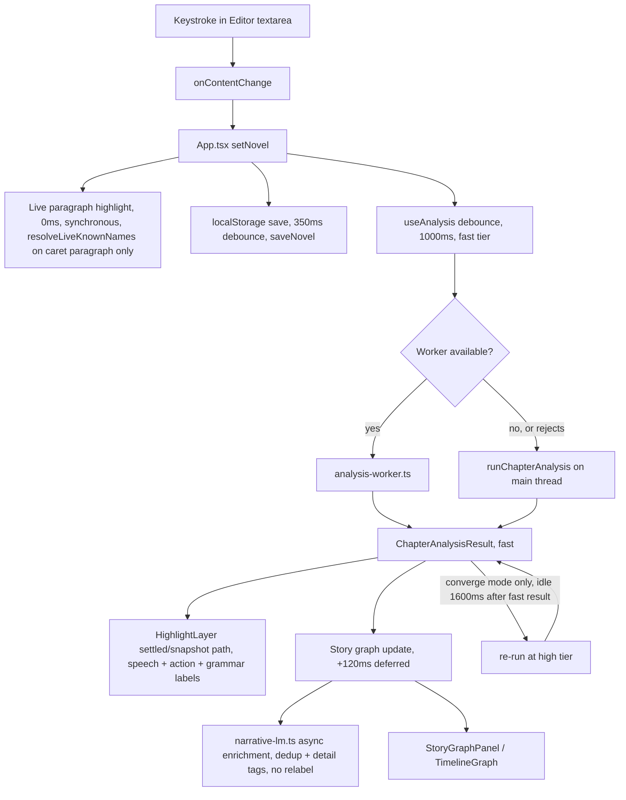

# Glass Editor / Latent Write, Architecture Map

Written 2026-07-30 as a top-down orientation document, not a line-by-line audit. It
verifies and corrects `README.md` and `CLAUDE.md` against the actual code, using
entry points, exports, section headers, and git history rather than reading every
file end to end. Where a claim is inferred rather than directly read, it says
"looks like."

This document assumes you have read `README.md` once. It does not repeat the
README's diagrams. It tells you where they are right, where they are stale, and
what they leave out entirely.

---

## 1. The one-picture data flow

From a keystroke to widgets and timeline updating, there are five independent
timers running off the same edit, not one pipeline:

Five clocks, all independent, all keyed off the same `novel` state change:

| What | Delay | File |
|---|---|---|
| Live entity highlight in the paragraph under the caret | 0ms (every keystroke) | `src/components/Editor.tsx` (`resolveLiveKnownNames`, called directly in a `useMemo`, no debounce) |
| localStorage persistence of the whole novel | 350ms | `src/App.tsx:576-582` |
| Chapter analysis dispatch, "fast" tier | 1000ms (`analysisDebounceMs`) | `src/lib/use-analysis.ts:96,190` |
| Grammar check + full snapshot markup | 1000ms (same value, passed in as `typingSettleMs`) | `src/components/Editor.tsx:151-152,196-199` |
| "High" tier refinement, converge mode only | +1600ms after the fast result lands (`CONVERGE_IDLE_MS`) | `src/lib/use-analysis.ts:64,235-256` |
| Story graph entry rebuild + LM enrichment | +120ms after analysis settles | `src/App.tsx:615-635` |
| World-data auto-extraction rescan (only when there's no explicit world data) | 2000ms on the chapters reference | `src/lib/use-analysis.ts:130` |

Two things worth naming explicitly:

- **The live highlight path never touches the worker.** It resolves names only in
  the paragraph under the caret (`src/components/Editor.tsx:158-170`), which is
  why typing feels instant even though full analysis is a worker round trip.
- **The "high" refinement only exists when converge mode is on**, and converge
  mode is now the only mode a user can pick. See section 2, System 3 below: the
  intelligence dial README describes is gone.

---

## 2. The subsystems, and who owns what

The app has closer to **11 real subsystems** than the README's 9. Two are missing
entirely (custom tools, and text/EPUB export is folded silently into "PDF
export"), and one described system (the intelligence dial) has been replaced by
something structurally different. Numbering below follows the README's System
1-9 where they still apply, then adds what's missing.

### System 1: App Shell and State Orchestration
**Job:** owns `novel` state, chapter selection, preferences, and every store
(annotation, adaptive, story graph, review results). Fans them out to children
and persists them.
**Entry point:** `src/App.tsx` (2000+ lines; this is the composition root, not a
place to add logic, it wires everything below).
**Consumes:** localStorage loaders (`storage.ts`, `preferences.ts`, `story-graph.ts`,
`renderer-review.ts`, `annotation-store.ts`, `adaptive-store.ts`), Electron menu
commands, keyboard shortcuts.
**Produces:** the `novel`, `currentId`, `intelMode`, and every store's state.
Persists all of them on a debounce.
**Consumed by:** every other system.
**Verified change from README:** the README's "Data Ownership Summary" is
accurate for this system. One addition worth naming: `src/lib/license.ts` and
`src/lib/features.ts` gate Pro-only features (`Tier = "free" | "pro"`) as a
cross-cutting concern threaded through App.tsx rather than a subsystem of its
own. Small enough (105 lines total) that it doesn't need a System number.

### System 2: Editor and Highlight Layer
**Job:** the live typing surface, plus the two-speed overlay (instant
paragraph-scoped entity highlight vs. debounced full markup).
**Entry point:** `src/components/Editor.tsx` (302 lines, read in full).
**Consumes:** `chapter.content`, the current `ChapterAnalysisResult`, known names.
**Produces:** textarea edit events back to `App.tsx`; the highlight overlay via
`HighlightLayer` (956 lines).
**Consumed by:** `App.tsx`, `EntityPopover`, `AnnotationPopover`.
**Confirmed accurate:** the two-path split (live paragraph vs. frozen snapshot) is
real and exactly as README describes it.
**Missing from README:** `src/lib/confidence-bands.ts` (39 lines, exports
`bandFor()`, `BAND_CERTAIN = 0.85`, `BAND_LIKELY = 0.58`) is a new file, imported
by `HighlightLayer.tsx`, that decides whether a speech/action attribution
renders as asserted, hedged, or not-asserted-at-all. This is the "ink only what
you're sure of" confidence-aware rendering. It exists in code now and is not
mentioned in README's System 2 at all.

### System 3: Chapter Analysis Pipeline
**Job:** runs speech detection, action detection, and chapter-level stats
(tension, register, rhythm, pacing) for the current chapter.
**Entry point:** `src/lib/use-analysis.ts` (the hook) and
`src/lib/chapter-analysis-runner.ts` (the pure function both the worker and the
main-thread fallback call). It composes `detectSpeechInChapter` from
`speech-detect.ts`, `findActionSentences`/`predictActionActor` from
`action-detect.ts`, and `analyzeChapter` from `chapter-analysis.ts`. It does
**not** call `narrative-events.ts`; that seam is one level up, in
`story-graph.ts`.
**Consumes:** chapter text, previous chapter's `endContext`, sibling chapter
stats, resolved character names, the `converge` flag.
**Produces:** `ChapterAnalysisResult` (current, prev, next), consumed by Editor,
AnalysisPanel, and the story graph.

**The README is stale here, and this is the single biggest correction in this
document.** README's System 3 describes an "Intelligence level (low, default,
high, or auto-resolved)" as a user-facing input, and its bottleneck section is
built entirely around "high mode" being manually selected. As of git commit
`6777ee0` ("Language accuracy + UX upgrade... The intelligence tier dial is
gone"), that dial does not exist in the UI any more:

- `src/App.tsx:306-307`: the actual state is `useState<"off" | "auto">`, not
  `"low" | "default" | "high"`.
- `src/lib/use-analysis.ts:96-100`: when `converge` is on (i.e. `intelMode !==
  "off"`), the first pass is hardcoded to `"fast"` and the refinement is
  hardcoded to `"high"`. The caller's `level` option is only honored on a
  classic single-pass path that App.tsx no longer uses.
- `src/components/Toolbar.tsx:19`, `AnalysisPanel.tsx:57`, `WorldDataView.tsx:33`
  still declare a wider `IntelMode` type (`"off"|"fast"|"default"|"high"|"auto"`)
  for internal bookkeeping (e.g. `resolvedLevel` display), but nothing in
  `App.tsx` lets a user pick `"fast"`, `"default"`, or `"high"` directly any
  more. There are exactly two user-facing states: off, or auto (which converges
  fast to high on idle).

Practically: "high mode is materially heavier" is still true as a fact about
the engine, but it is no longer something the writer chooses. It now always
runs, 1600ms after the writer stops typing (`CONVERGE_IDLE_MS`), replacing the
fast result. The old adjacent-chapter pre-analysis logic that used to gate on
`level === "high"` now also fires under `converge` (`use-analysis.ts:279`), so
that background cost is now the default writing experience for anyone who
hasn't turned analysis off, not an opt-in.

The tension-curve fix and `analysis.peakParagraph` field described in README
are real and unchanged (verified against `chapter-observation.ts`, see System
9).

### System 4: World Data and Entity Scan
**Job:** entity extraction and classification (characters/places/factions/
entities), name resolution, rename operations.
**Entry point:** `src/lib/world-data.ts`.
**Consumes:** novel/chapter text, existing world data, manual edits.
**Produces:** `worldData` buckets, the name list used by highlighting and speech
detection, rename operations.

**A defect the README doesn't mention, that was live in this codebase until
very recently and is now fixed.** `src/lib/world-data.ts:522-539`
(`autoExtractKnownNamesFast`, the private function that actually feeds
`resolveKnownNames()` and therefore speech attribution and the live highlight
layer) used to rank name candidates by **string length** before truncating to
30, while the public, unused-for-this-path `autoExtractEntities` (line 500)
ranked by relevance. Sorting by length is correct for building a highlight
regex (longest match first) and catastrophic as a selection filter: a
four-letter protagonist can never outrank thirty longer institutional nouns.
This shipped with 0% main-cast recall and roughly 53% of dialogue unattributed
on a real manuscript, documented in the committed report
`language-system-audit.html`, dated 2026-07-29. The fix, ranking by occurrence
count with length only as a tiebreak, is already in the code you're reading. It
landed in git commit `6777ee0` the next day, with a comment at
`world-data.ts:527-533` explaining exactly why the old comparator was wrong. If
you're auditing this codebase from the README alone you would never learn this
happened. It's only visible in `language-system-audit.html` and the git log.

**Missing from README's System 4 diagram entirely:** `src/components/
CastConfirmOverlay.tsx` (396 lines), a genuinely wired cold-start screen. It is
imported and rendered in `App.tsx` (state `castConfirmOpen`, `App.tsx:341`,
triggers around `App.tsx:868` and `:1230`, rendered at `:1702-1705`). It shows
the cast the scanner found, with mention counts and a line of dialogue each,
and asks the writer to confirm. This is the "turn the cold start into the best
moment" idea from the audit report, already shipped, and the README's System 4
section was never updated to include it.

Semantic-assist gating (hard-disabled outside Electron) is confirmed as
described.

### System 5: Story Graph and Timeline Stack
**Job:** turns per-chapter analysis into persisted graph entries and renders
them as a compact side panel and a fullscreen timeline.
**Entry point:** `src/lib/story-graph.ts` (`buildChapterEntry`,
`enrichChapterEntryWithLM`), presentation in `src/components/StoryGraphPanel.tsx`
(293 lines) and `src/components/TimelineGraphFull.tsx` (818 lines).
**Confirmed accurate:** `story-graph.ts:4` imports `detectNarrativeEvents` from
`narrative-events.ts` exactly as README's System 5 diagram shows
(`A[ChapterAnalysisResult] --> A2[narrative-events.ts] --> B[buildChapterEntry]`).
The LM pass does dedup + detail tags, confirmed not to overwrite `type` (a code
comment at `story-graph.ts` says so explicitly: "The type is NOT overwritten").
The two fixed defects README records (tension position never rendered; source
clause computed and discarded) are both still fixed, unchanged.

**One thing beyond what README and the plan document:** `story-graph.ts:175`
dynamically imports `refineEventSalience` from `narrative-events.ts`, a newer
LM-based salience-*pruning* pass (drops low-value events, gated on a
`SALIENCE=-0.05` threshold) that is separate from the "dedup + detail tags
only" role the plan assigns the LM. README doesn't mention this pass at all.

### System 6: Annotation and Adaptive Learning
**Job:** learns speaker/action disambiguation from the writer's manual
corrections.
**Entry point:** `src/lib/annotation-store.ts` (raw corrections),
`src/lib/adaptive-store.ts` (persisted model state).
**Shape, file by file:** `annotation-store.ts` owns load/save/add/clear/export
of corrections. `annotation-learn.ts` computes `computeLearnedBias` and
`characterBreakdown` (gated on a `LEARN_THRESHOLD` of 10 corrections).
`adaptive-store.ts` persists model state and metrics. `adaptive-inference.ts`
builds the per-analysis context (`buildAdaptiveInferenceContext`,
`rerankAdaptiveCandidates`). `adaptive-ranker.ts` does the online update and
retrain (`applyOnlineAdaptiveUpdate`, `retrainAdaptiveModels`). `adaptive-
similarity.ts` and `adaptive-memory.ts` are pure helper math (cosine
similarity, context-memory scoring) with no state of their own.
**Confirmed weak spot, not a code bug but a UX one:** `src/components/
Onboarding.tsx` has zero mentions of "annotation" or "correction" anywhere in
its source. The only path that starts the learning loop is not introduced to a
new user anywhere in onboarding. This matches a finding in
`language-system-audit.html` and nothing in the codebase has changed it since.
**Confidence-threshold sprawl, partially addressed:** the audit report flagged
eight uncoordinated hard-coded thresholds (0.50 through 0.85) spread across
modules. `confidence-bands.ts` (System 2) now centralizes the *display*
decision (certain/likely/unsure), but a rough grep of those same literal values
across `src/lib/*.ts` still hits speech-detect.ts, chapter-analysis.ts,
action-detect.ts, narrative-events.ts, adaptive-ranker.ts, world-data.ts, and
event-detect.ts. The *detection*-side thresholds are exactly as scattered as
the audit described. Only the rendering layer got a single owner.

### System 7: Renderer Workspace, Review, and Export
**Job:** the in-app Claude chat bound to the project directory, a separate
remote-model prose review path, and file export.
**Entry point:** `src/components/RendererPanel.tsx` (2042 lines) for chat,
`src/lib/project-manager.ts` for the typed Electron bridge.

**The fullscreen renderer workspace is a second, real Electron window, not an
overlay in the same DOM. README's diagram doesn't say this and it matters for
performance.** `electron/main.cjs:337-419` creates `_workspaceWindow`, a
`BrowserWindow` that loads the *same bundle* via `dist/index.html` with a
`{ hash: 'workspace' }` route. `src/main.tsx:26-31` reads
`window.location.hash.startsWith("#workspace")` and renders `WorkspaceWindow`
(a 43-line component that mounts one `RendererPanel` in `windowMode`) instead
of the full `App`. The two windows sync over `workspace:window-state` IPC
broadcasts (`main.cjs:348`) and share state only through project files and the
main process, not through any in-memory React state. Opening it is a second
full Electron renderer process, with its own JS heap, its own DOM, and
(because `main.tsx` runs unconditionally) its own instance of
`initLiquidGlassFilter()` and `initEdgeColor()` (System 8 and its worker) spun
up again. On a weak machine, opening the renderer workspace is closer in cost
to opening a second copy of the app than to opening a panel.

There is a third `BrowserWindow` too: a hidden one used for PDF/print rendering
(`main.cjs:567`, `pdfWin`).

**Three separate AI-touching paths from the main process, not one:**
1. **Renderer chat.** `electron/claude-code.cjs` spawns the Claude CLI as a
   subprocess and streams `stream-json` events back over IPC
   (`claude:run/stream/cancel/pipeline`, 5 channels, `claude-code.cjs:290-441`).
2. **Renderer review** (README's "remote review model"). `main.cjs:511-547`
   makes a direct HTTPS POST to `api.anthropic.com/v1/messages` **from the main
   process**, with the API key attached there so it never has to live in the
   sandboxed renderer. Confirmed via the code comment at `main.cjs:507-510`.
   This really is a second, independent path from the CLI subprocess, exactly
   as README implies by drawing it separately.
3. **Narrative LM embeddings** (System 5/9). `narrative-lm-embed`
   (`main.cjs:495-503`) runs `@xenova/transformers` locally, in the main
   process, warmed at `app.whenReady()`. README's System 7 diagram doesn't
   mention this third path at all, though it does show up in System 9.

**Slash commands confirmed wired, matching CLAUDE.md's table exactly:**
`/init`, `/context`, `/draft`, `/review`, `/lore`, `/assemble`, `/update` map to
pipeline ops in a table at `RendererPanel.tsx:118-124`. `/scan` is a distinct
branch (`RendererPanel.tsx:1357`), confirming the compact-vs-full-context split
is real code, not just documented policy. The extra-context gate for `/lore`
and `/review` is a literal array check at `RendererPanel.tsx:1486`.

**The instructions behind `/draft`, `/review`, `/lore`, etc. are not in this
repo.** `electron/claude-code.cjs` builds prompts that tell the Claude CLI to
read files under `novel-writing-system/`. For example, `claude-code.cjs:451`
reads: "Read novel-writing-system/SYSTEM_INDEX.md first... then
novel-writing-system/FROM_SCRATCH_PIPELINE.md." That directory is a sibling
project (`../novel-writing-system/`, confirmed to exist with
`CANONICAL_PIPELINE.md`, `PROSE_REVIEW_PROTOCOL.md`, etc.), bundled into the
shipped app via `electron-builder.yml`'s `extraResources` entry. The actual
"what makes a good chapter" logic that the renderer commands invoke lives in
markdown protocol documents outside this repo, not in glass-editor's
TypeScript. CLAUDE.md notes "do not modify them"; worth knowing this is why.
They aren't part of this codebase's ownership at all.

**Export is bigger than README's diagram shows.** README's System 7 diagram
has one export node, `pdf-export.ts`. In fact there are two export files:
`src/lib/pdf-export.ts` (PDF/print HTML, six typeset presets) and
`src/lib/text-export.ts` (`novelToMarkdown`, `novelToDocx`, `novelToEpub`, all
three confirmed exported and wired). `novelToMarkdown`/`novelToDocx` are used
directly from `App.tsx:1126-1133`. All three, including EPUB, are used from
`src/components/PdfExportOverlay.tsx:32,222`, whose name undersells what it
does: it's the export overlay for all four formats, not just PDF. README never
mentions `text-export.ts` at all.

### System 8: Liquid Glass and Compositing
**Job:** the backdrop-filter glass effect across panels/tabs/overlays,
computed via a per-pixel displacement map worker, cached and idle-scheduled.
**Entry point:** `src/lib/liquid-glass-filter.ts` (`initLiquidGlassFilter()`,
called once from `src/main.tsx:9`).
**Confirmed:** worker instantiated at `liquid-glass-filter.ts:129`
(`new Worker(...)`); `ResizeObserver` at line 588; `requestIdleCallback`
scheduling at line 657.

**The three overlay freeze modes are not equivalent, and README implies they
are.** `liquid-glass-filter.ts:38` defines `PAUSE_BODY_CLASSES =
["timeline-overlay-freeze", "renderer-workspace-freeze",
"electron-window-unfocused", "scroll-edge-idle"]`. This is the list that
actually pauses the worker/filter computation. `onboarding-overlay-freeze` is
**not** in that list. Grepping `styles.css:13568-13580` confirms onboarding's
freeze is a pure CSS rule (`backdrop-filter: none !important` on specific
selectors). It flattens the *visual* result but does not stop the JS-side
`ResizeObserver`/idle-scheduling loop from continuing to compute displacement
maps behind the onboarding overlay. Timeline and renderer-workspace freezes
stop the actual computation; onboarding only hides its output. This may be
intentional (onboarding may have fewer live glass surfaces behind it to worry
about) but it is a real, verified asymmetry the README's one-line description
("Freeze modes for the fullscreen timeline, fullscreen renderer workspace, and
onboarding overlay") doesn't capture.

**Not in README at all: the edge-color layer.** `src/lib/edge-color/edge-color.ts`
(`initEdgeColor()`, called from `main.tsx:20-22`) is a second, related visual
system: a body-glow plus specular-rim effect around glass surfaces, reading
color directly from the highlight layer's palette by geometry, event-driven
and idle-free. It's closely coupled to System 8 (same selector list) but is
its own file and its own initialization call. Small enough to fold into System
8 for this map, but worth knowing it exists as a separate concern if you go
looking for "the glass code" and only find `liquid-glass-*.ts`.

### System 9: Narrative Event Engine
**Job:** decides what actually happens in a chapter, at clause granularity,
and generates the event label from the same clause that triggered it.
**Entry point:** `src/lib/narrative-events.ts` (1467 lines; read its header
before changing it, per its own comment; every rule answers a measured failure
recorded in `plans/narrative-event-engine.md`).
**Confirmed structurally, via section headers, not full read:** exports
`detectNarrativeEvents` (line 920) and the async `refineEventSalience` (line
1439, see System 5). Section markers confirm the two-channel design (utterance-
act detection near line 287), the realis test (near line 489), agent/object
extraction (near lines 522-830), and per-chapter calibration/labelling (near
line 1285). This matches both README's System 9 diagram and the plan document
closely; nothing material is stale here.
**`chapter-observation.ts` (218 lines, read in full)** matches README's "This
chapter" brief description exactly, and enforces the rule CLAUDE.md states: it
gates the tension-peak claim on `maxTension >= 0.5` (near line 128) and always
reads `analysis.peakParagraph` or an event's own `paragraphIndex`, never
inverts `tensionCurve`.
**`event-detect.ts` status confirmed:** imported by exactly two files,
`scripts/test-event-detect.ts` and `scripts/ood-event-audit.ts`, both for
old-vs-new scoring. Zero imports anywhere in `src/`. README and CLAUDE.md's
"superseded but kept for scoring" claim is accurate, unembellished.
**The embedding seam (narrative-lm.ts)** confirmed to have three paths:
Electron IPC, browser WASM, and the `setEmbedder` injection point used by
`scripts/lm-node-backend.ts`. This matches the plan's description in
`plans/narrative-event-engine.md`, section "The Embedding Seam."

**Even `plans/narrative-event-engine.md` is already one commit stale.** The
plan says, in its own "what is still wrong, honestly" section, that precision
is "the open problem: 35.7%, and it is FLAT across the whole usable confidence
range," and frames an LM-based fix as future work not yet attempted ("The LLM
path, and why it is not in this change"). `git log -- plans/narrative-event-engine.md`
shows the file was last touched in commit `8c51eba`. The actual HEAD of the
repo is one commit later, `beccf08`, titled "Bring in the LM for salience,
precision 32.8% to 41.7%," and that work is already live in the code: the
`refineEventSalience` function this document already noted above
(`story-graph.ts:175`, dynamically imported from `narrative-events.ts`) is
exactly that LM salience re-rank, gated on a `SALIENCE` threshold. So the plan
document, written specifically to be the up-to-date reference for this
subsystem, was already superseded by the very next commit and was never
updated to say so. Read the git log for this subsystem, not just the plan
file, before trusting a precision number quoted from it.

### System 10: Custom Tool Import (not in README at all)
**Job:** a per-project plugin system letting a project bring its own custom
analysis "tools" (small React-like components compiled and run inside the
app), separate from both the built-in widgets and the renderer chat.
**Entry point:** `src/lib/tool-registry.ts` (214 lines; header states it
"discovers, validates, and stores per-project custom tools... called on
project open when customToolsEnabled is true") and `src/lib/tool-runner.ts`
(276 lines, builds the execution context/prompt for running a tool).
**The bridge into the widget grid:** `src/components/widgets/ToolWidgetSlot.tsx`
imports `* as ToolKit from "../../tools/tool-kit"`. `tool-kit.ts` is the sole
importer of `src/tools/primitives/*.tsx` (18 files: ToolArcRing, ToolButton,
ToolCard, ToolDataTable, ToolHeatmap, etc.), a small design-system kit that
exists only to be composed by dynamically-loaded, per-project custom tool
code, not by the app's own built-in widgets.
**IPC-backed, real, and shipped:** `project-fs.cjs` registers `tool:compile`,
`tool:scanProject`, `tool:importTools` channels; `esbuild-wasm` is a runtime
dependency in `package.json` (used to compile tool source at runtime);
`src/components/ToolImportOverlay.tsx` is the user-facing overlay, imported and
wired in `App.tsx`; `project-manager.ts` exports `scanExternalProject` and
`importTools` for it.
**Why it gets its own System number:** it has its own IPC channels, its own
compiler, its own component-primitive kit, and its own overlay UI, a fully
separate seam from every other system. README's "Files To Start With" list
doesn't mention a single one of these files.

---

## 3. The seams, specifically

Three seams the task asked about directly:

**The analysis worker boundary** (`src/lib/analysis-worker-client.ts` and
`src/lib/analysis-worker.ts`): message IN is `{ id, payload:
RunChapterAnalysisInput }`, message OUT is `{ id, ok: true, result } | { id,
ok: false, error }`. Two independent fallback layers exist, not one: (a) if
`Worker` construction itself fails, `ensureWorker()` marks the worker
unavailable and calls `runChapterAnalysis` directly on the main thread; (b)
`use-analysis.ts` also wraps every call in `.catch(() =>
runChapterAnalysis(input))` in case a constructed worker's promise later
rejects. **There is no client-side timeout.** If `postMessage` succeeds but the
worker never replies (hangs, e.g. on a pathological input), the calling
promise never resolves. The only way analysis recovers is the worker's own
`onerror` firing, not a deadline the client enforces.

**The Electron main/renderer IPC boundary:** `electron/preload.cjs` exposes
`window.electronAPI` with channel families for export, menu commands,
project/file IO (13 methods), Claude CLI (5 methods plus 6 streaming events),
renderer review, narrative LM embedding, edge-color capture, workspace window
control, and custom tools. Handlers are split cleanly by concern:
`project:*`/`tool:*` in `electron/project-fs.cjs`, `claude:*` in
`electron/claude-code.cjs`, everything else (`workspace:*`, `renderer-review`,
`export-pdf`, `narrative-lm-*`, `edge-color:capture`, `draft-guard:update`) in
`electron/main.cjs`. Every `project-manager.ts` export spot-checked has a
matching preload method and IPC channel with consistent naming.

**The sync/async split around the language model:** the narrative-events
engine itself is fully synchronous and runs inline in the analysis pipeline (a
per-chapter cost, not per-keystroke; it runs on the same deferred story-graph
path as everything else in System 5). The LM only touches two things
asynchronously, after the synchronous detection already produced a result:
salience pruning (`refineEventSalience`) and dedup/detail-tag enrichment
(`enrichChapterEntryWithLM`), both dynamically imported from `story-graph.ts`
and both allowed to fail silently (wrapped in a bare `catch`) without blocking
the UI. The renderer-review and renderer-chat AI paths are fully async and
IPC/subprocess-based, entirely outside the analysis pipeline. The
`narrative-lm-embed` main-process path is warmed eagerly at `app.whenReady()`
so the first embedding call in a session doesn't pay a cold-start cost.

---

## 4. What runs when, a summary table

| Trigger | What runs | Where |
|---|---|---|
| Every keystroke | Live paragraph-scoped entity highlight | main thread, `Editor.tsx` |
| Every keystroke | Textarea resize (rAF-scheduled) | main thread |
| 350ms after last edit | Save whole novel to localStorage | main thread |
| 1000ms after last edit | Fast-tier chapter analysis (speech, action, chapter stats) | worker, fallback main thread |
| 1000ms after last edit | Grammar check + full snapshot highlight markup | main thread |
| 1600ms after the fast result (converge/auto mode only) | High-tier refinement, replaces displayed result | worker, fallback main thread |
| Whenever converge/auto is on and an adjacent chapter is unanalyzed | Background pre-analysis of neighbor chapters, idle-scheduled | worker, fallback main thread |
| 120ms after analysis settles | Story graph entry rebuild (`narrative-events.ts` detection, synchronous) | main thread |
| After story graph entry builds | LM salience pruning + dedup/detail-tag enrichment | async, Electron IPC or WASM |
| 2000ms on chapters reference, only with no explicit world data | Whole-novel entity auto-extraction rescan | main thread |
| On project open, if custom tools enabled | Tool discovery/compile via esbuild-wasm | Electron main + renderer |
| Continuously, idle-scheduled | Liquid glass filter map (re)generation on resize | worker |
| Continuously, geometry-driven, idle-free | Edge-color glow/rim tracking | main thread |
| On opening the fullscreen renderer workspace | A second full Electron renderer process boots (new liquid-glass worker, new edge-color loop, shared state only via project files + IPC) | new `BrowserWindow` |
| On `/scan`, `/draft`, `/context`, `/review`, `/lore`, `/assemble`, `/update`, `/init` | Claude CLI subprocess spawned/reused, streams back over IPC | Electron main (`claude-code.cjs`) |
| On a review trigger | Direct HTTPS call to `api.anthropic.com` from the main process | Electron main (`main.cjs`) |

For a weak machine, two costs are easy to miss from the README alone. First,
converge/auto mode means the expensive "high" tier now runs by default on
every idle pause, not just when a user opts into "high": the old opt-in
framing in README's bottleneck section no longer matches how often it actually
runs. Second, opening the renderer workspace is a second Electron renderer
process with its own copy of the glass/edge-color systems, not a lightweight
panel.

---

## 5. Dead or orphaned code

**`src/components/widgets/WidgetGrid.tsx`, confirmed dead, safe to delete.**
Nothing imports it anywhere in `src/` (`grep -rln "WidgetGrid" src/` outside
its own file returns zero results). `AnalysisPanel.tsx` builds its widget grid
inline instead, driven by `src/lib/widget-config.ts`'s `WIDGET_REGISTRY` (18
entries, one per user-toggleable widget) rather than by `WidgetGrid.tsx`'s
hardcoded list. This confirms the user's own prior knowledge that it's dead.

**Four widgets are dead only because their sole importer is the dead
`WidgetGrid.tsx`, safe to delete alongside it, or keep if you plan to revive
the grid:** `ComparativeWidget.tsx`, `DialogueWidget.tsx`, `PacingWidget.tsx`,
`RegisterWidget.tsx`. Each is imported by `WidgetGrid.tsx` and by nothing else
(verified per-file with targeted greps against `src/`).

**Two widgets are orphaned outright, zero imports anywhere including from
`WidgetGrid.tsx`, safe to delete:** `DeepAnalysisWidget.tsx`,
`TextureWidget.tsx`.

**`DialRing.tsx` looks orphaned by the same test but is not: it is live via
System 10**, the same way as `ArcRing.tsx`/`WidgetCard.tsx` below.
`src/tools/primitives/ToolDialRing.tsx:2` imports it directly (`import {
DialRing } from "../../components/widgets/DialRing"`), and `tool-kit.ts:30`
re-exports `ToolDialRing`. Do not delete it.

**Live, and worth knowing why they don't show up in a naive "who imports this
widget" grep against `AnalysisPanel.tsx`:** `WidgetCard.tsx`, `ArcRing.tsx`,
and `DialRing.tsx` are shared sub-components, not top-level widgets. Two
things keep each of them alive. Other widgets use them as their shell/dial
(`WidgetCard` in `CastWidget.tsx:3`, `SensoryBalanceWidget.tsx:4`,
`ProseProfileWidget.tsx:6`, and most of the 18 registry widgets; `ArcRing`
alongside `WidgetCard` in the same three files), and System 10's tool-kit
wraps all three as primitives (`ToolCard.tsx:2` uses `WidgetCard`,
`ToolArcRing.tsx:2` uses `ArcRing`, `ToolDialRing.tsx:2` uses `DialRing`) for
dynamically-loaded custom tools. `ToolWidgetSlot.tsx` is also live, imported
directly by `AnalysisPanel.tsx`. It's the bridge into System 10, not a dead
widget.

**`WIDGET_REGISTRY` (18 ids) vs. the 30 physical files in
`src/components/widgets/` reconciles exactly:** 18 registry widgets, plus
`PlaceholderWidget.tsx` (fallback for an unrecognized or unconfigured id, not
itself in the registry), plus `ToolWidgetSlot.tsx` (System 10 bridge), plus
`WidgetCard.tsx`/`ArcRing.tsx`/`DialRing.tsx` (shared sub-components, also used
by System 10), totals **23 legitimately live files**. The other **7** are
dead: `WidgetGrid.tsx` itself, the four widgets whose only importer was
`WidgetGrid.tsx` (`ComparativeWidget`, `DialogueWidget`, `PacingWidget`,
`RegisterWidget`), and the two orphaned outright (`DeepAnalysisWidget`,
`TextureWidget`). 23 plus 7 equals 30, matching the directory exactly.
`language-system-audit.html`'s "29 widgets" figure appears to be counting raw
files in the directory (minus one, perhaps `WidgetGrid.tsx` itself) rather
than distinct live analysis widgets. Reconcile any "29" you see quoted
elsewhere against this list rather than assuming it means 29 independently
useful metrics.

**`src/lib/event-detect.ts`, confirmed superseded-but-intentionally-kept, not
orphaned.** Imported by exactly two files: `scripts/test-event-detect.ts` and
`scripts/ood-event-audit.ts`, both for old-vs-new scoring. Zero imports in
`src/`. Keep it. Deleting it breaks the ability to prove the new engine is
better, which is the entire point of both suites.

**`src/tools/primitives/*.tsx` (18 files) and `src/tools/tool-kit.ts`, live,
but only for System 10.** `tool-kit.ts` re-exports every primitive (`ToolCard`,
`ToolOverlay`, `ToolButton`, etc., verified via its own export list) and is
imported by exactly one file outside `src/tools/`:
`src/components/widgets/ToolWidgetSlot.tsx`. If you're looking at `src/tools/`
expecting it to back the built-in widgets, it doesn't. It exists solely to be
composed by dynamically-loaded, per-project custom tool code (System 10).

**The dev-only diagnostic entry points are not dead code, and not shipped in
the built app.** `src/orb-dev.tsx`, `src/glass-shear.ts`,
`src/glass-glow-bench.ts`, `src/glass-gpu-bench.ts`, `src/glass-verify.ts`,
`src/glass-direction.ts`, `src/edge-color-dev.ts`, `src/lens-dev.tsx` each back
a matching root-level `.html` file (`orb-dev.html`, `glass-shear.html`, etc.)
used only through `npm run dev` or the dedicated `electron scripts/glass-*.cjs`
harnesses named in CLAUDE.md. Confirmed these never reach the packaged app:
`vite.config.ts` has no `build.rollupOptions.input` entry, so Vite's default
single-entry build only bundles `index.html`. `dist/` (checked directly)
contains only `index.html`, not the diagnostic pages. Keep all of these; they
are the actual verification harnesses CLAUDE.md's "Liquid glass" section
requires you to run before touching that code.

**`src/lib/renderer-text.ts`, `src/lib/renderer-text-wall-worker.ts`,
`src/lib/renderer-active-store.ts`, `src/components/RendererTextWall.tsx`, all
live**, imported by `RendererPanel.tsx` and/or `AnalysisPanel.tsx` (verified by
grep). Not orphaned despite not being mentioned in README's "Files To Start
With" list.

**`src/lib/auto-intel.ts` (36 lines) looks orphaned.** No file outside itself
imports anything from it (`grep -rn "auto-intel" src/` outside the file itself
returns nothing), and it exports `IntelligenceLevel`-adjacent auto-resolution
logic that predates the converge-on-idle rebuild (System 3). Given the
intelligence dial it supported no longer exists in the UI, this is a
reasonable candidate for deletion, though it wasn't traced deeply enough to be
certain nothing dynamically references it. Verify with a repo-wide search
before removing.

---

## 6. The test and verification story

`scripts/` holds roughly 40 files. Not all of them are tests, and not all
tests gate anything. Three real categories:

**Gated accuracy suites** exit with a non-zero code if a measured accuracy
falls under a target, and are meant to be run before/after touching the
`src/lib/` module they cover (this is what CLAUDE.md means by "TDD accuracy
test suites"). Confirmed gated (checked for `process.exit(1)` or
`process.exitCode = 1` in each): `accuracy-suite.ts` (speech, per-tier ranges:
fast 60-78%, default 75-92%, high 90-100%; CLAUDE.md's prose table simplifies
this to flat floors, which is close but not exact), `scan-accuracy-suite.ts`,
`test-chapter-analysis.ts`, `test-repetition.ts`, `test-prose-profile.ts`,
`test-grammar-check.ts`, `test-continuity-voice.ts`, `test-chapter-dna.ts`,
`test-paragraph-risk.ts`, `test-chapter-diff.ts`, `test-prose-segments.ts`,
`test-auto-format.ts`, `test-tension-scene.ts`, `test-cast-roles.ts`,
`test-known-names.ts`, `test-chapter-observation.ts`, `test-event-detect.ts`,
`test-liquid-glass-exact.ts`, `test-liquid-glass-fuzz.ts`,
`test-narrative-lm.ts` (this one hard-gates on the LM backend actually
loading, not just on accuracy; see the plan's "Embedding Seam" section), and
three that exist, are gated, and have npm aliases in `package.json`, but have
**no documentation anywhere** (not in README, not in CLAUDE.md's command
table): `test-chapter-roles.ts`, `test-entity-scan.ts`, `test-local-review.ts`.

`test-name-bucket-accuracy.ts` is also gated (three `process.exit(1)` calls)
but is the least discoverable suite in the repo: it has **no npm alias at
all** (checked `package.json` directly; it isn't there), no README or
CLAUDE.md mention, and its own header comment says it must be invoked with a
special stub-injection flag, `NODE_OPTIONS="--require /tmp/stub-sharp.cjs" npx
tsx scripts/test-name-bucket-accuracy.ts`, not a plain `tsx` run.

`test-event-lm.ts` is gated too and has neither an npm alias nor any mention
in README, CLAUDE.md, or the plan's file list. It appears to be an orphaned
leftover test for the LM path, superseded in spirit by `test-narrative-lm.ts`.

**Report-only audits** deliberately never gate on the number they report,
because gating would destroy the thing that makes them useful (tuning against
a held-out measure defeats its purpose, and CLAUDE.md says so explicitly).
Confirmed: `ood-language-audit.ts` and `ood-event-audit.ts` have zero
`process.exit` calls tied to their metrics (only a crash handler).
`test-event-labels.ts` is also report-only/legacy in practice. It's the suite
that reported "0/6 relabeled" for months while silently measuring nothing, per
the plan's diagnosis.

**Perf/bench, not accuracy:** `test-analysis-responsiveness.ts` (the numbers
README quotes directly in System 3), `test-edge-color-perf.ts` (named
RED/GREEN gates, still a pass/fail exit code, but timing-based not
accuracy-based), `glass-gpu-bench.cjs`/`glass-glow-bench.cjs` (measurement
only, need a real GPU and a running dev server, exactly as CLAUDE.md
describes), `glass-pixel-diff.cjs` (a real green/red gate, but its baseline is
a saved *screenshot*, distinct from `liquid-glass-baseline.ts`'s frozen *math*
oracle used by the exact/fuzz suites; easy to conflate the two "baselines,"
they check different things), and `glass-app-profile.cjs` (pure profiling, not
pass/fail).

**One-off tools, not tests:** `print-chapter.ts`, `glass-shear.cjs` (manual
diagnostics), `lm-node-backend.ts` and `liquid-glass-baseline.ts` (helper
modules imported by other suites, never run standalone), `export-orb-svg.ts`
(build tool for the app icon), and three `.mjs` files this document's earlier
file listing missed entirely because it only searched for
`.ts`/`.tsx`/`.cjs`/`.js`: `scripts/capture-shots.mjs` ("the product shots the
marketing site uses"), `scripts/demo-manuscript.mjs` (synthetic manuscript
"written for the capture, not for the reader," feeds `capture-shots.mjs`), and
`scripts/generate-license-code.mjs` (Pro license-code generator, pairs with
`src/lib/license.ts`). None of these three have npm aliases or any mention in
README or CLAUDE.md.

**A naming check worth recording:** `npm run audit:ood` maps to
`ood-language-audit.ts` and `npm run audit:ood-events` maps to
`ood-event-audit.ts`. These do match despite the filenames being easy to
transpose from memory. The real doc/code gap isn't naming drift, it's the
gated suites above with no prose documentation at all.

**`language-system-audit.html`'s provenance.** This is a committed, static
HTML file at the repo root (not auto-generated; grepping for its filename
across `scripts/` and `src/` turns up nothing outside the file itself), dated
29 July 2026, one day before the git commit (`6777ee0`, 30 July) that fixed
the exact defect it diagnosed (the world-data.ts name-ranking comparator,
System 4 above). It reads as a hand/agent-authored audit deliverable that
motivated that fix, not a build artifact. Treat it as a historical diagnostic
record, not live documentation. Its headline numbers (52.9% unattributed
dialogue, 0% cast recall) describe a bug that no longer exists in the tree,
though the report itself is still useful for how it found the bug
(whole-manuscript, label-free auditing against two full novels, contrasted
with curated-fixture suites).
