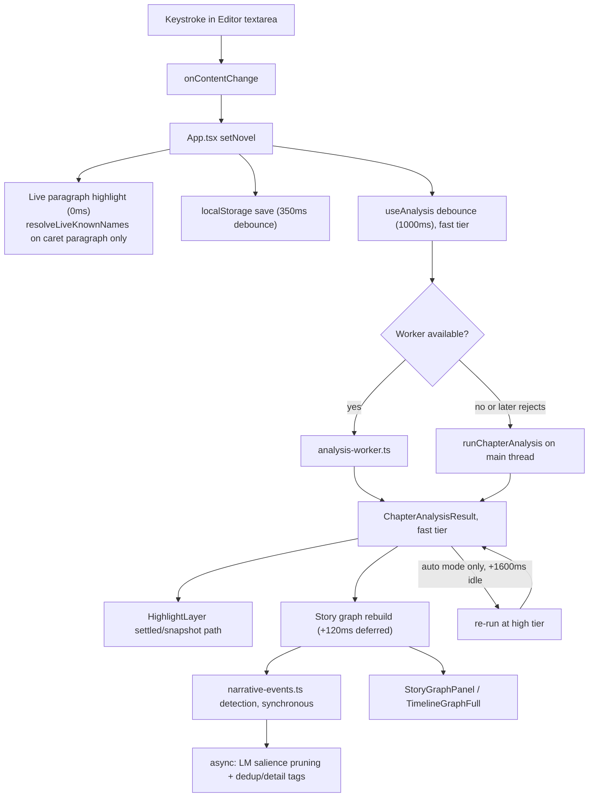
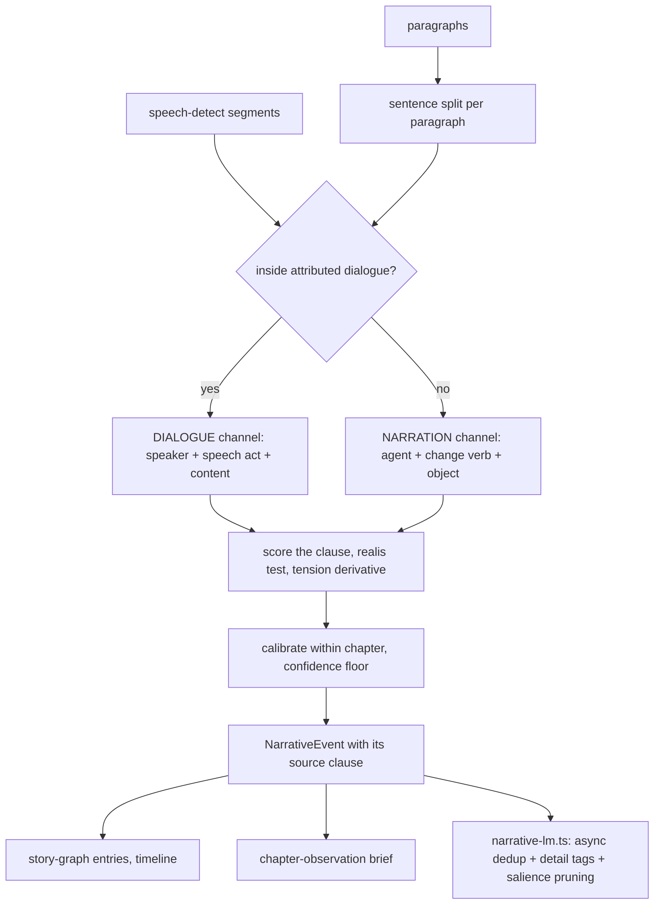

# Glass Editor / Latent Write, architecture map

Written as a top-down orientation document for a developer who already owns this
code but cannot hold all of it in their head at once. It is not a line-by-line
audit. `src/lib/speech-detect.ts` (2540 lines), `src/lib/chapter-analysis.ts`
(2274 lines) and `src/lib/world-data.ts` (1358 lines) were read only for their
exported signatures and section-header comments (`grep ^export`, `grep "^// ───"`),
not end to end. Everything else named below was either read in full or spot
checked with `grep`/`git log`/`git show`. Where a claim is inferred rather than
directly read, it says "looks like."

**Read this first if you are only going to read one paragraph.** README.md and
CLAUDE.md were both last edited at commit `39e3f57`. The repository has since
moved 10 commits further (current HEAD is `8efca8d`, branch
`narrative-event-engine`), and several of those commits changed load-bearing
numbers that README and CLAUDE.md still quote from before the change. The
biggest one: the event-detection gold set grew from 22 events / 5 chapters / 1
book to **103 events / 19 chapters / 8 books / 7 authors**, and the honest
precision on that larger set is **28.4%**, not the 57.1% both docs still cite.
This is explained in full under System 9 and section 6. Prefer
`scripts/test-event-detect.ts`'s own header comment over any prose description,
including this one, because it is the file that actually gates the build.

---

## 1. One picture: keystroke to screen

There is no single pipeline. A keystroke fans out into five independently timed
paths, all triggered off the same `App.tsx` state update.

| What | Delay | File |
|---|---|---|
| Live entity highlight in the paragraph under the caret | 0ms, every keystroke | `src/components/Editor.tsx`, `resolveLiveKnownNames` called directly in a `useMemo` |
| Whole-novel localStorage save | 350ms | `src/App.tsx:582` |
| Chapter analysis dispatch, fast tier | 1000ms (`analysisDebounceMs`) | `src/App.tsx:425`, `src/lib/use-analysis.ts:96` |
| Grammar check plus full snapshot markup | 1000ms (same value, passed to Editor as `typingSettleMs`) | `src/components/Editor.tsx:151` |
| High-tier refinement, auto mode only | +1600ms after the fast result lands (`CONVERGE_IDLE_MS`) | `src/lib/use-analysis.ts:64,255` |
| Story graph entry rebuild, then LM enrichment | +120ms after analysis settles | `src/App.tsx:622,632` ("yield current frame; 120ms is imperceptible for graph updates") |
| Whole-novel entity rescan, only when there is no explicit world data | 2000ms on the chapters reference | `src/lib/use-analysis.ts:130` |

Two things worth knowing cold:

- **The live highlight path never touches the worker.** It resolves names only
  in the paragraph under the caret, which is why typing feels instant even
  though the full pipeline is a worker round trip.
- **The intelligence dial the README describes no longer exists.** `App.tsx:306`
  declares `useState<"off" | "auto">`, not `"low" | "default" | "high"`. Under
  auto mode, `use-analysis.ts:96-100` hardcodes the first pass to `"fast"` and
  the refinement to `"high"` ("Under converge the first pass is always fast and
  the refinement is always high; the caller's level applies only to the
  classic single-pass path"). There are exactly two user-facing states now:
  off, or auto, which always converges fast to high on every idle pause. The
  background adjacent-chapter pre-analysis that used to be opt-in under "high"
  now also fires under auto (`use-analysis.ts:278`), so that background cost is
  the default writing experience for anyone who has not turned analysis off.

---

## 2. The subsystems

### System 1: App shell and state orchestration
Owns `novel` state, chapter selection, preferences, and every store (annotation,
adaptive, story graph, review results), and fans them out to children.
**Entry point:** `src/App.tsx` (1925 lines; this is the composition root, not a
place to add analysis logic).
**Consumes:** localStorage loaders (`storage.ts`, `preferences.ts`,
`story-graph.ts`, `renderer-review.ts`, `annotation-store.ts`,
`adaptive-store.ts`), Electron menu commands, keyboard shortcuts.
**Produces:** `novel`, `currentId`, `intelMode`, and every store's state;
persists all of them on a debounce.
**Consumed by:** every other system.
A small cross-cutting concern lives here rather than as its own system:
`src/lib/license.ts` (79 lines) and `src/lib/features.ts` (26 lines) gate
Pro-only features (`Tier = "free" | "pro"`), threaded through `App.tsx`.

### System 2: Editor and highlight layer
The live typing surface, plus a two-speed overlay: instant paragraph-scoped
entity highlight versus a debounced full markup pass.
**Entry point:** `src/components/Editor.tsx` (302 lines).
**Consumes:** `chapter.content`, the current `ChapterAnalysisResult`, known
names.
**Produces:** textarea edit events back to `App.tsx`; the highlight overlay via
`HighlightLayer.tsx` (956 lines).
**Consumed by:** `App.tsx`, `EntityPopover`, `AnnotationPopover`.
`src/lib/confidence-bands.ts` (39 lines: `bandFor()`, `BAND_CERTAIN = 0.85`,
`BAND_LIKELY = 0.58`) is imported by `HighlightLayer.tsx` and decides whether a
speech/action attribution renders as asserted, hedged, or not shown at all.
README does not mention this file; it is the "only ink what you're sure of"
rule made concrete.

### System 3: Chapter analysis pipeline
Runs speech detection, action detection, and chapter-level stats (tension,
register, rhythm, pacing) for the current chapter.
**Entry point:** `src/lib/use-analysis.ts` (the hook) and
`src/lib/chapter-analysis-runner.ts` (the pure function both the worker and the
main-thread fallback call; it composes `detectSpeechInChapter` from
`speech-detect.ts`, `findActionSentences`/`predictActionActor` from
`action-detect.ts`, and `analyzeChapter` from `chapter-analysis.ts`; it does
**not** call `narrative-events.ts`, that seam is one level up in `story-graph.ts`).
**Consumes:** chapter text, previous chapter's `endContext`, sibling chapter
stats, resolved character names, the `converge` flag.
**Produces:** `ChapterAnalysisResult` (current, prev, next).
**Consumed by:** Editor, AnalysisPanel, story graph.
The tension curve fix README describes is real and unchanged: `analyzeChapter`
used to point-sample one paragraph per bucket, dropping the true peak in 15% of
chapters; buckets now aggregate, and a separate `analysis.peakParagraph` field
locates the real peak. Read that field; never invert `tensionCurve` to find a
paragraph, since a bucket index maps to a bucket centre, not a paragraph.

### System 4: World data and entity scan
Entity extraction and classification (characters, places, factions, entities),
name resolution, and rename operations.
**Entry point:** `src/lib/world-data.ts` (1358 lines; `scanAndClassify` at
line 876, `resolveKnownNames`/`resolveLiveKnownNames` at 1192/1203).
**Consumes:** novel or chapter text, existing world data, manual edits.
**Produces:** `worldData` buckets, the name list used by highlighting and
speech detection, rename operations.
**Consumed by:** highlight layer, speech detection, story graph, `WorldDataView`.
A defect fixed the day before this document was updated (commit `bc2c826`,
"Fix the character scan: 9 false names to 0 on the test chapter"): the scanner
was calling sentence-opening common nouns and verbs characters, because a
capital letter at the start of a sentence carries no information. Two new
per-candidate tests were added, both using the manuscript itself as the
dictionary so neither goes stale on a new book: does the word also appear
mid-sentence (POSITION), and does a lowercase form of the same word appear
elsewhere in the text (a common noun the author also uses ordinarily). A
closed list of sentence-opening adverbs ("Tonight", "Meanwhile", ...) was added
to `COMMON_CAPITALIZED` for the same reason. Not mentioned in README at all:
`src/components/CastConfirmOverlay.tsx` (396 lines), a cold-start screen shown
after a scan that asks the writer to confirm the detected cast, wired into
`App.tsx` at lines 341, 868, 1230 and 1703.

### System 5: Story graph and timeline stack
Turns per-chapter analysis into persisted graph entries and renders them as a
compact side panel and a fullscreen timeline.
**Entry point:** `src/lib/story-graph.ts` (`buildChapterEntry`,
`enrichChapterEntryWithLM`), presentation in `StoryGraphPanel.tsx` (293 lines)
and `TimelineGraphFull.tsx` (818 lines).
**Consumes:** `ChapterAnalysisResult`, `worldData` names and aliases.
**Produces:** persisted story graph entries, compact and fullscreen timeline
views, event chip hover text (type, salience, paragraph, confidence, and the
source clause).
**Consumed by:** `StoryGraphPanel`, `TimelineGraphFull`, chapter navigation.
`story-graph.ts:4` imports `detectNarrativeEvents` from `narrative-events.ts`
directly, exactly as README's diagram shows. Beyond what README or the plan
document mention: `story-graph.ts:175` also dynamically imports
`refineEventSalience` from `narrative-events.ts`, a newer LM-based salience
pruning pass (drops low-value events) that is separate from the "dedup plus
detail tags only" role assigned to the LM elsewhere. A code comment at
`story-graph.ts:230` confirms the LM does not overwrite `type`.

### System 6: Annotation and adaptive learning
Learns speaker/action disambiguation from the writer's manual corrections.
**Entry point:** `src/lib/annotation-store.ts` (raw corrections, 93 lines),
`src/lib/adaptive-store.ts` (persisted model state, 238 lines).
**Consumes:** manual speech/action corrections, prediction traces from
analysis, current chapter id and world data.
**Produces:** learned bias for speaker/action disambiguation, adaptive model
state and metrics, immediate overlay correction colors and labels.
**Consumed by:** `useAnalysis` (via `buildAdaptiveInferenceContext`), overlay
rendering.
File by file: `annotation-learn.ts` (539 lines) computes `computeLearnedBias`
and `characterBreakdown`, gated on 10 corrections (`LEARN_THRESHOLD`).
`adaptive-inference.ts` (131 lines) builds the per-analysis context.
`adaptive-ranker.ts` (160 lines) does the online update and retrain.
`adaptive-similarity.ts` and `adaptive-memory.ts` are pure math helpers with no
state of their own. A real gap, not a code bug: `src/components/Onboarding.tsx`
has no mention of "annotation" or "correction" anywhere in its source, so the
only path that starts this learning loop is never introduced to a new user.

### System 7: Renderer workspace, review, and export
The in-app Claude chat bound to the project directory, a separate remote-model
prose review path, and file export.
**Entry point:** `src/components/RendererPanel.tsx` (2042 lines) for chat,
`src/lib/project-manager.ts` for the typed Electron bridge.
**Consumes:** project-backed chapter files, `novel.txt`, renderer chat
messages, slash commands, API key and selected review model.
**Produces:** persisted Claude sessions with streamed assistant/thinking/tool
lanes, review results, exported files.
**Consumed by:** the writer directly, plus `AnalysisPanel` (review flags).
This system has more moving parts than README's single diagram implies. The
fullscreen renderer workspace is a **second real Electron window**, not an
overlay in the same DOM: `electron/main.cjs:359` creates a `BrowserWindow` that
loads the same bundle via a `#workspace` hash route, read by `src/main.tsx` to
render `WorkspaceWindow` instead of `App`. Because `main.tsx` runs
unconditionally, opening it also spins up a second copy of the liquid glass
worker and edge-color loop (Systems 8). A third, hidden `BrowserWindow` handles
PDF/print rendering (`main.cjs:567`, `pdfWin`). There are three separate
AI-touching paths from the main process, not one: the Claude CLI subprocess for
renderer chat (`electron/claude-code.cjs`, channels `claude:run/stream/cancel/
pipeline`), a direct HTTPS call to `api.anthropic.com` from the main process
for renderer review (`main.cjs:511`, API key kept out of the sandboxed
renderer), and the narrative-LM embedding path (`main.cjs:497`, warmed at
`app.whenReady()`). Export is also bigger than README shows: besides
`pdf-export.ts`, `src/lib/text-export.ts` exports `novelToMarkdown`,
`novelToDocx` and `novelToEpub`, all three wired into
`PdfExportOverlay.tsx`, whose name undersells that it handles four formats.
The instructions behind `/draft`, `/review`, `/lore` etc. are markdown protocol
files in a sibling directory, `../novel-writing-system/`, not part of this
repo; CLAUDE.md's "do not modify them" is why.

### System 8: Liquid glass and compositing
The backdrop-filter glass effect across panels, tabs and overlays, computed via
a per-pixel displacement-map worker, cached and idle-scheduled.
**Entry point:** `src/lib/liquid-glass-filter.ts` (`initLiquidGlassFilter()`,
called once from `src/main.tsx`).
**Consumes:** DOM elements matching the glass selector, element geometry.
**Produces:** per-element SVG filter ids applied as backdrop filters.
**Consumed by:** every glass surface in the app.
Treat this file and `src/lib/liquid-glass-worker.ts` as pixel-frozen; CLAUDE.md
is explicit that blur, bezel, refraction and saturation are signed off and not
to be retuned while optimising, and the fold-over artifact in the refraction is
understood and deliberately kept (see CLAUDE.md's "Liquid glass" section for
the arithmetic on why). The three overlay freeze modes are not equivalent:
`PAUSE_BODY_CLASSES` in `liquid-glass-filter.ts` actually stops the worker/idle
loop for the timeline and renderer-workspace overlays, but the onboarding
overlay's freeze is a pure CSS rule that hides the visual result without
stopping the JS-side computation behind it. A related, separate file not
mentioned in README at all: `src/lib/edge-color/edge-color.ts`
(`initEdgeColor()`, called from `main.tsx`), a body-glow and specular-rim
effect reading color from the highlight layer's palette, geometry-driven and
idle-free. Small enough to fold into this system for this map, but it is its
own file and its own init call, worth knowing about if you go looking for "the
glass code" and only find `liquid-glass-*.ts`.

### System 9: Narrative event engine
Decides what actually happens in a chapter, at clause granularity, and
generates each event's label from the same clause that triggered detection.
This is what fills the arc timeline's event chips and the lead line of the
"This chapter" brief.
**Entry point:** `src/lib/narrative-events.ts` (1536 lines). Exports
`detectNarrativeEvents` (line 954) and the async `refineEventSalience`
(line 1508). Read its header before changing it; every rule answers a
measured failure.
**Consumes:** paragraphs and `speech-detect` segments for the same
paragraphs, known names, per-paragraph tension (the derivative, not the level).
**Produces:** `NarrativeEvent[]`, each carrying label, type, salience,
paragraph, offset, and the verbatim clause it came from.
**Consumed by:** `story-graph.ts` (timeline), `chapter-observation.ts` (the
"This chapter" brief).

**The single biggest correction in this document.** README and CLAUDE.md both
quote "22 events, 5 chapters, 1 author, precision 57.1%, major recall 63.6%,
F1 55.8%" as the current gold-set numbers, and CLAUDE.md states the suite
"gates on precision >=50% and major-event recall >=55%". Neither is true of the
code at HEAD. `scripts/test-event-detect.ts` (lines 56-59) records the full
history of the gold set, verified by reading the file directly:

| Gold set | Precision | Major recall | F1 |
|---|---|---|---|
| 22 events, 5 chapters, 1 author | 57.1% | 63.6% | 55.8% |
| 45 events, 11 chapters, 1 author | 35.7% | 60.0% | 39.6% |
| 67 events, 15 chapters, 4 books | 35.6% | 35.9% | 33.3% |
| 103 events, 19 chapters, **8 books** | **28.4%** | **27.1%** | **26.2%** |

The file's own comment calls this "not the engine getting worse, it is the
measurement getting honest": each smaller set was drawn from prose the engine
had been shaped against. The eight-book set (Austen, Doyle, Wells, Dickens
twice, Shelley, Stoker, and two in-house manuscripts) is the one the suite
gates on today, at `TARGETS = { majorRecall: 0.25, precision: 0.26,
labelFitRate: 0.95 }` (`test-event-detect.ts:77-88`), not the 50%/55% CLAUDE.md
describes. For scale, the dictionary engine this replaced scores precision
30.2%, major recall 13.6% on the same eight-book set, so the rebuild is still
roughly 2x better at finding the events that matter, and the gates are set
just under measured performance on purpose, as a regression lock rather than
an aspiration.

`plans/narrative-event-engine.md` is itself one step behind: its own tables
stop at the 45-event expansion (its "3a" section) and its LM numbers predate
commit `8efca8d`, which moved the LM type-accuracy gate from 0.40 to 0.28 to
match an eight-book measurement of 31.6% top-1 (down from 42.2% on a
single-author 44-clause set, the same monotonic slide as the event suite, same
cause). Treat the plan document as the *design rationale* (clause-level
detection, the realis test, the two-channel dialogue/narration split, why
`unclassified` exists on purpose) and the code (`test-event-detect.ts`,
`test-narrative-lm.ts`) as the source of truth for *current numbers*.

The embedding seam (`narrative-lm.ts`) runs MiniLM three ways: Electron IPC to
the main process, browser WASM, and, via `setEmbedder`, an injected Node
backend used only by `scripts/lm-node-backend.ts` for the test suites. Keep
this seam; an engine whose only inference path is inside Electron cannot be
measured by a script.

`src/lib/event-detect.ts` is the engine this replaced. Confirmed imported by
exactly two files, `scripts/test-event-detect.ts` and
`scripts/ood-event-audit.ts`, and by nothing in `src/`. It stays, on purpose,
so the suites can score old against new.

### System 10: Custom tool import (not in README at all)
A per-project plugin system letting a project bring its own small
analysis "tools" (React-like components, compiled and run inside the app),
separate from both the 18 built-in widgets and the renderer chat.
**Entry point:** `src/lib/tool-registry.ts` (214 lines, discovers/validates/
stores per-project tools on project open) and `src/lib/tool-runner.ts`
(276 lines, builds the execution context for running a tool).
**Consumes:** per-project tool source files, compiled via `esbuild-wasm`
(a real runtime dependency in `package.json`).
**Produces:** dynamically loaded widget slots.
**Consumed by:** `src/components/widgets/ToolWidgetSlot.tsx`, which imports
`* as ToolKit from "../../tools/tool-kit"`. `tool-kit.ts` is the sole importer
of `src/tools/primitives/*.tsx` (18 files), a small component kit that exists
only to be composed by dynamically loaded custom tool code, not by the app's
own built-in widgets. IPC-backed and real: `project-fs.cjs` registers
`tool:compile`, `tool:scanProject`, `tool:importTools`; the user-facing overlay
is `src/components/ToolImportOverlay.tsx`, wired into `App.tsx`.

---

## 3. What runs when

| Trigger | What runs | Where |
|---|---|---|
| Every keystroke | Live paragraph-scoped entity highlight | main thread, `Editor.tsx` |
| 350ms after last edit | Save whole novel to localStorage | main thread |
| 1000ms after last edit | Fast-tier chapter analysis (speech + action + chapter stats) | worker, falls back to main thread |
| 1000ms after last edit | Grammar check plus full snapshot highlight markup | main thread |
| +1600ms after the fast result (auto mode only) | High-tier refinement, replaces the displayed result | worker, falls back to main thread |
| Whenever auto mode is on and a neighbor chapter is unanalyzed | Background pre-analysis of adjacent chapters, idle-scheduled | worker, falls back to main thread |
| +120ms after analysis settles | Story graph entry rebuild, including synchronous `narrative-events.ts` detection | main thread |
| After the story graph entry builds | LM salience pruning and dedup/detail-tag enrichment | async, Electron IPC or WASM, wrapped in a bare catch |
| 2000ms on the chapters reference, only with no explicit world data | Whole-novel entity auto-extraction rescan | main thread |
| On project open, if custom tools are enabled | Tool discovery and compile via `esbuild-wasm` | Electron main plus renderer |
| Continuously, idle-scheduled | Liquid glass filter map regeneration on resize | worker |
| Continuously, geometry-driven, idle-free | Edge-color glow/rim tracking | main thread |
| On opening the fullscreen renderer workspace | A second full Electron renderer process boots, with its own liquid-glass worker and edge-color loop | new `BrowserWindow` |
| On `/scan`, `/draft`, `/context`, `/review`, `/lore`, `/assemble`, `/update`, `/init` | Claude CLI subprocess spawned or reused, streams back over IPC | Electron main, `claude-code.cjs` |
| On a review trigger | Direct HTTPS call to `api.anthropic.com` from the main process | Electron main, `main.cjs` |

For a weak machine, two costs are easy to miss from README alone: **(1)** auto
mode means the expensive high tier now runs by default on every idle pause, not
only when a user opts into a "high" setting that no longer exists in the UI;
**(2)** opening the renderer workspace is a second Electron renderer process
with its own copy of the glass and edge-color systems, not a lightweight panel.
High mode is roughly 4.8x the cost of low/fast mode on sampled chapters, per
`scripts/test-analysis-responsiveness.ts` (low ~44ms, default ~58ms, high
~215ms average, numbers as quoted in README and not contradicted by anything
found here).

---

## 4. The three seams that matter

**The analysis worker boundary**
(`src/lib/analysis-worker-client.ts` and `src/lib/analysis-worker.ts`). Message
in is `{ id, payload: RunChapterAnalysisInput }`; message out is
`{ id, ok: true, result }` or `{ id, ok: false, error }`. What crosses: plain
serializable chapter text, names, and options. What does not cross: DOM nodes,
React state, or anything from Electron's main process (the worker only ever
talks to the renderer that spawned it). Two independent fallbacks exist: if
`Worker` construction itself fails, `ensureWorker()` marks the worker
unavailable and calls `runChapterAnalysis` directly on the main thread; if a
constructed worker's promise later rejects, `use-analysis.ts` also wraps every
call in `.catch(() => runChapterAnalysis(input))`. There is no client-side
timeout: if `postMessage` succeeds but the worker never replies, the calling
promise never resolves, and recovery depends on the worker's own `onerror`
firing rather than a deadline the client enforces.

**The Electron main/renderer IPC boundary**
`electron/preload.cjs` exposes `window.electronAPI` with channel families for
export, menu commands, project/file IO, Claude CLI, renderer review, narrative
LM embedding, edge-color capture, workspace window control, and custom tools.
What crosses: only what `ipcRenderer.invoke`/`.send` can serialize (strings,
plain objects, buffers), never live objects or functions. What cannot cross:
direct access to Node or Electron APIs from the renderer; the renderer is
sandboxed and every filesystem, subprocess, or network action goes through a
named IPC channel handled in the main process. Handlers split cleanly by
concern: `project:*` and `tool:*` in `electron/project-fs.cjs`, `claude:*` in
`electron/claude-code.cjs`, everything else (`workspace:*`, `renderer-review`,
`export-pdf`, `narrative-lm-*`, `edge-color:capture`, `draft-guard:update`) in
`electron/main.cjs`.

**The synchronous-detection versus asynchronous-language-model split**
`narrative-events.ts`'s detection is fully synchronous and runs inline on the
deferred story-graph path (a per-chapter cost, not a per-keystroke one). The LM
only touches two things, both after synchronous detection already produced a
result, both dynamically imported from `story-graph.ts`, and both allowed to
fail silently in a bare `catch` without blocking the UI: salience pruning
(`refineEventSalience`) and dedup/detail-tag enrichment
(`enrichChapterEntryWithLM`). What can cross this seam: the already-detected
`NarrativeEvent[]` and its clause text, going in; a pruned/annotated version,
coming back, on its own schedule. What cannot cross: the LM is never allowed to
relabel or retype an event (a code comment at `story-graph.ts:230` states the
type is not overwritten), because a past version of this exact pass caused the
truncated labels the plan document diagnoses. Renderer-review and renderer-chat
are fully async and IPC/subprocess-based, entirely outside the analysis
pipeline. The `narrative-lm-embed` main-process path is warmed eagerly at
`app.whenReady()` so the first embedding call in a session is not a cold start.

---

## 5. Dead or orphaned code

**`src/components/widgets/WidgetGrid.tsx`, safe to delete.** Confirmed: nothing
outside its own file imports it (`grep -rln WidgetGrid src` returns only
itself). `AnalysisPanel.tsx` builds the widget grid inline, driven by
`src/lib/widget-config.ts`'s `WIDGET_REGISTRY` (18 entries), not by this file.

**`ComparativeWidget.tsx`, `DialogueWidget.tsx`, `PacingWidget.tsx`,
`RegisterWidget.tsx`, safe to delete alongside `WidgetGrid.tsx`, or keep if you
plan to revive the grid.** Each is imported only by `WidgetGrid.tsx`, verified
per file. (A naive substring grep for "PacingWidget" also matches
`CrossPacingWidget.tsx`, which is a real, live, separately named widget; it is
not evidence `PacingWidget.tsx` itself is used anywhere but `WidgetGrid.tsx`.)

**`DeepAnalysisWidget.tsx`, `TextureWidget.tsx`, safe to delete.** Zero imports
anywhere, including from `WidgetGrid.tsx`.

**`WidgetCard.tsx`, `ArcRing.tsx`, `DialRing.tsx`, keep, they are live shared
sub-components, not top-level widgets.** They back the shell/dial of most of
the 18 registry widgets (for example `CastWidget.tsx`, `SensoryBalanceWidget.tsx`,
`ProseProfileWidget.tsx`) and are also re-wrapped as primitives for System 10's
tool kit (`ToolCard.tsx` to `WidgetCard`, `ToolArcRing.tsx` to `ArcRing`,
`ToolDialRing.tsx` to `DialRing`). `ToolWidgetSlot.tsx` is likewise live, the
bridge into System 10, imported directly by `AnalysisPanel.tsx`.

Reconciling the directory: 30 files in `src/components/widgets/`, of which
18 are registry widgets, 1 is `PlaceholderWidget.tsx` (fallback for an
unrecognized id), 1 is `ToolWidgetSlot.tsx`, 3 are the shared sub-components
above, and the remaining 7 are the dead files listed here.

**`src/lib/event-detect.ts`, keep, superseded on purpose.** Imported by exactly
`scripts/test-event-detect.ts` and `scripts/ood-event-audit.ts`, zero imports
in `src/`. Deleting it breaks the ability to prove the new engine is better,
which is the entire point of both suites (see System 9 and section 6).

**`src/tools/primitives/*.tsx` (18 files) and `src/tools/tool-kit.ts`, keep,
live for System 10 only.** If you are in `src/tools/` expecting it to back the
18 built-in widgets, it does not; it exists solely to be composed by
dynamically loaded, per-project custom tool code.

**Dev-only diagnostic entry points, keep.** `src/orb-dev.tsx`,
`src/glass-shear.ts`, `src/glass-glow-bench.ts`, `src/glass-gpu-bench.ts`,
`src/glass-verify.ts`, `src/glass-direction.ts`, `src/edge-color-dev.ts`,
`src/lens-dev.tsx` each back a matching root-level `.html` file, used only
through `npm run dev` or the `electron scripts/glass-*.cjs` harnesses CLAUDE.md
requires before touching liquid glass code. `vite.config.ts` has no
`build.rollupOptions.input` entry, so the default single-entry build only
bundles `index.html`; none of these reach the packaged app.

**`src/lib/auto-intel.ts` (36 lines), looks orphaned, candidate for deletion.**
No file outside itself imports from it, and it exports intelligence-level
auto-resolution logic that predates the auto/off rebuild described in section 1.
Not traced deeply enough to be fully certain nothing dynamically references
it; check with a fresh repo-wide search before removing.

---

## 6. The verification story

`scripts/` holds 44 files. Not all are tests, and not all tests gate anything.

**Gated accuracy suites** (exit non-zero if a measured accuracy falls under a
target; run before and after touching the `src/lib/` module they cover):
`accuracy-suite.ts` (speech, per-tier: fast 60-78%, default 75-92%, high
90-100%), `scan-accuracy-suite.ts` (recall >=70%, precision >=80%),
`test-chapter-analysis.ts`, `test-repetition.ts`, `test-prose-profile.ts`,
`test-grammar-check.ts`, `test-continuity-voice.ts`, `test-chapter-dna.ts`,
`test-paragraph-risk.ts`, `test-chapter-diff.ts`, `test-prose-segments.ts`
(>=95%), `test-auto-format.ts` (>=90%), `test-tension-scene.ts` (>=85%),
`test-cast-roles.ts`, `test-known-names.ts` (100%, regression lock),
`test-chapter-observation.ts` (100%, contract not wording),
`test-event-detect.ts` (gated on the eight-book measurement, see System 9),
`test-liquid-glass-exact.ts`, `test-liquid-glass-fuzz.ts`, and
`test-narrative-lm.ts` (hard-gates on the LM backend actually loading, not just
on accuracy). Three have npm aliases in `package.json` but no documentation in
README or CLAUDE.md: `test-chapter-roles.ts`, `test-entity-scan.ts`,
`test-local-review.ts`. `test-name-bucket-accuracy.ts` is also gated (three
`process.exit(1)` calls) but has **no npm alias at all**, and its own header
comment requires a special invocation:
`NODE_OPTIONS="--require /tmp/stub-sharp.cjs" npx tsx
scripts/test-name-bucket-accuracy.ts`. It is the least discoverable suite in
the repo. `test-event-lm.ts` is gated too, and has neither an alias nor any
mention in README, CLAUDE.md, or the plan document; it looks like an orphaned
leftover, superseded in spirit by `test-narrative-lm.ts`.

**Report-only audits** (never gate on the number reported, on purpose, because
tuning against a held-out measure would destroy the point of having it):
`ood-language-audit.ts` and `ood-event-audit.ts`. Confirmed: neither has a
`process.exit`/`process.exitCode` call tied to its metrics; `ood-event-audit.ts`
does have one `process.exitCode = 1` at line 348, but it sits inside a generic
`main().catch(e => { console.error(e); process.exitCode = 1 })` crash handler,
not a gate on the audit's findings. `test-event-labels.ts` is report-only in
practice too, the suite that reported "0/6 relabeled" for months while
silently measuring nothing, per the plan document's diagnosis.

**Perf and bench, not accuracy:** `test-analysis-responsiveness.ts` (the
numbers quoted in section 3), `test-edge-color-perf.ts` (named RED/GREEN
gates, timing-based), `glass-gpu-bench.cjs`/`glass-glow-bench.cjs`
(measurement only, need a real GPU and a running dev server),
`glass-pixel-diff.cjs` (a real pass/fail gate, but its baseline is a saved
screenshot, distinct from `liquid-glass-baseline.ts`'s frozen math oracle used
by the exact/fuzz suites), and `glass-app-profile.cjs` (pure profiling).

**One-off tools, not tests:** `print-chapter.ts`, `glass-shear.cjs` (manual
diagnostics), `lm-node-backend.ts` and `liquid-glass-baseline.ts` (helper
modules imported by other suites), `export-orb-svg.ts` (app icon build tool),
`import-gutenberg.ts` (built the eight-book corpus under
`scripts/fixtures/corpus/`), and three `.mjs` files with no npm alias or doc
mention: `capture-shots.mjs` (product shots), `demo-manuscript.mjs` (synthetic
manuscript feeding the capture script), `generate-license-code.mjs` (pairs with
`src/lib/license.ts`).

---

## 7. If you are changing X, read Y first

| Changing... | Read first |
|---|---|
| Anything in `src/App.tsx` | Section 1 above (the five timers), so you know which debounce your change lands inside |
| `speech-detect.ts` or `action-detect.ts` | `CLAUDE.md`'s test table; run `accuracy-suite.ts` before and after |
| `world-data.ts` extraction or ranking | `git show bc2c826` (the position/lowercase-form fix), then `npm run audit:ood` |
| `narrative-events.ts` | The file's own header comment, then `plans/narrative-event-engine.md` for the design rationale, then `scripts/test-event-detect.ts`'s header for the *current* numbers (the plan document is one generation behind the code) |
| `story-graph.ts` | System 5 above, specifically the `refineEventSalience` dynamic import that neither README nor the plan document mention |
| `chapter-analysis.ts` tension curve | The "Tension Curve" note in README's System 3 and `chapter-observation.ts`'s `maxTension >= 0.5` gate; never invert `tensionCurve` |
| `liquid-glass-filter.ts` or `liquid-glass-worker.ts` | CLAUDE.md's "Liquid glass" section in full before touching anything; run all three harnesses (`test:glass-exact`, `test:glass-fuzz`, `test:glass-pixels`) |
| Anything in `electron/main.cjs` or `preload.cjs` | Section 4 above (the IPC boundary), and check whether a change needs to reach the workspace window too, since it loads the same bundle |
| The renderer chat slash commands | CLAUDE.md's decision table, and `RendererPanel.tsx:118-124` for the actual command-to-pipeline map |
| Widgets in `src/components/widgets/` | Section 5 above before assuming a file is dead or safe to extend; check `widget-config.ts`'s `WIDGET_REGISTRY` first |
| A test suite's target numbers | CLAUDE.md's rule: raise targets as the engine improves, never lower them to turn a red suite green without recording why at the site |
