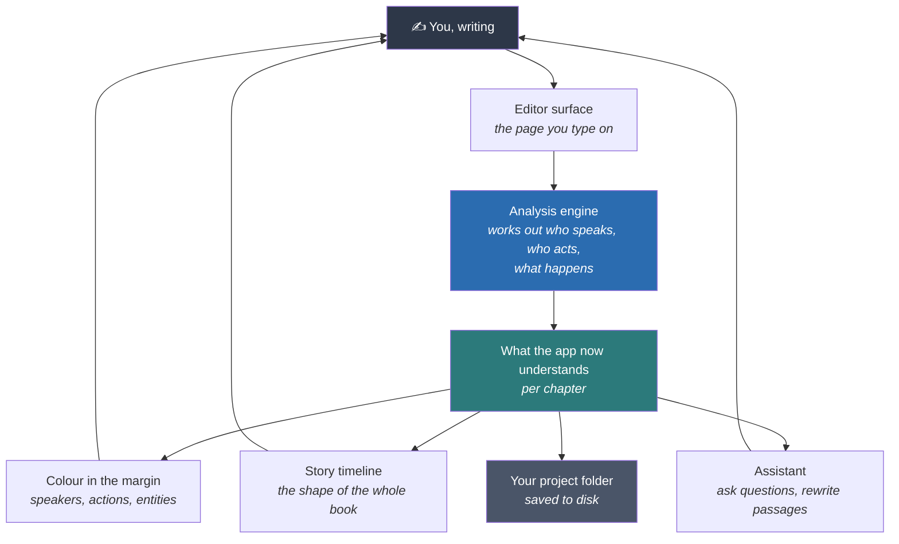
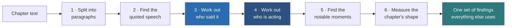
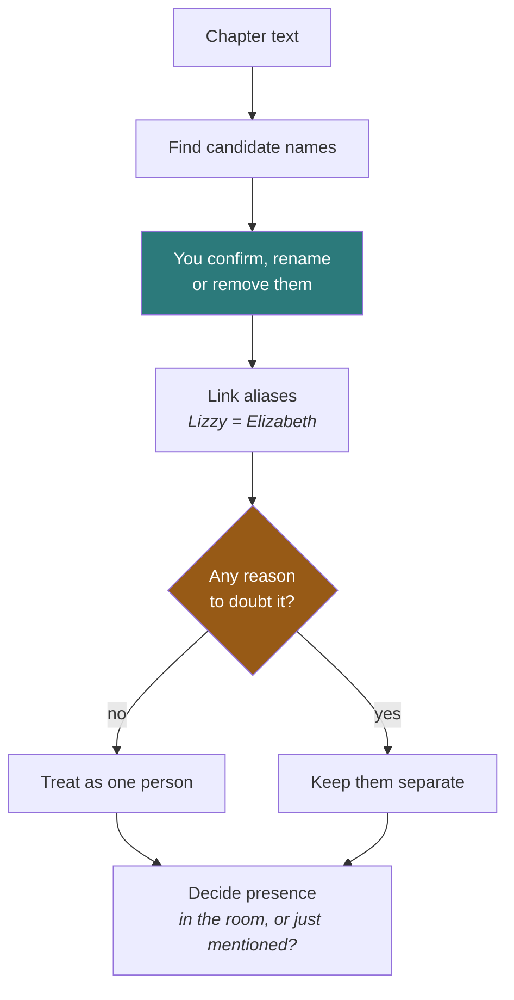
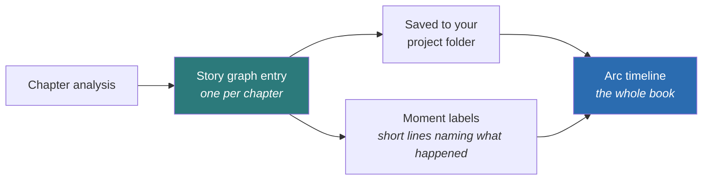
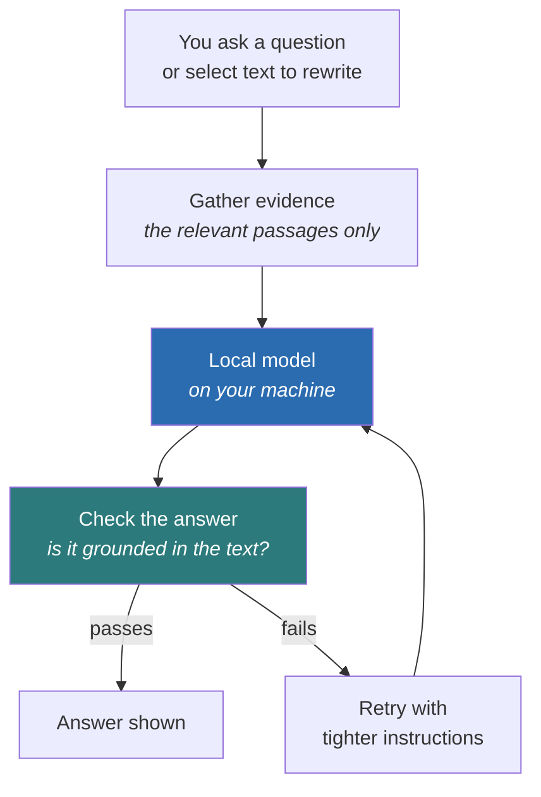
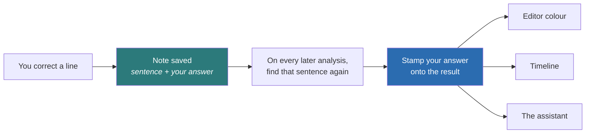
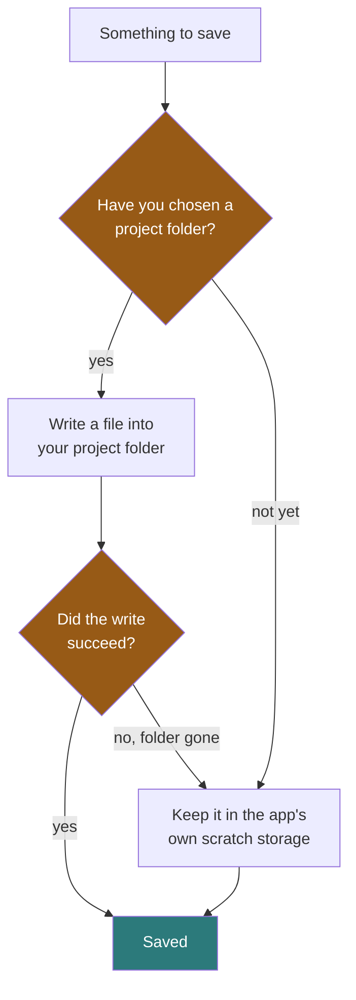

# Latent Write

**A novel-writing desk that keeps track of who is speaking, who is doing what,
and what shape your story is in, entirely on your own computer.**

You write. While you write, the app works out who is speaking each line, who is
performing each action, which characters are actually present in a scene, what
the notable moments are, and how tension rises and falls across the book. It
shows you that as colour in the margin, a timeline of the whole story, and an
assistant you can ask questions of.

### Where your manuscript goes

Your book stays on your machine. There is no account, no server, and nothing is
uploaded. The folder you choose holds your prose as an ordinary text file that
any program can open.

One exception, stated plainly because it is the thing worth being careful about.
There is a separate optional workspace that talks to Anthropic's Claude service,
and text you put in it does leave your computer. It is **off until you set it up
yourself** with your own account, it is **not used for any of the analysis**
described on this page, and everything else keeps working if you never touch it.
It is described in [The four levels of "AI"](#the-four-levels-of-ai-in-this-app).

> **Status.** Version 0.1.0, and there is no installer yet. Today it runs from
> source, which realistically means a developer sets it up. If you are a writer
> evaluating this, read on for what it does, but know that the
> [Quick start](#quick-start) is not yet a door you can walk through.

> Built with React (an interface library), TypeScript, Vite and Electron
> (the toolkit that turns a web app into a desktop program). The project is
> called **Latent Write**; its source folder is named `glass-editor`.

---

## Contents

- [Who this is for](#who-this-is-for)
- [Practical questions, answered first](#practical-questions-answered-first)
- [Quick start](#quick-start)
- [The whole system in one picture](#the-whole-system-in-one-picture)
- [How a chapter becomes understanding](#how-a-chapter-becomes-understanding)
- [The systems, one at a time](#the-systems-one-at-a-time)
  - [1. Reading the manuscript](#1-reading-the-manuscript)
  - [2. Knowing the cast](#2-knowing-the-cast)
  - [3. Showing the shape of the story](#3-showing-the-shape-of-the-story)
  - [4. Helping you write](#4-helping-you-write)
  - [5. Correcting the app when it is wrong](#5-correcting-the-app-when-it-is-wrong)
  - [6. The glass look](#6-the-glass-look)
  - [7. Keeping your work](#7-keeping-your-work)
- [The four levels of "AI" in this app](#the-four-levels-of-ai-in-this-app)
- [How we know it works](#how-we-know-it-works)
- [Is any of it paid?](#is-any-of-it-paid)
- [Project layout](#project-layout)
- [Command reference](#command-reference)
- [Going deeper](#going-deeper)

---

## Who this is for

**Writers** working on long fiction, who want the machine to keep track of the
things that are tedious to hold in your head across two hundred thousand words,
without handing the book to a company.

**Engineers** joining the project. Everything below is plain-language on
purpose, but nothing is softened. Measured numbers are given with their
weaknesses attached, file paths are real, and the honest failure cases are in
[How we know it works](#how-we-know-it-works). For the implementation-level map,
read [`ARCHITECTURE.md`](./ARCHITECTURE.md) after this.

---

## Practical questions, answered first

Things a writer needs to know before anything else. Short answers, no hedging.

**How do I get my book in?** Import a plain text file (`.txt`). Chapters are
recognised from the text itself. There is no Word or Scrivener import today, so
you would export to text first.

**How do I get my book out?** It is never locked in. Inside your project folder
your prose sits in a file called `novel.txt`, which is ordinary text you can open
in anything, on any machine, with or without this app. Everything the app works
out is kept in *separate* small files alongside it, so the worst case, this
project disappearing tomorrow, still leaves you with your manuscript intact.
There is also a text export and a formatted PDF export.

**Does it run on Windows?** Unproven. Development and all measurements are on
macOS with Apple Silicon. The code has no Mac-only dependency and the
technologies used are cross-platform, but no Windows build has been produced or
tested, so treat it as unknown rather than supported.

**Does it slow down on a long book?** Analysis is per chapter and does not
re-read the whole book, so chapter thirty costs the same as chapter three.
Measured, it grows in a straight line with chapter length rather than
accelerating. What has *not* been measured is the timeline view with ninety
chapters in it, so that is an honest unknown.

**Can I turn the colour off?** Yes. Analysis has an off switch, and turning it
off leaves you with a plain writing surface.

**How stable is it?** Version 0.1.0. Treat it as early. Keep backups of your
manuscript, as you would with any tool at this stage.

**What does the optional download cost me?** Nothing in money. It is about
1.1 GB for the smaller language model, or 2.5 GB for the larger one. Both are
optional and the app is fully usable without either.

---

## Quick start

> This section is for developers. If you are here as a writer, skip to
> [The whole system in one picture](#the-whole-system-in-one-picture).

```bash
npm install            # fetch dependencies
npm run dev            # run in a browser, for fast iteration
npm run electron:dev   # run the real desktop app
```

To produce a build:

```bash
npm run build
npm run electron:build
```

The app works immediately with no model downloads. The optional local language
model is offered later, and declining it reduces how deeply the app can answer
questions. It never leaves you with a wrong answer that a model was meant to
fix. That guarantee is explained in
[The four levels of "AI"](#the-four-levels-of-ai-in-this-app).

---

## The whole system in one picture



Text flows down the page. Understanding flows back up to you at the bottom.

The important thing here is the **loop**. This is not a process that ends in a
report. Everything the app works out is handed back to you while you are still
writing, and anything you correct goes straight back in.

---

## How a chapter becomes understanding

This is the single most important process in the app, so it is worth walking
through slowly. It runs every time you stop typing for a moment.



**Step 1, split into paragraphs.** Ordinary text splitting, but it is the unit
everything else counts in.

**Step 2, find the quoted speech.** Locate every stretch of dialogue, including
the awkward ones. Quotes left deliberately unclosed across a paragraph break,
quotes inside quotes, and quoted phrases that are not speech at all, such as a
character reading a sign.

**Step 3, work out who said it.** The hard part, and the heart of the app. When
the text says `"Go now," said Mara`, it is easy. Most dialogue in real fiction
does not say that. The engine works through progressively weaker evidence:

| Evidence | Example |
|---|---|
| An explicit tag | `"Go now," said Mara.` |
| A name in the surrounding action | `Mara set down the lamp. "Go now."` |
| A name being spoken to | `"Go now, Theo."` (so the speaker is *not* Theo) |
| Alternation | two people talking, turns swapping predictably |
| Recency | who spoke most recently, decaying as the scene moves on |
| Pronoun agreement | `she said` rules out the men in the room |

Each candidate gets a score, and the winner also gets a **confidence**. Be
precise about what that word means here, because it is easy to over-read. It
measures how far ahead the winner finished, not how likely it is to be right.
Two poor guesses can be far apart. So a pale colour means "these candidates were
close, look at this one", not "this is probably wrong", and a strong colour
means the engine was decisive rather than correct. Low confidence is never
hidden. It shows as a paler colour and as a "needs review" count.

**Step 4, work out who is acting.** The same question for actions rather than
speech, as in *who* lit the lantern. This step **reads the results of step 3**
and is not independent of it. Quoted stretches are excluded from being actions,
confident speakers are added to the pool of possible actors, and the current
speaker becomes the assumed subject for a following sentence that only says
"he" or "she". That coupling is deliberate and worth a lot of accuracy, but it
means **a wrong speaker can carry into a wrong actor**. The debug panel says so
out loud.

**Step 5, find the notable moments.** A separate engine looks for events worth
putting on a timeline, such as a decision, a revelation, an arrival or a turn in
the argument. It writes each one as a short label naming who did it.

**Step 6, measure the chapter's shape.** Dialogue density, pacing, tension rise
and fall, which characters dominate. This is what the timeline draws.

All six steps run out of the way of the page you are typing on, so your typing
never stutters, and they wait for you to pause rather than running again on
every keystroke.

### Fast first, then better

The app does not make you choose an accuracy setting. It runs the **fast** pass
immediately so the page has colour right away, and then, if you stay still for
about 1.6 seconds, it quietly re-runs at the **high** setting and replaces the
answer with the better one.

This replaced an older design that tried to guess the right setting up front by
skimming the chapter. That guess could land on a weaker setting and you would
never know it had. Converging removes the guess. It does not make the engine
right, it just means you always end on the best answer the engine has, rather
than on whichever one a prediction picked for you.

---

## The systems, one at a time

### 1. Reading the manuscript

**What it is for.** Turning prose into structured facts, with no model and no
network, so the core of the app is free, instant and private.

**How it works.** Everything in the walkthrough above lives here, and none of it
uses a learned model. It runs on four kinds of ordinary rule:

- **Text patterns.** Recipes that match shapes in the text, such as "a closing
  quote mark, then a comma, then the word *said*, then a capitalised word".
- **Word shape.** Whether a word is capitalised mid-sentence, whether it is
  possessive, whether it looks like a surname.
- **Position.** Where a word sits changes what it does. The name in `"Go now,
  Theo."` is being *spoken to*, so Theo is the one person who cannot be
  speaking. The same name outside the quotes would mean the opposite.
- **Counting.** How often each character speaks, how recently, how the scene
  has been alternating.

**What to know as a user.** The colour in your margin is this engine's opinion.
Paler colour means it is less sure. If it is wrong you can correct it, and the
correction sticks to that line forever (see
[Correcting the app](#5-correcting-the-app-when-it-is-wrong)).

**Honest limits, with both numbers.** On ordinary dialogue that carries a tag
like `said Mara`, the engine is right **86%** of the time at its normal setting
and **100%** on the curated test cases. On dialogue where the tag has been
deliberately deleted and the speaker must be recovered from context alone,
across fifteen books, it is right about **52%** of the time.

Most of a real novel sits between those two numbers, nearer the top of the
range, because most dialogue carries some attribution. The 52% is the figure to
hold on to anyway, since it is the one measured on books the engine was never
tuned against. Both are explained in
[How we know it works](#how-we-know-it-works).

---

### 2. Knowing the cast

**What it is for.** Working out who the characters are, which names refer to the
same person, and who is actually present in a scene.

**How it works, in three parts.**



**Finding names.** The app extracts candidate character names from the prose,
and you can confirm, rename or remove them in the world panel. Your version
always wins over the guess.

**Linking aliases.** "Elizabeth", "Lizzy" and "Miss Bennet" are one person. The
app proposes links but is deliberately timid about it, because a wrong merge
corrupts every count downstream and is very hard to notice. It only ever links
a name to one confirmed main name, never chains links together, and several
signals can veto a merge outright.

**Presence versus mention.** A character being *talked about* is not the same as
a character being *in the room*, and treating them as the same thing makes the cast list wrong.
The app decides about **90%** of these cases with rules alone and asks the local
model only about the genuinely ambiguous remainder.

---

### 3. Showing the shape of the story

**What it is for.** Letting you see a whole book at once, which is the thing
that is impossible to hold in your head.

**How it works.** Each analysed chapter is condensed into a **story graph entry**
(a small summary record) holding its characters, notable events, tension curve
and role in the arc. Those entries stack into a timeline.



The timeline draws a spine that rises with tension, marks each chapter, shows
which characters carry which stretches of the book, and lets you jump straight
to the sentence behind any event.

**What to know as a user.** The timeline is built as you visit chapters, and it
is **saved**, so it is still there when you reopen the app. Revisiting a chapter
refreshes its entry.

**Honest limits.** Of the four events shown per chapter, fewer than half match
a hand-annotated gold standard. This is recorded as a **currently failing test**
rather than quietly rounded up.

---

### 4. Helping you write

**What it is for.** Answering questions about your own book, and rewriting
passages on request, without the manuscript leaving the machine.

**How it works.** An optional local language model (a small AI that runs on your
own computer) is downloaded once, on your say-so, and verified against a known
fingerprint, so a tampered or corrupted download is refused. Two sizes
exist, a small fast one and a larger, slower one that
"thinks" before answering.



Two design rules matter here:

**The model is given windows, never the whole book.** Tasks ship roughly 110 to
140 characters of context around the thing in question. This keeps answers about
what the sentences actually say rather than what the model half-remembers.

**Answers are checked, not trusted.** A verifier looks at whether the answer is
actually supported by the passage it was given. A failed check triggers a retry
with tighter instructions, rather than showing you a confident wrong answer.

Background jobs such as summarising a chapter go to a second copy of the engine
that can work on several of them at once, so they do not queue behind whatever
you just asked.

On Apple Silicon Macs the model runs on the graphics chip rather than the main
processor. Measured, that makes it about five times faster at taking your text
in and twice as fast at producing an answer. Both of those describe the
machine's speed, not yours.

---

### 5. Correcting the app when it is wrong

**What it is for.** When the app says Mara and you know it is Theo, you fix it,
and the fix holds.

**How it works.** Clicking a highlighted line opens a small panel. You pick the
right character and confirm. The app writes a note recording the sentence
itself, the text either side of it and your answer.



**Two properties, and you can judge them.**

**Your correction changes that line and nothing else.** It does not nudge the
engine's opinion elsewhere in the book. This is deliberate. An earlier design
did try to learn from corrections, and it was measured making things *worse*:
ten corrections changed 115 unrelated attributions across one book, because a
list of corrections is a record of where the engine *fails*, not a description
of who speaks most. Feeding that back in amplified the app's own blind spots.

**The correction follows the sentence, not a line number.** If you later insert
two paragraphs above it, the note moves with its sentence. If you delete the
sentence, the note is dropped rather than landing on an innocent neighbour.

**What to know as a user.** The trade is real and worth stating. Because a
correction is a fact about one line, fixing a hard line in chapter 3 does not
fix a similar line in chapter 9. You would correct that one too.

---

### 6. The glass look

**What it is for.** A writing surface that feels like a physical object rather
than a form, without costing you frames while you type.

**How it works.** Panels blur and bend whatever sits behind them, the way real
frosted glass does. Most of that uses the browser's built-in effects. A few
parts are drawn by hand instead, because the built-in blur produces visible
stripes across large soft shadows, and once you have seen them you cannot
unsee them.

The rule underneath all of it is that **the page you are typing on always wins**.
An effect that costs too much is quietly simplified rather than allowed to make
the app stutter. Heavy background work is deliberately cut into small pieces so
the screen can keep refreshing between them, which costs a few percent of
background speed and buys visibly smoother scrolling.

---

### 7. Keeping your work

**What it is for.** Making sure that closing the app loses nothing.

**How it works.** Once you have chosen a project folder, each kind of
information is written to its own small file inside it, next to your `novel.txt`.
Until you choose one, the app is working on an unsaved draft and keeps
everything in its own internal scratch storage instead. It works out which of
the two applies before every single save.



| What is saved | Holds |
|---|---|
| Novel | chapters, metadata, world data |
| Story graph | per-chapter timeline entries |
| Annotations | your corrections |
| Knowledge notes | facts the app worked out about your world, and whether you accepted or dismissed each one |
| Reviews | prose-review results |
| Assistant answers | model answers, keyed to the exact text they were about |

**Two rules keep this honest.**

Anything the app worked out is stamped with the exact text it was worked out
from. Edit that chapter and the old conclusion is thrown away whole rather than
half-updated, because a conclusion about prose you have since rewritten is not
partly true, it is wrong.

And if a save is ever refused, the data goes to the scratch storage instead of
being dropped. That rule exists because this app genuinely had the bug. If you
had not yet chosen a project folder, every save was being sent to a folder that
was not there, and nothing checked whether it had worked. The result was that
your timeline was rebuilt beautifully all session and was blank again every
time you reopened the app.

---

## The four levels of "AI" in this app

The word "AI" covers four unrelated things here, with different costs, different
failure modes and different privacy properties. **Most of the app is level 1.**

| | What it is | Where it runs | What it costs you |
|---|---|---|---|
| **1. Plain rules** | Text patterns, word shapes, grammar position, counting. No model at all. | Background thread on your machine | Nothing, and it is instant |
| **2. Local embeddings** | A small maths model for judging similarity between passages. | Your machine | Bundled in the app |
| **3. Local language model** | Qwen3, in a 1.1 GB or a 2.5 GB version, checked against a known fingerprint, and required to answer in a fixed format. | Your machine, separate process | One optional download |
| **4. Cloud Claude** | Anthropic's Claude, used only inside the separate renderer workspace. | Anthropic's servers | Your own Anthropic account and its charges |

**Levels 1 to 3 all run on your machine and send nothing anywhere. Level 4 is
the only one that leaves your computer**, it is a separate workspace you have to
go and set up with your own Anthropic account, and none of the analysis on this
page uses it. If you never open it, it never runs.

Three rules hold across all four, and they are the reason the app is usable
without any of the optional parts:

**The rule-based answer is always first-class.** Every local-model task is an
*improvement on* an answer that level 1 already produced. Turning the model off,
or never downloading it, reduces depth. It never leaves you with something
wrong that a model was supposed to fix.

**The model judges, it does not invent.** Each task hands the model a short list
of candidates the rules already found, plus the exact sentences involved, and
takes back one choice. A bad model answer can cost you a mark. It cannot
conjure a character who is not there.

**The model sees windows, never the manuscript.** Small snippets around the
thing in question, never the book.

---

## How we know it works

Every engine has a **suite** (a pass-or-fail gate) and most also have a **probe**
(a script that measures something and prints it for a human to read). Both are
kept, because a gate tells you nothing broke and a probe tells you how well it
actually does.

### Measured accuracy

Numbers from live runs in this repository, not from comments.

Four words are used throughout, so they are worth defining once.

- A **gold set** is a set of passages a human marked up by hand, treated as the
  right answer.
- **Precision** is how often the app is right when it says something. High
  precision means few false alarms.
- **Recall** is how much of the real thing it found at all. High recall means
  few misses. The two trade against each other, which is why both are shown.
- **precision@4** is precision counting only the four events the timeline
  actually puts on screen, rather than everything the engine found. It is the
  number that matches what you would see.

| Engine | Benchmark | Result |
|---|---|---|
| Speech attribution | curated cases, 217 expectations | fast **80%** · default **86%** · high **100%** |
| Speech attribution | **tag deleted**, 786 lines, 15 books | fast **51.5%** · default **52.0%** · high **52.9%** |
| Narrative events | gold set, ±1 paragraph | precision **30.6%** · major recall **43.3%** |
| Narrative events | what the timeline actually shows | precision@4 **46.2%** |
| Event labels | gold set | well-formed **100%** · names an agent **86.5%** |
| Character presence | 246 marks, 67 chapters | **90%** decided by rules alone |
| Presence review (model) | the 7 cases rules would not decide | 4 answered correctly, 3 declined, **0 answered wrongly** |
| Alias linking | 47 characters, 6 books | 8 proposals, **8 correct, 0 wrong merges** |
| Local prose review | 8 patterns, 120 expectations | **100%** recall and precision |

**The two speech numbers are the most important thing on this page.** The
curated suite is hand-written cases, and scoring 100% on examples you wrote
yourself is a weak signal, because it can be tuned against. The second
benchmark deletes the dialogue tag and forces recovery from context alone across
fifteen books, eight of them never used during development. **52% is the honest
number.** The same caution applies to the 100% on prose review, whose eight
patterns were written alongside the detectors that find them.

### A test that is currently failing, on purpose

```
FAIL  precision@4 (what is SHOWN)  46.2%  target ≥ 48%
```

The timeline shows four events per chapter and fewer than half are gold events.
It is recorded here rather than hidden, and every other gate in that suite
passes.

### Proving that a cleanup changed nothing

`scripts/fingerprint-analysis.ts` hashes about 93,000 facts (every speaker,
action, event and statistic) across seven books at three settings. A change that
is supposed to be invisible must produce an identical hash. An accuracy score
staying still is not the same proof, because a change can trade two errors for
two different errors and keep the score.

---

## Project layout

> **Everything from here on is for developers.** If you came to understand what
> the app does, you have read it. Thank you for getting this far.

```
src/
  App.tsx              the shell: state, effects, wiring
  components/          editor, highlight layer, panels, timeline, popovers
  lib/
    speech-detect.ts       who is speaking          (the core engine)
    action-detect.ts       who is acting
    narrative-events.ts    what happens
    chapter-analysis.ts    chapter shape and tension
    annotation-pins.ts     your corrections, pinned to their sentence
    story-graph.ts         per-chapter timeline entries
    world-data.ts          characters, places, aliases
    project-manager.ts     where state gets saved
electron/
  assistant.cjs          local model runtime
  assistant-sidecar.cjs  batch engine for background jobs
  project-fs.cjs         reading and writing the project folder
scripts/                 every suite, probe and verification harness
plans/                   design records and measured findings
```

### Where to start reading

| If you want to understand | Start with |
|---|---|
| How speaker attribution works | `src/lib/speech-detect.ts` |
| How the app is wired together | `ARCHITECTURE.md` |
| Why a design is the way it is | `plans/` |
| What is known to be weak | this page, plus `plans/system-audit-2026-08.md` |

---

## Command reference

```bash
# Run
npm run dev                                   # browser build
npm run electron:dev                          # desktop app
npm run build && npm run electron:build       # installable build

# Accuracy suites
npx tsx scripts/accuracy-suite.ts             # speech attribution, curated
npx tsx scripts/test-masked-attribution.ts    # speech attribution, tag deleted
npm run test:event-detect                     # events vs the gold set
npx tsx scripts/test-character-presence.ts    # presence vs mention
npx tsx scripts/test-alias-propose.ts         # alias linking and its vetoes
npx tsx scripts/scan-accuracy-suite.ts        # local prose-review patterns

# Behaviour gates
npx tsx scripts/verify-annotation-pins.ts     # corrections stick, and touch nothing else
npx tsx scripts/verify-state-persistence.ts   # nothing is lost on close
npx tsx scripts/fingerprint-analysis.ts --check   # output is byte-identical

# Drift audits, on books never used in development
npm run audit:ood
npm run audit:ood-events

# Visual checks against the real components (needs `npm run dev`)
electron scripts/verify-timeline-cast.cjs
electron scripts/verify-alias-ui.cjs

# Local-model tasks (skip cleanly when the model is not downloaded)
electron scripts/verify-assistant-tasks.cjs
```

---

## Is any of it paid?

Not today. The code contains a tier map (`src/lib/features.ts`) that marks a few
features as "pro", and a plan for what a paid tier might eventually be, but
**nothing is currently gated**. Every feature described on this page is
available, and the check that would enforce a tier is not called from anywhere.

Two things are worth stating plainly because they will not change. The
rule-based engines are never gated, so the app's understanding of your
manuscript is not a paid feature. And nothing is enforced by a server, because
there is no server.

---

## Going deeper

| Document | What it holds |
|---|---|
| [`ARCHITECTURE.md`](./ARCHITECTURE.md) | The implementation map: modules, seams, what runs when |
| [`plans/`](./plans/) | Design records, measurements and the reasoning behind each decision |
| [`plans/system-audit-2026-08.md`](./plans/system-audit-2026-08.md) | A read-only survey of what is weak, stale or risky |
| [`UPGRADE-LOG.md`](./UPGRADE-LOG.md) | What changed, and why |

---

## A note on how this project works

Two habits show up everywhere in this repository and explain a lot of the code
you will read.

**Measure before claiming.** Optimisations that did not move a number were
reverted rather than shipped. Accuracy figures are given alongside the benchmark
that makes them look worst.

**Record what was tried and rejected.** The `plans/` directory holds the
experiments that failed as well as the ones that shipped, because the most
expensive mistake is re-running an experiment someone already disproved.
