# Glass Editor

Glass Editor (ships as **Latent Write**) is a desktop-first novel writing workspace built with React, TypeScript, Vite, and Electron. It combines a live writing surface with chapter analysis, world-data extraction, adaptive annotation feedback, story-graph generation, fullscreen timeline views, renderer-style prose review, and export tooling.

Everything that reads the manuscript runs **on the writer's machine**. There is no server, and no chapter text leaves the app unless the writer explicitly opens the cloud-backed renderer workspace.

## Running The App

```bash
npm install
npm run dev
```

Useful commands:

```bash
npm run build
npm run electron:dev
npm run electron:build
```

Verification. Every engine in this app has a suite, and most have a *probe* as
well — a suite gates behaviour, a probe measures it and prints output for
reading. Both are load-bearing; see "How This Repo Measures Itself" below.

```bash
npx tsx scripts/accuracy-suite.ts             # speech attribution, curated cases
npx tsx scripts/test-masked-attribution.ts    # speech attribution, tag deleted
npm run test:event-detect                     # events vs the hand-annotated gold set
npx tsx scripts/test-character-presence.ts    # presence vs evocation
npx tsx scripts/test-alias-propose.ts         # alias linking and its vetoes
npx tsx scripts/scan-accuracy-suite.ts        # local prose-review patterns
npm run audit:ood                             # language/register drift, held-out books
npm run audit:ood-events                      # events, label-free, over whole manuscripts

# Visual, on the REAL components (needs `npm run dev` on :5178)
electron scripts/verify-timeline-cast.cjs     # cast ledger; THEME=dark for the other scheme
electron scripts/verify-alias-ui.cjs          # alias suggestions in the world overlay

# Local-model tasks (needs the model on disk; SKIPs cleanly without it)
electron scripts/verify-assistant-tasks.cjs
electron scripts/probe-presence-review.cjs
electron scripts/probe-alias-review.cjs
```

## The Four Model Layers

The word "AI" covers four completely different things in this codebase, with
different costs, different failure modes and different privacy properties. Most
of the app is layer 1.

| | What it is | Where it runs | Cost to the user |
|---|---|---|---|
| **1. Deterministic NLP** | Regex, morphology, positional grammar, frequency statistics. No model at all. | Web Worker + main thread | Free, instant |
| **2. Local embeddings** | MiniLM via `@xenova/transformers`. Similarity, dedup, salience pruning. | Electron main process, or WASM in the browser | Bundled |
| **3. Local chat model** | Qwen3-1.7B-Q4_K_M (Apache-2.0, 1.1 GB, sha256-verified), grammar-constrained JSON only. | Electron `utilityProcess` | Opt-in download |
| **4. Cloud Claude** | The `claude` CLI, spawned as a subprocess. Renderer workspace only. | The user's own machine, the user's own key | Their API bill |

Three rules hold across the whole app and are worth stating once:

- **★ THE DETERMINISTIC ANSWER IS ALWAYS FIRST-CLASS.** Every layer-3 task is an
  increment on an answer layer 1 already produced. Turning the model off, or
  never downloading it, degrades *depth* — never *correctness*. There is no
  surface whose free behaviour is wrong-and-waiting-to-be-fixed by a model.
- **★ LAYER 3 NEVER GENERATES; IT JUDGES.** Every task hands the model a small
  set of candidates the deterministic engine produced, plus verbatim evidence,
  and takes back one label. This is the blocking → verification split that
  entity-resolution practice settled on, and it is why a bad model answer can
  cost a mark but can never invent one.
- **★ THE MODEL SEES WINDOWS, NEVER THE MANUSCRIPT.** Tasks ship ±110–140
  character snippets around the thing in question. That keeps answers about
  what the sentences *do* rather than about whatever the model half-remembers
  of the book.

## Architecture

This section is organized in two layers:

1. A full-system overview showing how the major subsystems connect.
2. Per-system internal diagrams with input channels, output channels, performance paths, and current bottlenecks.

### Full Overview

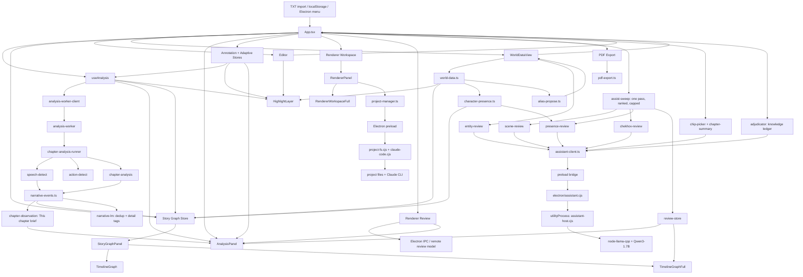

### Data Ownership Summary

- `App.tsx` is the orchestration root. It owns novel state, chapter selection, preferences, annotation/adaptive stores, story graph, review results, and overlay visibility.
- `Editor` is the live typing surface. It only owns local UI concerns such as sizing, caret tracking, and paragraph-scoped live highlight behavior.
- `useAnalysis` owns current-chapter analysis, stale-cache reuse, worker dispatch, and high-mode adjacent pre-analysis.
- `world-data.ts` owns entity extraction, name resolution, and rename utilities.
- `narrative-events.ts` owns event detection: it decides what happens in a chapter, at clause granularity, and generates each event's label from the clause that triggered it. It replaced `event-detect.ts`, which is retained only so the suites can score against it.
- `chapter-observation.ts` owns the "This chapter" brief above the widgets — a lead line built from the detected events plus up to three anchored facts, each from a different dimension.
- `story-graph.ts` owns persisted chapter graph entries and the asynchronous LM pass. That pass does semantic dedup and detail tags; it deliberately no longer relabels (see System 9).
- `StoryGraphPanel` and `TimelineGraphFull` are presentation layers over precomputed graph/timeline data.
- `RendererPanel` owns renderer chat presentation, slash-command routing, project-backed message persistence, and the bridge into the fullscreen renderer workspace.
- `project-manager.ts` is the typed renderer-side gateway to Electron project filesystem handlers and Claude session status/streaming.
- `character-presence.ts` owns the presence/evocation classification: whether a named character is on the page, speaking, or being talked about while elsewhere. It writes `charactersPresent` and `entry.presence`; it declares `uncertain` rather than guessing.
- `alias-propose.ts` owns alias and duplicate-entry proposals. It never writes to `worldData` — `WorldDataView` applies what the writer confirms.
- `assist-sweep.ts` owns the ONE background model pass per chapter, its fixed task order and its hard budget.
- `review-store.ts` owns every model answer and, critically, the record of every question ASKED — including the ones that came back unusable.
- `assistant-client.ts` is the renderer-side gateway to the local model; `electron/assistant.cjs` owns the model file, the child process and the memory guard.

## System 1: App Shell And State Orchestration

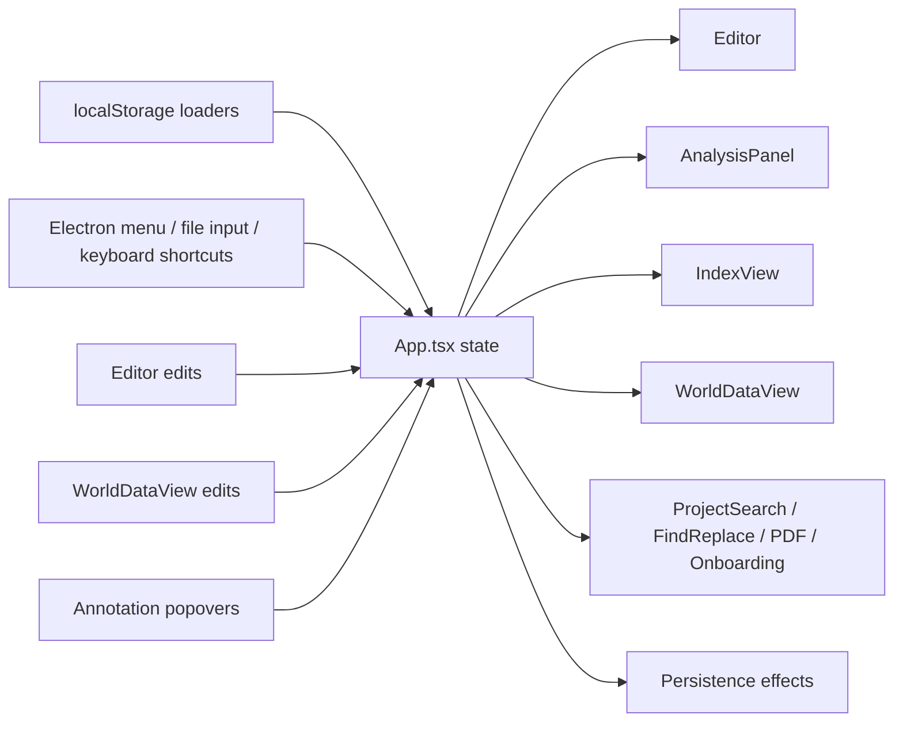

### Input Channels

- Novel content loaded from `storage.ts`.
- Current chapter id loaded from `storage.ts`.
- Preferences loaded from `preferences.ts`.
- Story graph loaded from `story-graph.ts` localStorage helpers.
- Review results loaded from `renderer-review.ts` localStorage helpers.
- Annotation store loaded from `annotation-store.ts`.
- Adaptive store loaded from `adaptive-store.ts`.
- Electron menu commands, keyboard shortcuts, import/export actions.

### Output Channels

- Feeds `Editor`, `AnalysisPanel`, `WorldDataView`, overlays, and toolbars.
- Persists novel, chapter id, preferences, story graph, review results, annotations, and adaptive models.
- Pushes renamed entities back through chapter/book rename operations.

### Performance Paths

- Chapter edits update the active chapter and fan out into editor, analysis, and story-graph maintenance.
- Analysis settle events can update story graph entries and review surfaces.
- World-data edits can invalidate name resolution, timelines, and entity highlighting.

### Current Bottlenecks

- Any unstable prop passed from `App.tsx` into large children can reintroduce broad rerender churn.
- Large localStorage payloads remain sensitive to quota and serialization cost if prediction logs become too verbose.
- Story-graph maintenance is already deferred, but still fans out to multiple widgets after analysis settles.

## System 2: Editor And Highlight Layer

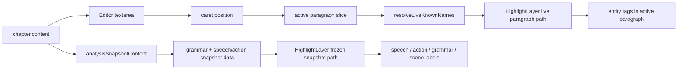

### Input Channels

- Current chapter text from `App.tsx`.
- Analysis snapshot from `useAnalysis`.
- Known names from `useAnalysis` / world data.
- Annotation overrides and prediction traces from the annotation/adaptive layer.

### Output Channels

- Textarea edit events back to `App.tsx`.
- Live visual output through `HighlightLayer`.
- Entity click anchors into `EntityPopover`.
- Speech/action annotation clicks into `AnnotationPopover`.

### Performance Paths

- The live path only resolves names inside the paragraph under the caret.
- Grammar, speech, and action rendering stay on the settled snapshot path.
- Highlight overlay stays mounted to avoid compositor flips while typing.

### Current Bottlenecks

- Extremely long single paragraphs still cost more than average because the live path is paragraph-scoped, not token-scoped.
- Snapshot path still has to build rich markup for all analyzed paragraphs once analysis settles.
- Grammar remains intentionally excluded from the per-keystroke path because it is not cheap enough for live typing.

## System 3: Chapter Analysis Pipeline

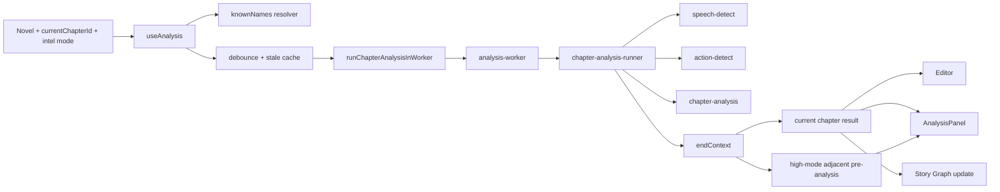

### Input Channels

- Current chapter text.
- Previous analyzed chapter end-context.
- Sibling chapter stats from cached analyses.
- Resolved names from `world-data.ts`.
- Intelligence level (`low`, `default`, `high`, or auto-resolved).
- Optional learned bias and adaptive inference context.

### Output Channels

- `ChapterAnalysisResult` for the current chapter.
- `prevResult` and `nextResult` for cross-chapter widgets.
- Snapshot data for `Editor` and `HighlightLayer`.
- Source material for story-graph chapter entries.

### Performance Paths

- Current chapter analysis runs in a worker-backed path with main-thread fallback.
- High mode also idle-schedules adjacent chapter pre-analysis.
- Stale cached results are shown immediately while fresh analysis recomputes.

### Current Bottlenecks

- High mode is materially heavier than the other modes on long chapters.
- Adjacent pre-analysis still consumes background time in high mode even though it is chunked and idle-scheduled.
- Without world data, known-name fallback extraction remains more expensive than the world-aware path.

### Tension Curve — Fixed Defect, Recorded

`analyzeChapter` reduces per-paragraph tension to ≤30 buckets. It used to
**point-sample** one paragraph per bucket, which over 40 chapters longer than 30
paragraphs discarded **49.1%** of all paragraphs, missed the chapter's real
maximum in **15%** of chapters, and — because every paragraph-number claim in the
UI was made by inverting that curve — named a paragraph that was not actually at
the chapter's peak in **47.5%** of cases.

Two changes: buckets now **aggregate** (peak level lost 15.0% → 0.0%), and a new
`analysis.peakParagraph` locates the peak from the **full** signal, tie-broken to
the middle of the longest run at the chapter maximum (off-peak 47.5% → **0.0%**).

Read `analysis.peakParagraph`. Do not invert `tensionCurve` to find a paragraph —
tension is a three-level ordinal, so its peak is usually a tie across many
paragraphs and a bucket index maps back to a bucket *centre*.

### Observed Timing Profile

From `scripts/test-analysis-responsiveness.ts` on the current codebase:

- Low: ~44.45ms average across sampled chapters.
- Default: ~58.13ms average.
- High: ~214.73ms average.
- High mode is roughly 4.83x the cost of low mode on the sampled set.

## System 4: World Data And Entity Scan

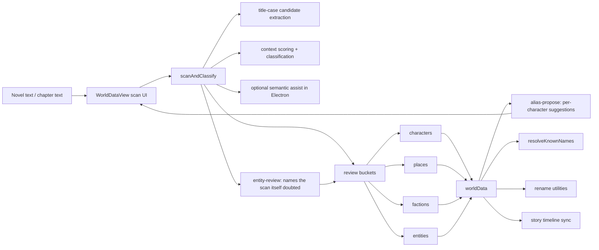

### Input Channels

- Full novel or chapter text.
- Existing world data.
- Optional adaptive context for prediction traces and feedback.
- Manual edits from `WorldDataView`.

### Output Channels

- Structured `worldData` buckets.
- Name list used by the highlight layer and speech detection.
- Rename operations across chapter or whole-book text.
- Character aliases and canonical names used by the story timeline.

### Performance Paths

- Heuristic entity extraction runs in batches with main-thread yielding.
- Semantic assist is hard-disabled outside Electron.
- Live highlight path uses `resolveLiveKnownNames`, not the full scan pipeline.

### Current Bottlenecks

- Whole-book scans on very large novels are still expensive even without semantic assist.
- Semantic assist remains runtime-gated and cannot be used in plain Vite/web dev.
- Moving entries between buckets is cheap, but rescans remain the dominant cost.

## System 5: Story Graph And Timeline Stack

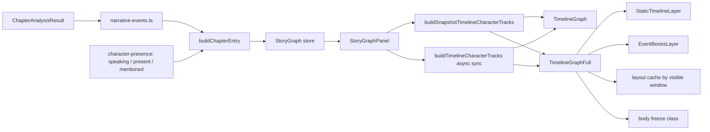

### What A Graph Entry Holds

Beyond role, tension curve, word count and `majorEvents`, an entry carries:

- `charactersPresent` — characters actually ON THE PAGE. This used to mean
  "named anywhere in the chapter", which put a woman three counties away in the
  same list as the man arguing in the room.
- `presence` — the full per-character classification, evocation included.
  Optional: entries written before the classifier existed carry none, and every
  display consumer must treat that as "unclassified", never as "absent".
- `chipPicks` — the ranks the model promoted for the timeline, if it was asked.

### Input Channels

- Chapter analysis results.
- `worldData` character names and aliases.
- Chapter metadata and current chapter id.
- Optional LM pass for semantic dedup and detail tags. It does **not** relabel.

### Output Channels

- Compact side-panel timeline, with per-event position ticks on the tension bar.
- Fullscreen timeline overlay.
- Hover text on every event chip in both views: type, salience, paragraph,
  confidence, and the **source clause**.
- Top-character chips and chapter navigation clicks.
- Stored story graph entries in localStorage.

### Performance Paths

- Story graph entries are updated after analysis settles, not on every keystroke.
- Timeline tracks use snapshot-first rendering, then asynchronous world-aware sync.
- Fullscreen timeline now splits into a static layer and a dynamic event-detail layer.
- Event box layouts are cached by visible chapter window.
- Opening the fullscreen overlay freezes background glass/backdrop work behind it.

### Current Bottlenecks

- Event-chip collision layout is still main-thread work.
- A 170-chapter timeline can still be limited by SVG text and chip density if the visible detail window becomes very busy.
- The LM pass is asynchronous, but still extra work on top of the base story-graph pipeline.

### Two Fixed Defects, Recorded

**`tensionPosition` was computed for every event and never read.** Chips stack by
array index in both timeline views, so two events at 10% and 90% of a chapter
rendered with identical spacing and the timeline could not show *where* anything
happened. The compact view's tension bar now carries a tick per event at its real
position; the chips still stack, because they need the vertical room to stay
legible.

**The source clause was computed and thrown away.** `story-graph.ts` selected a
sentence, derived a label from it, and dropped it — so a 28-character chip had no
way to justify itself and no way to be checked. `MajorEvent.sentence` and
`.paragraphIndex` now persist, which is what the hover text shows and what makes
an event jumpable.

## System 6: Annotation And Adaptive Learning

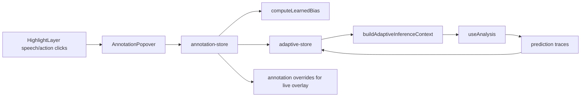

### Input Channels

- Manual speech/action corrections from the writer.
- Prediction traces from analysis.
- Current chapter id and world data.

### Output Channels

- Learned bias for speaker/action disambiguation.
- Adaptive model state and metrics.
- Debug panel metrics and review counts.
- Immediate overlay correction colors and labels.

### Performance Paths

- Prediction logging and model updates are constrained to feedback-oriented paths.
- Adaptive context is memoized and only passed into analysis when needed.
- Overlay uses lightweight overrides directly instead of waiting for full re-analysis.

### Current Bottlenecks

- Excessive prediction persistence can create storage churn and analysis loops if not kept idempotent.
- Retraining or updating adaptive state after many corrections can add background cost.
- Debug mode expands the amount of prediction detail retained and displayed.

## System 7: Renderer Workspace, Review, And Export

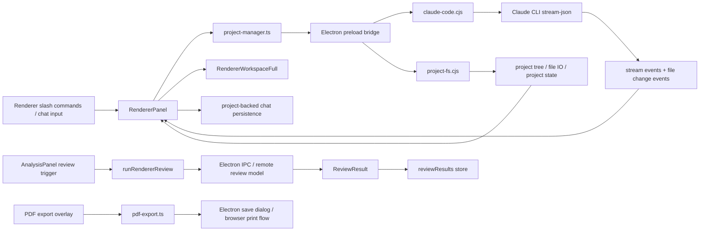

### Input Channels

- Project-backed chapter files, `novel.txt`, and renderer session state.
- Free-form renderer chat messages and slash commands (`/draft`, `/review`, `/assemble`, etc.).
- Current chapter text for legacy renderer review.
- API key + selected review model.
- Novel metadata and export settings.

### Output Channels

- Persistent Claude sessions, streamed assistant/thinking/tool lanes, and file-change notifications.
- Fullscreen renderer workspace with file tree, markdown/text preview, and resizable chat pane.
- Renderer review flags in the analysis surface.
- Persisted review results.
- Exported PDF / print HTML.

### Performance Paths

- Claude workspace operations run in Electron subprocesses and stay off the live editor path.
- Renderer file-tree updates are narrow: tree listing is project-scoped, file preview only reads the selected file, and chat persistence is project-backed rather than global localStorage.
- Review work is remote and asynchronous; it does not run in the live editor path.
- PDF export is on-demand and isolated behind its own overlay.

### Current Bottlenecks

- Renderer sessions still depend on Claude CLI availability and model latency.
- Project-wide file-change bursts can refresh the renderer workspace more often than a single-file editor would.
- Review result persistence can grow over time with many chapters.
- PDF export is bounded more by document size and asset generation than by UI render cost.

## System 8: Liquid Glass And Compositing

```mermaid
flowchart LR
    A[.liquid-glass / analysis tabs / action groups] --> B[initLiquidGlassFilter]
    B --> C[ResizeObserver + idle scheduling]
    C --> D[liquid-glass-worker]
    D --> E[SVG filter cache]
    E --> F[per-element backdrop-filter url(#id)]
    F --> G[visible glass surfaces]

    H[Timeline / renderer / onboarding overlays] --> I[body.*-overlay-freeze]
    I --> J[background glass flattened]
```

### Input Channels

- DOM elements matching the glass selector.
- Element width, height, and border radius.
- Worker-generated displacement maps.
- Overlay open/close state for timeline, renderer workspace, and onboarding.

### Output Channels

- Per-element SVG filter ids applied as backdrop filters.
- Glass surfaces across panels, tabs, overlays, and action groups.
- Freeze modes for the fullscreen timeline, fullscreen renderer workspace, and onboarding overlay.

### Performance Paths

- Filter generation is idle-scheduled and offloaded to a worker.
- Filter instances are cached and reference-counted.
- Overlay freeze modes disable background blur computation while preserving each overlay's own blur plane and visual treatment.

### Current Bottlenecks

- Many simultaneous live glass surfaces can still increase compositor cost.
- Large overlay stacks with multiple backdrop-filter planes are expensive in Electron/Chromium.
- Resizing many glass surfaces at once can still burst worker/filter churn.

## System 9: Narrative Event Engine

What actually happens in a chapter. This is what fills the arc timeline's event
chips and the lead line of the "This chapter" brief.

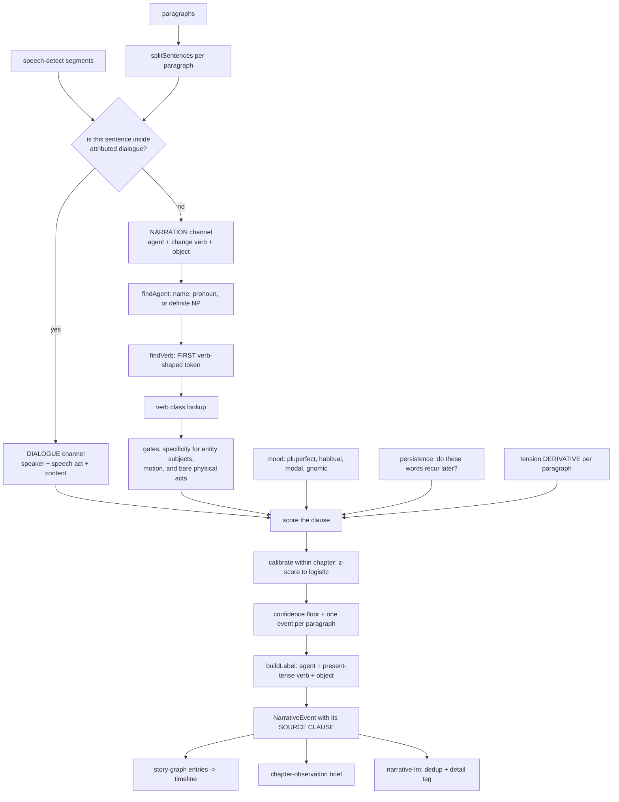

### Input Channels

- Paragraphs, and `speech-detect` segments for the same paragraphs.
- Known names from world data plus detected speakers.
- Per-paragraph tension, one value per paragraph, **no subsampling** — the engine
  reads its derivative, because a local rise is evidence that something happened
  where a high plateau only says the chapter is tense.

### Output Channels

- `NarrativeEvent[]`, ranked by calibrated confidence, each carrying its label,
  type, salience, paragraph, offset, and the verbatim clause it came from.
- Both the legacy six types (for the existing colour map) and a richer taxonomy:
  decision, revelation, confrontation, action, arrival, departure, shift,
  state-change, unclassified.

### Design Rules That Are Load-Bearing

- **The unit is a clause, not a paragraph.** The predecessor scored paragraphs and
  then scavenged a label from anywhere inside, so agent, verb, type and label
  could each come from a different sentence.
- **Verb classes, not phrases.** Verbs are a closed class and generalise; the
  predecessor's 170 multi-word phrases did not — 45% occurred in one sample book
  and not the other, and 24% in neither.
- **A realis test.** Backstory, habit and hypothetical are penalised, not accepted.
  Penalties are subtractive and confidence is calibrated *within* the chapter, so a
  wholly retrospective chapter still ranks its own best clauses.
- **`unclassified` exists on purpose.** The predecessor defaulted unmatched clauses
  to "confrontation", which is why 36.3% of its output was typed that way.
- **Labels are short by construction**, not truncated after the fact, because the
  timeline gives a label 20–36 characters.

### Two Channels, And Why

Most events in this corpus are **attributed dialogue acts**. Speaker attribution is
this app's strongest signal (`speech-detect` ~96% in high mode) and the predecessor
used it as a flat +0.2 for "contains a quotation mark".

### Verification

```
npm run test:event-detect                 # gold set, gated, old vs new
npm run test:event-detect -- --detail     # per-chapter alignment, every miss
FLOOR=0.4 npm run test:event-detect       # sweep the operating point
npm run audit:ood-events                  # label-free, in-distribution vs held out
npm run print:chapter root-crown 16       # numbered paragraphs, for annotating
```

Current gold-set numbers — **74 chapters, 463 gold events (231 major), ±1
paragraph tolerance**. This table was previously written against a 22-event, 5
chapter fixture; the gold set has grown 21× since, and the numbers moved a long
way with it.

| | OLD `event-detect.ts` | NEW `narrative-events.ts` |
|---|---|---|
| emitted | 198 | 620 |
| matched, ±1 paragraph | 82 | **190** (129 on the exact anchor) |
| precision | **41.4%** | 30.6% |
| recall | 17.7% | **41.0%** |
| recall on major events | 19.0% | **43.3%** |
| F1 | 24.8% | **35.1%** |
| type correct, of matched | 3.7% | **27.9%** |
| labels fitting the UI budget | 35.4% | **100%** |
| labels well formed | 75.3% | **99.4%** |

**★ THE OLD ENGINE HAS HIGHER PRECISION AND THAT IS NOT A DEFEAT.** It emitted
198 events against the new engine's 620 — it is precise because it is nearly
silent, missing four major events in five. The trade bought recall on major
events from 19.0% to 43.3% and F1 from 24.8% to 35.1%, and the labels went from
a third fitting the timeline's budget to all of them.

What the timeline actually **shows** (the top four per chapter, 275 chips):

| | OLD | NEW |
|---|---|---|
| precision@4 | 41.4% | 46.2% |
| major events shown | 19.0% | **26.8%** |
| shown labels well formed | 75.3% | **100%** |
| shown labels naming an agent | 67.2% | **86.5%** |

Type accuracy is reported, not gated: a trained-literary-scholar typology reached
Krippendorff's α of only 0.57–0.75 on a coarser scheme, so moderate type agreement
is a property of the domain. Position and salience are the gates.

### Current Bottlenecks And Known Weaknesses

- **`action` dominates the held-out manuscript at 54.0%.** It is the widest class
  in the lexicon and a domestic novel is made of people opening doors. Requiring a
  real object or a specified clause moved it from 58.9%; it needs a better answer.
- **`precision@4` currently FAILS its gate at 46.2% against a target of 48%**,
  so `npm run test:event-detect` exits non-zero. Fewer than half the chips the
  timeline shows are gold events. Every other gate in the suite passes.
- **Precision is 30.6% overall.** The engine emits 620 events for 463 gold ones;
  it over-fires, and the ranking is what makes the surface usable rather than
  the detector.
- Label ↔ gold token overlap is **9.5%**: the label usually names the right beat
  in different words than a reader would use. Closing that gap is abstraction, which
  is what the generative path in `plans/narrative-event-engine.md` is for.
- Detection is synchronous and runs per chapter, not per keystroke, on the same
  deferred path as the story-graph update.

### The Embedding Seam

`narrative-lm.ts` runs MiniLM three ways: Electron IPC to the main process,
browser WASM, and — via `setEmbedder` — an injected Node backend for the suites.

★ That third path did not exist, and its absence was expensive.
`@xenova/transformers` v2 statically imports `sharp`, whose native binary is not
built in this store. Electron's main process stubs it; no script did. So importing
the module under `tsx` threw at import time, `enrichChapterEntryWithLM` swallowed
it in a bare `catch`, and the offline suite reported **"relabeled events: 0/6
(0%)"** — a number that read as "the LM agrees" and meant "the LM never loaded".
`scripts/lm-node-backend.ts` installs the stub and the backend. Keep the seam: an
engine whose only inference path is inside Electron cannot be measured.

## System 10: Local Assistant Runtime

The generic inference service every layer-3 task goes through. It knows about
models, grammars, tokens and timings, and **nothing** about novels, chapters or
entities — the caller owns all of that and ships it in the system prompt.

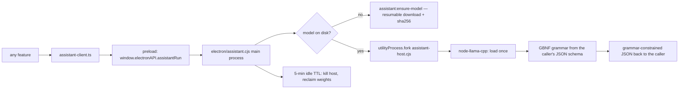

### The Model

| | |
|---|---|
| Default | `qwen3-1.7b-q4_k_m` — Qwen3 1.7B, Q4_K_M, Apache-2.0 |
| Size | 1,107,409,472 bytes, sha256-verified after download |
| Context | 4096 on the Metal tier, 2048 on the CPU tier |
| Alternatives | Qwen3-4B and Granite-4.0-micro ship as presets; any GGUF URL is accepted |

### Design Rules That Are Load-Bearing

- **A child process, not the main one.** llama.cpp weights are the largest
  allocation in the app; when the host exits the OS reclaims all of it with no
  reliance on the addon's own free paths. A wedged inference also cannot take
  the writer's window with it.
- **★ A 1.1 GB FETCH IS NEVER AN IMPLICIT SIDE EFFECT OF A RUN.**
  `assistant:run` lazily forks and loads, and explicitly does *not* download.
  Downloading is its own call, with its own progress events.
- **A memory guard refuses to load** when the machine cannot afford it, rather
  than letting the OS decide which process dies.
- **Grammar-constrained JSON, always.** The caller's JSON schema becomes a GBNF
  grammar, so a malformed answer is impossible rather than merely unlikely.
- **★ REASON BEFORE LABEL, IN EVERY SCHEMA.** A grammar emits properties in
  declaration order; putting the verdict first makes the model commit before it
  has written a word of evidence. Every task in this repo declares
  `{reason, verdict, confidence}` in that order, and it is not cosmetic — the
  one task that got it wrong produced labels contradicting their own reasons.
- **The exported functions are what the harnesses drive**, so
  `scripts/verify-assistant-runtime.cjs` exercises the real code path rather
  than a copy of it.

### Current Bottlenecks

- One model, one slot. Concurrent tasks queue; the sweep is written to be
  sequential and cancellable rather than to fight for the lock.
- First run after a cold start pays host boot plus model load (both have
  120 s ceilings) before the first token.
- The 5-minute idle TTL trades a reload against holding ~1.1 GB resident.

## System 11: The Review Sweep

One background pass per chapter, in a fixed order, with a hard budget. The
alternative — several schedulers against a single-slot inference host — is two
queues fighting for one lock.

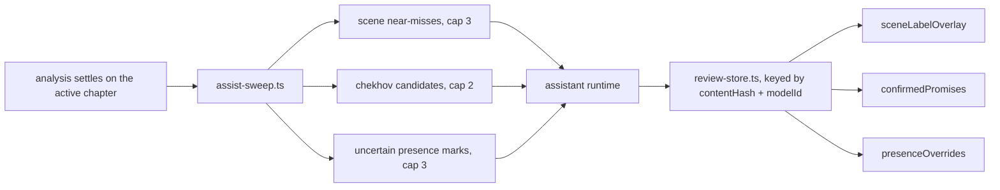

### Design Rules That Are Load-Bearing

- **★ RANK AND CAP, DO NOT SWEEP.** Eight questions per chapter, bounded
  whatever the prose does. Measured over 73 DEV chapters, an uncapped scene pass
  *alone* would be 16.64 questions per chapter — for a queue an edit invalidates
  before it drains.
- **The cap is on QUESTIONS ASKED, not answers kept.** A chapter whose top three
  near-misses were all answered last time asks nothing and moves on, rather than
  walking down the ranking to find three unasked ones. "Everything worth asking
  has been asked" is the settled state.
- **★ A QUESTION ASKED AND ABSTAINED ON IS STILL RECORDED.** `asked` is
  membership, not payload. Without it, a null answer is re-asked on every mount
  for the life of the chapter.
- **Staleness by reconstruction, plus one guard.** A chapter entry whose
  `contentHash` or `modelId` no longer matches is dropped whole. But
  `knowledgeContentHash` is `length|first-60-chars`, so a length-preserving
  mid-chapter edit leaves it byte-identical — every selector therefore re-checks
  its answer against live text.
- **One selector per surface, and no consumer may re-implement its conditions.**
  What the widget shows and what the harness measures have to be the same
  function, or a gate proves something the writer never sees.

### The Tasks

| Task | Asked about | What a confident answer does |
|---|---|---|
| `scene-review` | scenes the engine scored as near-misses | supplies a scene label |
| `chekhov-review` | ranked unpaid-promise candidates | marks one as a real promise |
| `presence-review` | the ~10% of cast marks the engine defers | settles present vs mentioned |
| `entity-review` | scan names the scan itself doubted | moves or drops a name |
| `timeline-chips` | stored events, by rank | promotes which chips the timeline shows |
| `chapter-summary` | a settled chapter | writes the brief |
| `continuity-adjudication` | knowledge-ledger candidates | confirms or dismisses a contradiction |

## System 12: Character Presence And Aliases

Two engines that answer questions the rest of the app had been assuming away.

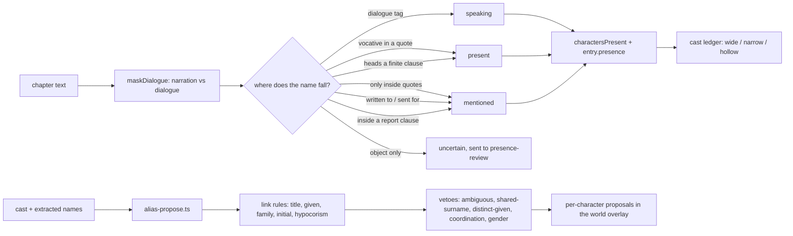

### Presence vs Evocation

A character named in a chapter is not the same as a character *in* it. The
ledger used to draw one mark for both, because `charactersPresent` came from a
bare `chapter.content.includes(name)`.

The field has a name for this distinction — presence vs **evocation** — and
pointedly does not solve it: the Corpus Novelties NER guidelines annotate both
identically and say telling them apart "can be done in a later step". So there
is no gold set to borrow and no pretrained classifier to call.

**★ THE SIGNAL IS POSITION RELATIVE TO THE QUOTATION MARKS, NOT A VERB LIST.**
Two attempts died on word lists. "Elizabeth Bennet had been obliged to sit down"
and "when Jane and Elizabeth were alone" are presence, and no NAME+action-verb
pattern reaches them because prose puts auxiliaries and appositives in between.
Masking dialogue costs one pass and separates the classes outright.

Measured over 246 cast marks in 67 DEV chapters: **90% decided
deterministically**, and the model reviews the rest.

### Aliasing, And The One Departure From The Literature

Vala et al. (2015) and Renard's `GraphRulesCharacterUnifier` link name mentions
into a graph, then remove edges along the shortest path between any vetoed pair,
and take connected components as characters.

**★ THIS DOES NOT USE COMPONENTS.** Components are how "Elizabeth Bennet"
reaches "Mr. Bennet" through the shared node "Bennet" and two people become one
— which is exactly why Vala then needs path surgery to undo it. This links a
surface form only to a *canonical character the writer already has*, and drops
any form two of them could claim. Same protection, no graph, and it produces the
per-character list the UI wants anyway.

**★ A WRONG MERGE IS FAR WORSE THAN A MISSED ONE**, and the code says so
everywhere. Two characters collapsing into one speaker is silent and corrupts
every downstream count; a missed nickname costs a nickname. Every ambiguity
resolves to "propose nothing", and nothing is written without a click.

The veto worth knowing about: if a book uses one surname with **both** a male
and a female title, that surname belongs to a family and no bare-surname link to
it is trusted. Without it the engine proposed "Miss Darcy" as an alias of
"Darcy" — Georgiana, his sister, across 39 occurrences. Deliberately not a
majority vote: "Mr. Darcy" outnumbers "Miss Darcy" many times over, so a
majority would confidently return male and merge her anyway.

### Current Bottlenecks

- `proposeAliases` walks the whole book once per candidate name. It is memoised
  on the cast, and only runs while the Characters tab is open.
- Presence is classified per chapter at analysis time and persisted on the graph
  entry; the display builder prefers the stored answer and only recomputes for
  graphs written before the field existed.

## System 13: Knowledge Ledger And Adjudicator

Facts the manuscript asserts about its own world, and the contradictions between
them. The ledger extracts candidates deterministically and the adjudicator
confirms or dismisses them.

- Generator and adjudicator are **separate**, and the guards run **before** the
  model — a candidate that fails a deterministic check never costs an inference.
- Dismissals are **durable**: a fact the writer has waved off does not come back
  on the next sweep.
- The measured funnel put raw candidate precision at roughly **1 in 8**, which
  is why the guards exist and why the model is the last step rather than the
  first.

Spec: `plans/knowledge-ledger-and-local-adjudicator.md`.

## How This Repo Measures Itself

Two kinds of script, and they are not interchangeable.

- **A suite gates.** `test-*.ts` asserts behaviour and exits non-zero. Its job is
  to stop a regression.
- **A probe measures.** `probe-*.ts` / `probe-*.cjs` prints distributions, funnels
  and real output for reading. Its job is to tell you whether a feature is worth
  building *before* you build it, and what it is actually doing afterwards.

Four rules this repo learned the hard way, each from a shipped defect:

- **★ PAIR EVERY NEGATIVE GATE WITH A POSITIVE ONE.** `every(x => !bad)` is
  satisfied perfectly by an empty set, and `0 === 0` is true. Two features here
  have gone green while rendering nothing at all.
- **★ MEASURE THE SHIPPED MODULE, NOT A COPY OF ITS REGEX.** A probe that
  re-implements the thing it measures scores prose the real filters already
  reject.
- **★ MEASURE AT THE CUT THE PRODUCT USES.** Scoring a model task on inputs the
  deterministic engine would never send it measures nothing. Doing this
  correctly is what turned one failing measurement here into a passing one.
- **★ A GATE KEYED TO PIXELS CANNOT SURVIVE VISUAL WORK**, which is the only
  work it exists to check. Visual gates select on `data-*` attributes.

### Measured Accuracy, In One Place

Numbers below are from a live run of the suites in this repo, not from comments.
Where two numbers exist for one engine, both are shown — they measure different
things and the gap is the point.

| Engine | Benchmark | Result |
|---|---|---|
| Speech attribution | curated cases, 217 expectations | fast **80%** · default **86%** · high **100%** |
| Speech attribution | **masked tag**, 786 lines, 15 books | fast **51.5%** · default **52.0%** · high **52.9%** |
| Narrative events | gold set, ±1 paragraph | precision **30.6%** · major recall **43.3%** |
| Narrative events | what the timeline SHOWS, top 4 | precision@4 **46.2%** · major shown **26.8%** |
| Event labels | gold set | well-formed **100%** · name an agent **86.5%** · fit the budget **100%** |
| Character presence | 246 marks, 67 DEV chapters | **90%** decided deterministically |
| Presence review (model) | 7 deferred cases | 4 right-and-applied, **0 wrong-and-applied** |
| Alias proposer | 47 characters, 6 DEV books | 8 proposals, **8 correct, 0 wrong merges** |
| Local prose review | 8 patterns, 120 expectations | **100%** recall and precision |

**★ THE TWO SPEECH NUMBERS ARE THE MOST IMPORTANT THING ON THIS PAGE.** The
curated suite is hand-written cases, and 100% on fixtures you wrote yourself is
a weak signal — it can be tuned against. The masked benchmark deletes the
dialogue tag and forces recovery from context alone across 15 books, eight of
them held out. **52% is the honest number.** Quote that one.

The same caution applies to the 100% on local prose review: eight patterns, 120
expectations, all authored alongside the detectors.

### Currently Failing Gates

Recorded rather than hidden. `npm run test:event-detect` exits non-zero on:

```
FAIL  precision@4 (what is SHOWN)  46.2%  target ≥ 48%
```

The timeline shows the top four events per chapter, and fewer than half of those
are gold events. Every other gate in that suite passes.

## Measured Out: Model Tasks That Were Built And Withdrawn

Three tasks are implemented, tested, and deliberately **not wired**. Each keeps
its number and a wire-it-back condition in its own header. They are kept rather
than deleted because the measurement is the asset — the next model gets
evaluated against the same probe.

| Module | Measurement | Why it is off |
|---|---|---|
| `attribution-review.ts` | 5 cases: 1 right, 1 declined, **3 wrong and applied** — every wrong answer at 0.8–1.0, stable across 2 prompt versions × 4 presentations | The deterministic engine's own posterior is better. A suggestion wrong three times in five, carrying a fluent reason, costs more attention than it saves. |
| `alias-review.ts` | 8 pairs: 1 right, **1 wrong and surfaced**, both at confidence 1.0 | It merged two sisters while reasoning "both names share the same surname and are given different first names" — which is the *proof* they are two people. A merge has no deterministic answer underneath it to fall back on. |
| salience blend in `story-graph.ts` | precision@3 49.1% blended vs 49.1% off; major coverage 16.9% vs 18.6% | The embedding score is good enough to PRUNE with and not good enough to RANK with. Constant churn, zero accuracy. Pruning stays; the blend weight is 0. |

**★ THE PATTERN WORTH COPYING.** Each was withdrawn on a number, not an opinion,
and the withdrawal condition is stated in the file so nobody has to re-argue it
from the prompt. The rule that decided all three: score **wrong-and-applied**,
not accuracy. A declined answer costs nothing when a deterministic engine
already holds one.

## Persistence

Desktop writes one JSON file per store into the project directory through
`project-manager.ts` → `electron/project-fs.cjs`. The browser build writes the
same shapes to `localStorage`. `isDesktopApp()` is the switch, and every store
picks its path itself.

| Store | Project file | localStorage key | Holds |
|---|---|---|---|
| Novel | project files | `glass-editor:novel-v1` | chapters, meta, world data |
| Current chapter | — | `glass-editor:current-chapter-v1` | selection only |
| Story graph | `story-graph` | `glass-editor:story-graph-v1` | per-chapter entries, events, presence |
| Annotations | `annotations` | `glass-editor:annotations-v1` | the writer's corrections |
| Adaptive model | `adaptive` | `glass-editor:adaptive-learning-v1` | learned weights and traces |
| Assist reviews | `assist-reviews` | `glass-editor:assist-reviews-v1` | model answers + every key asked |
| Knowledge ledger | `knowledge-ledger` | `glass-editor:knowledge-ledger-v1` | world facts, verdicts, dismissals |
| Review results | `review-results` | `glass-editor:review-results-v1` | prose-review output |
| License | — | `glass-editor:license-v1` | tier + activation code |

**★ EVERY MODEL-DERIVED STORE IS KEYED BY `contentHash` + `modelId`.** Changing
either drops the chapter's entry whole rather than merging into it: answers
reached against prose that no longer exists are not partially valid, they are
wrong.

## Licensing

`src/lib/features.ts` maps a `FeatureKey` to the tier that unlocks it, and
`hasAccess(key, tier)` is the only check. Current map:

| Feature | Tier |
|---|---|
| `intel-auto`, `intel-off`, `split-view` | free |
| `intel-manual`, `renderer-workspace`, `custom-tools`, `story-nlp-control` | pro |

Codes are HMAC-SHA-256 over a build-time salt, validated locally. Nothing about
the tier is enforced server-side, and the deterministic engines are not gated —
see the first rule under "The Four Model Layers".

Plan: `plans/pricing-and-license-system-plan.md`.

## Current System Hot Spots

- Fullscreen timeline detail chips remain the primary timeline-specific hot path.
- Event detection adds a synchronous per-chapter pass on the deferred story-graph path; it is clause-level over every sentence, so it scales with sentence count rather than paragraph count.
- High intelligence mode remains intentionally expensive; low mode is the fast writing-safe path.
- Whole-book world/entity scans remain expensive on large manuscripts.
- LocalStorage persistence still needs disciplined payload sizes for annotations/adaptive data.
- Complex backdrop-filter stacks are still a compositor risk when not explicitly frozen or isolated, which is why timeline, renderer workspace, and onboarding all use body-freeze overlay modes.

## Files To Start With

- `src/App.tsx` — root orchestration.
- `src/components/Editor.tsx` — live writing surface.
- `src/components/HighlightLayer.tsx` — overlay rendering.
- `src/lib/use-analysis.ts` — analysis hook and worker dispatch.
- `src/lib/chapter-analysis-runner.ts` — pure analysis pipeline.
- `src/lib/world-data.ts` — world/entity scanning and name resolution.
- `src/lib/narrative-events.ts` — event detection. Read its header before changing it; every rule is a response to a measured failure.
- `src/lib/chapter-observation.ts` — the "This chapter" brief above the widgets.
- `src/lib/story-graph.ts` — chapter graph generation and persistence.
- `plans/narrative-event-engine.md` — the diagnosis, the numbers, and the on-device LLM decision table.
- `src/components/StoryGraphPanel.tsx` — compact graph and fullscreen entry point.
- `src/components/TimelineGraphFull.tsx` — fullscreen story timeline.
- `src/components/RendererPanel.tsx` — renderer chat surface and slash-command routing.
- `src/components/RendererWorkspaceFull.tsx` — fullscreen renderer workspace with file tree + viewer.
- `src/components/Onboarding.tsx` — welcome flow, widget previews, renderer intro, and shortcut guide.
- `src/lib/project-manager.ts` — typed bridge for Electron project/session APIs.
- `electron/project-fs.cjs` — project directory structure, file IO, and project state handlers.
- `electron/claude-code.cjs` — Claude CLI subprocess/session manager.

Added since the sections above were first written:

- `src/lib/character-presence.ts` — presence vs evocation. Read the header before touching a pattern; every rule is a response to a measured failure.
- `src/lib/alias-propose.ts` — alias and duplicate proposals, and the vetoes that make them safe.
- `src/lib/assist-sweep.ts` — the one model pass per chapter, its order and its caps.
- `src/lib/review-store.ts` — model answers, and the record of what was asked.
- `src/lib/assistant-client.ts` — renderer-side gateway to the local model.
- `electron/assistant.cjs` — model registry, download, memory guard, child process.
- `electron/assistant-host.cjs` — the inference child process and its message protocol.
- `src/lib/knowledge-ledger.ts` + `src/lib/adjudicator.ts` — world facts and their contradictions.
- `src/lib/features.ts` — the whole paywall, in twenty lines.
- `plans/assistant-adjudication-wave-2.md` — the spec the review sweep implements.
- `plans/knowledge-ledger-and-local-adjudicator.md` — the ledger spec.
- `plans/pricing-and-license-system-plan.md` — tiering.
- `src/lib/liquid-glass-filter.ts` — glass filter worker orchestration.