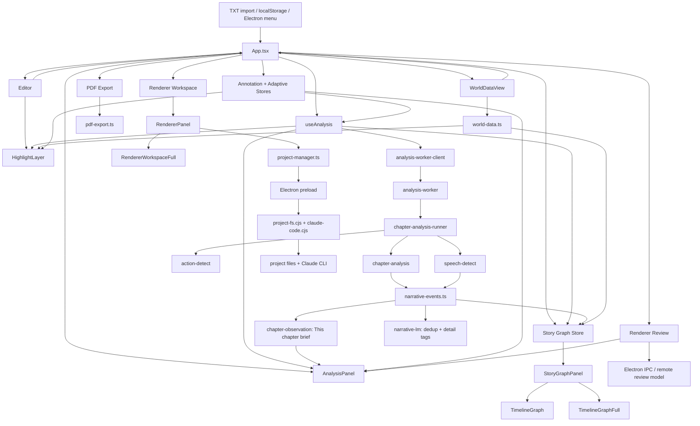
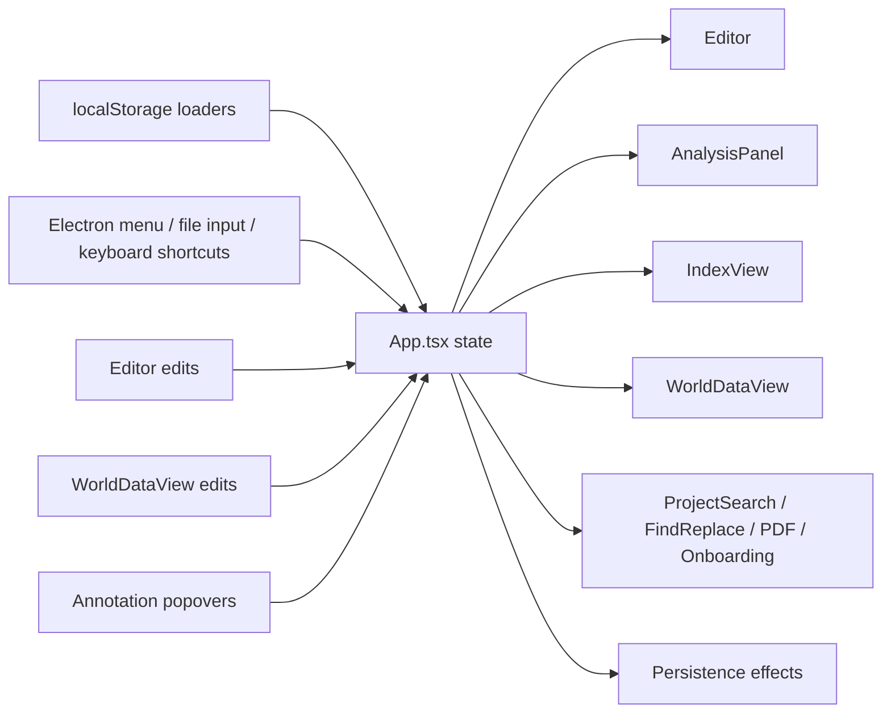
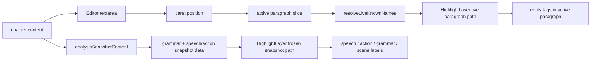
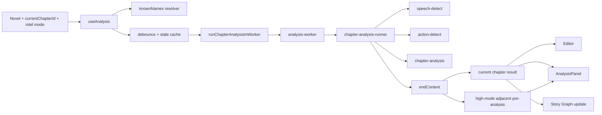
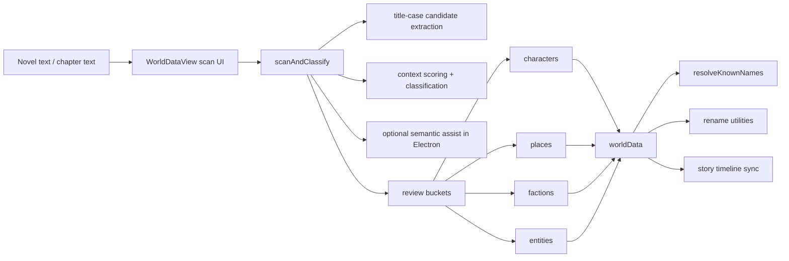
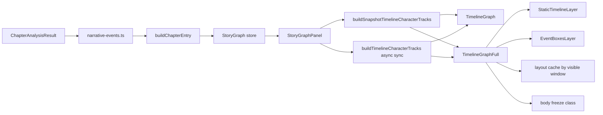
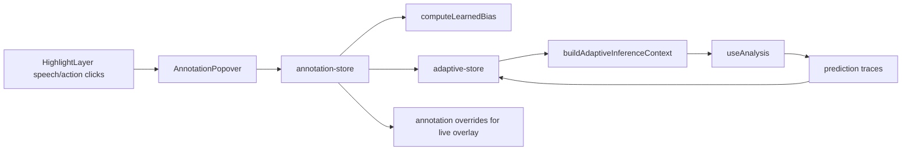
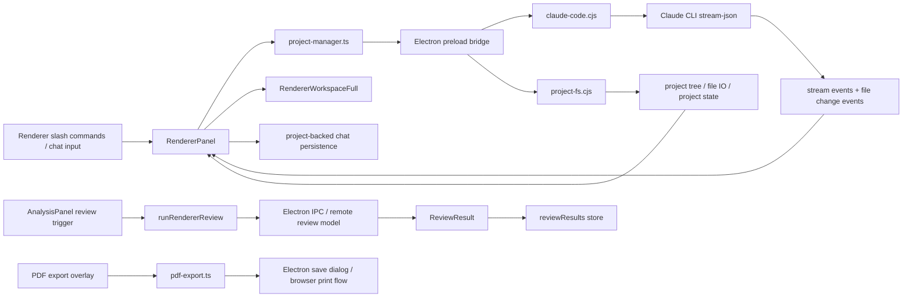
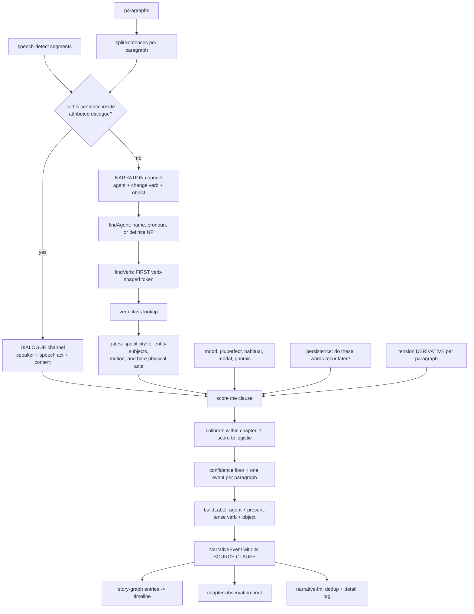

# Glass Editor

Glass Editor is a desktop-first novel writing workspace built with React, TypeScript, Vite, and Electron. It combines a live writing surface with chapter analysis, world-data extraction, adaptive annotation feedback, story-graph generation, fullscreen timeline views, renderer-style prose review, and export tooling.

## Running The App

```bash
npm install
npm run dev
```

Useful commands:

```bash
npm run build
npm run electron:dev
npm run electron:build
npx tsx scripts/test-analysis-responsiveness.ts
npm run test:event-detect     # event detection vs the hand-annotated gold set
npm run audit:ood-events      # event detection, label-free, over whole manuscripts
```

## Architecture

This section is organized in two layers:

1. A full-system overview showing how the major subsystems connect.
2. Per-system internal diagrams with input channels, output channels, performance paths, and current bottlenecks.

### Full Overview



### Data Ownership Summary

- `App.tsx` is the orchestration root. It owns novel state, chapter selection, preferences, annotation/adaptive stores, story graph, review results, and overlay visibility.
- `Editor` is the live typing surface. It only owns local UI concerns such as sizing, caret tracking, and paragraph-scoped live highlight behavior.
- `useAnalysis` owns current-chapter analysis, stale-cache reuse, worker dispatch, and high-mode adjacent pre-analysis.
- `world-data.ts` owns entity extraction, name resolution, and rename utilities.
- `narrative-events.ts` owns event detection: it decides what happens in a chapter, at clause granularity, and generates each event's label from the clause that triggered it. It replaced `event-detect.ts`, which is retained only so the suites can score against it.
- `chapter-observation.ts` owns the "This chapter" brief above the widgets — a lead line built from the detected events plus up to three anchored facts, each from a different dimension.
- `story-graph.ts` owns persisted chapter graph entries and the asynchronous LM pass. That pass does semantic dedup and detail tags; it deliberately no longer relabels (see System 9).
- `StoryGraphPanel` and `TimelineGraphFull` are presentation layers over precomputed graph/timeline data.
- `RendererPanel` owns renderer chat presentation, slash-command routing, project-backed message persistence, and the bridge into the fullscreen renderer workspace.
- `project-manager.ts` is the typed renderer-side gateway to Electron project filesystem handlers and Claude session status/streaming.

## System 1: App Shell And State Orchestration



### Input Channels

- Novel content loaded from `storage.ts`.
- Current chapter id loaded from `storage.ts`.
- Preferences loaded from `preferences.ts`.
- Story graph loaded from `story-graph.ts` localStorage helpers.
- Review results loaded from `renderer-review.ts` localStorage helpers.
- Annotation store loaded from `annotation-store.ts`.
- Adaptive store loaded from `adaptive-store.ts`.
- Electron menu commands, keyboard shortcuts, import/export actions.

### Output Channels

- Feeds `Editor`, `AnalysisPanel`, `WorldDataView`, overlays, and toolbars.
- Persists novel, chapter id, preferences, story graph, review results, annotations, and adaptive models.
- Pushes renamed entities back through chapter/book rename operations.

### Performance Paths

- Chapter edits update the active chapter and fan out into editor, analysis, and story-graph maintenance.
- Analysis settle events can update story graph entries and review surfaces.
- World-data edits can invalidate name resolution, timelines, and entity highlighting.

### Current Bottlenecks

- Any unstable prop passed from `App.tsx` into large children can reintroduce broad rerender churn.
- Large localStorage payloads remain sensitive to quota and serialization cost if prediction logs become too verbose.
- Story-graph maintenance is already deferred, but still fans out to multiple widgets after analysis settles.

## System 2: Editor And Highlight Layer



### Input Channels

- Current chapter text from `App.tsx`.
- Analysis snapshot from `useAnalysis`.
- Known names from `useAnalysis` / world data.
- Annotation overrides and prediction traces from the annotation/adaptive layer.

### Output Channels

- Textarea edit events back to `App.tsx`.
- Live visual output through `HighlightLayer`.
- Entity click anchors into `EntityPopover`.
- Speech/action annotation clicks into `AnnotationPopover`.

### Performance Paths

- The live path only resolves names inside the paragraph under the caret.
- Grammar, speech, and action rendering stay on the settled snapshot path.
- Highlight overlay stays mounted to avoid compositor flips while typing.

### Current Bottlenecks

- Extremely long single paragraphs still cost more than average because the live path is paragraph-scoped, not token-scoped.
- Snapshot path still has to build rich markup for all analyzed paragraphs once analysis settles.
- Grammar remains intentionally excluded from the per-keystroke path because it is not cheap enough for live typing.

## System 3: Chapter Analysis Pipeline



### Input Channels

- Current chapter text.
- Previous analyzed chapter end-context.
- Sibling chapter stats from cached analyses.
- Resolved names from `world-data.ts`.
- Intelligence level (`low`, `default`, `high`, or auto-resolved).
- Optional learned bias and adaptive inference context.

### Output Channels

- `ChapterAnalysisResult` for the current chapter.
- `prevResult` and `nextResult` for cross-chapter widgets.
- Snapshot data for `Editor` and `HighlightLayer`.
- Source material for story-graph chapter entries.

### Performance Paths

- Current chapter analysis runs in a worker-backed path with main-thread fallback.
- High mode also idle-schedules adjacent chapter pre-analysis.
- Stale cached results are shown immediately while fresh analysis recomputes.

### Current Bottlenecks

- High mode is materially heavier than the other modes on long chapters.
- Adjacent pre-analysis still consumes background time in high mode even though it is chunked and idle-scheduled.
- Without world data, known-name fallback extraction remains more expensive than the world-aware path.

### Tension Curve — Fixed Defect, Recorded

`analyzeChapter` reduces per-paragraph tension to ≤30 buckets. It used to
**point-sample** one paragraph per bucket, which over 40 chapters longer than 30
paragraphs discarded **49.1%** of all paragraphs, missed the chapter's real
maximum in **15%** of chapters, and — because every paragraph-number claim in the
UI was made by inverting that curve — named a paragraph that was not actually at
the chapter's peak in **47.5%** of cases.

Two changes: buckets now **aggregate** (peak level lost 15.0% → 0.0%), and a new
`analysis.peakParagraph` locates the peak from the **full** signal, tie-broken to
the middle of the longest run at the chapter maximum (off-peak 47.5% → **0.0%**).

Read `analysis.peakParagraph`. Do not invert `tensionCurve` to find a paragraph —
tension is a three-level ordinal, so its peak is usually a tie across many
paragraphs and a bucket index maps back to a bucket *centre*.

### Observed Timing Profile

From `scripts/test-analysis-responsiveness.ts` on the current codebase:

- Low: ~44.45ms average across sampled chapters.
- Default: ~58.13ms average.
- High: ~214.73ms average.
- High mode is roughly 4.83x the cost of low mode on the sampled set.

## System 4: World Data And Entity Scan



### Input Channels

- Full novel or chapter text.
- Existing world data.
- Optional adaptive context for prediction traces and feedback.
- Manual edits from `WorldDataView`.

### Output Channels

- Structured `worldData` buckets.
- Name list used by the highlight layer and speech detection.
- Rename operations across chapter or whole-book text.
- Character aliases and canonical names used by the story timeline.

### Performance Paths

- Heuristic entity extraction runs in batches with main-thread yielding.
- Semantic assist is hard-disabled outside Electron.
- Live highlight path uses `resolveLiveKnownNames`, not the full scan pipeline.

### Current Bottlenecks

- Whole-book scans on very large novels are still expensive even without semantic assist.
- Semantic assist remains runtime-gated and cannot be used in plain Vite/web dev.
- Moving entries between buckets is cheap, but rescans remain the dominant cost.

## System 5: Story Graph And Timeline Stack



### Input Channels

- Chapter analysis results.
- `worldData` character names and aliases.
- Chapter metadata and current chapter id.
- Optional LM pass for semantic dedup and detail tags. It does **not** relabel.

### Output Channels

- Compact side-panel timeline, with per-event position ticks on the tension bar.
- Fullscreen timeline overlay.
- Hover text on every event chip in both views: type, salience, paragraph,
  confidence, and the **source clause**.
- Top-character chips and chapter navigation clicks.
- Stored story graph entries in localStorage.

### Performance Paths

- Story graph entries are updated after analysis settles, not on every keystroke.
- Timeline tracks use snapshot-first rendering, then asynchronous world-aware sync.
- Fullscreen timeline now splits into a static layer and a dynamic event-detail layer.
- Event box layouts are cached by visible chapter window.
- Opening the fullscreen overlay freezes background glass/backdrop work behind it.

### Current Bottlenecks

- Event-chip collision layout is still main-thread work.
- A 170-chapter timeline can still be limited by SVG text and chip density if the visible detail window becomes very busy.
- The LM pass is asynchronous, but still extra work on top of the base story-graph pipeline.

### Two Fixed Defects, Recorded

**`tensionPosition` was computed for every event and never read.** Chips stack by
array index in both timeline views, so two events at 10% and 90% of a chapter
rendered with identical spacing and the timeline could not show *where* anything
happened. The compact view's tension bar now carries a tick per event at its real
position; the chips still stack, because they need the vertical room to stay
legible.

**The source clause was computed and thrown away.** `story-graph.ts` selected a
sentence, derived a label from it, and dropped it — so a 28-character chip had no
way to justify itself and no way to be checked. `MajorEvent.sentence` and
`.paragraphIndex` now persist, which is what the hover text shows and what makes
an event jumpable.

## System 6: Annotation And Adaptive Learning



### Input Channels

- Manual speech/action corrections from the writer.
- Prediction traces from analysis.
- Current chapter id and world data.

### Output Channels

- Learned bias for speaker/action disambiguation.
- Adaptive model state and metrics.
- Debug panel metrics and review counts.
- Immediate overlay correction colors and labels.

### Performance Paths

- Prediction logging and model updates are constrained to feedback-oriented paths.
- Adaptive context is memoized and only passed into analysis when needed.
- Overlay uses lightweight overrides directly instead of waiting for full re-analysis.

### Current Bottlenecks

- Excessive prediction persistence can create storage churn and analysis loops if not kept idempotent.
- Retraining or updating adaptive state after many corrections can add background cost.
- Debug mode expands the amount of prediction detail retained and displayed.

## System 7: Renderer Workspace, Review, And Export



### Input Channels

- Project-backed chapter files, `novel.txt`, and renderer session state.
- Free-form renderer chat messages and slash commands (`/draft`, `/review`, `/assemble`, etc.).
- Current chapter text for legacy renderer review.
- API key + selected review model.
- Novel metadata and export settings.

### Output Channels

- Persistent Claude sessions, streamed assistant/thinking/tool lanes, and file-change notifications.
- Fullscreen renderer workspace with file tree, markdown/text preview, and resizable chat pane.
- Renderer review flags in the analysis surface.
- Persisted review results.
- Exported PDF / print HTML.

### Performance Paths

- Claude workspace operations run in Electron subprocesses and stay off the live editor path.
- Renderer file-tree updates are narrow: tree listing is project-scoped, file preview only reads the selected file, and chat persistence is project-backed rather than global localStorage.
- Review work is remote and asynchronous; it does not run in the live editor path.
- PDF export is on-demand and isolated behind its own overlay.

### Current Bottlenecks

- Renderer sessions still depend on Claude CLI availability and model latency.
- Project-wide file-change bursts can refresh the renderer workspace more often than a single-file editor would.
- Review result persistence can grow over time with many chapters.
- PDF export is bounded more by document size and asset generation than by UI render cost.

## System 8: Liquid Glass And Compositing

```mermaid
flowchart LR
    A[.liquid-glass / analysis tabs / action groups] --> B[initLiquidGlassFilter]
    B --> C[ResizeObserver + idle scheduling]
    C --> D[liquid-glass-worker]
    D --> E[SVG filter cache]
    E --> F[per-element backdrop-filter url(#id)]
    F --> G[visible glass surfaces]

    H[Timeline / renderer / onboarding overlays] --> I[body.*-overlay-freeze]
    I --> J[background glass flattened]
```

### Input Channels

- DOM elements matching the glass selector.
- Element width, height, and border radius.
- Worker-generated displacement maps.
- Overlay open/close state for timeline, renderer workspace, and onboarding.

### Output Channels

- Per-element SVG filter ids applied as backdrop filters.
- Glass surfaces across panels, tabs, overlays, and action groups.
- Freeze modes for the fullscreen timeline, fullscreen renderer workspace, and onboarding overlay.

### Performance Paths

- Filter generation is idle-scheduled and offloaded to a worker.
- Filter instances are cached and reference-counted.
- Overlay freeze modes disable background blur computation while preserving each overlay's own blur plane and visual treatment.

### Current Bottlenecks

- Many simultaneous live glass surfaces can still increase compositor cost.
- Large overlay stacks with multiple backdrop-filter planes are expensive in Electron/Chromium.
- Resizing many glass surfaces at once can still burst worker/filter churn.

## System 9: Narrative Event Engine

What actually happens in a chapter. This is what fills the arc timeline's event
chips and the lead line of the "This chapter" brief.



### Input Channels

- Paragraphs, and `speech-detect` segments for the same paragraphs.
- Known names from world data plus detected speakers.
- Per-paragraph tension, one value per paragraph, **no subsampling** — the engine
  reads its derivative, because a local rise is evidence that something happened
  where a high plateau only says the chapter is tense.

### Output Channels

- `NarrativeEvent[]`, ranked by calibrated confidence, each carrying its label,
  type, salience, paragraph, offset, and the verbatim clause it came from.
- Both the legacy six types (for the existing colour map) and a richer taxonomy:
  decision, revelation, confrontation, action, arrival, departure, shift,
  state-change, unclassified.

### Design Rules That Are Load-Bearing

- **The unit is a clause, not a paragraph.** The predecessor scored paragraphs and
  then scavenged a label from anywhere inside, so agent, verb, type and label
  could each come from a different sentence.
- **Verb classes, not phrases.** Verbs are a closed class and generalise; the
  predecessor's 170 multi-word phrases did not — 45% occurred in one sample book
  and not the other, and 24% in neither.
- **A realis test.** Backstory, habit and hypothetical are penalised, not accepted.
  Penalties are subtractive and confidence is calibrated *within* the chapter, so a
  wholly retrospective chapter still ranks its own best clauses.
- **`unclassified` exists on purpose.** The predecessor defaulted unmatched clauses
  to "confrontation", which is why 36.3% of its output was typed that way.
- **Labels are short by construction**, not truncated after the fact, because the
  timeline gives a label 20–36 characters.

### Two Channels, And Why

Most events in this corpus are **attributed dialogue acts**. Speaker attribution is
this app's strongest signal (`speech-detect` ~96% in high mode) and the predecessor
used it as a flat +0.2 for "contains a quotation mark".

### Verification

```
npm run test:event-detect                 # gold set, gated, old vs new
npm run test:event-detect -- --detail     # per-chapter alignment, every miss
FLOOR=0.4 npm run test:event-detect       # sweep the operating point
npm run audit:ood-events                  # label-free, in-distribution vs held out
npm run print:chapter root-crown 16       # numbered paragraphs, for annotating
```

Current gold-set numbers (22 events, 5 chapters, ±1 paragraph tolerance):

| | OLD | NEW |
|---|---|---|
| precision | 28.6% | **57.1%** |
| recall on major events | 27.3% | **63.6%** |
| F1 | 22.2% | **55.8%** |
| type correct, of matched | **0.0%** | **50.0%** |
| labels fitting the UI budget | 50.0% | **100%** |

Type accuracy is reported, not gated: a trained-literary-scholar typology reached
Krippendorff's α of only 0.57–0.75 on a coarser scheme, so moderate type agreement
is a property of the domain. Position and salience are the gates.

### Current Bottlenecks And Known Weaknesses

- **`action` dominates the held-out manuscript at 54.0%.** It is the widest class
  in the lexicon and a domestic novel is made of people opening doors. Requiring a
  real object or a specified clause moved it from 58.9%; it needs a better answer.
- The operating point rests on **22 gold events**, and F1 is flat from floor 0.28
  to 0.52, so the threshold is not meaningful to two decimal places.
- The gold set is 5 chapters from 2 books. It needs genuinely out-of-distribution
  prose before these numbers are quoted as generalisation.
- Label ↔ gold token overlap is 20.7%: the label usually names the right beat in
  different words than a reader would use. Closing that gap is abstraction, which
  is what the generative path in `plans/narrative-event-engine.md` is for.
- Detection is synchronous and runs per chapter, not per keystroke, on the same
  deferred path as the story-graph update.

### The Embedding Seam

`narrative-lm.ts` runs MiniLM three ways: Electron IPC to the main process,
browser WASM, and — via `setEmbedder` — an injected Node backend for the suites.

★ That third path did not exist, and its absence was expensive.
`@xenova/transformers` v2 statically imports `sharp`, whose native binary is not
built in this store. Electron's main process stubs it; no script did. So importing
the module under `tsx` threw at import time, `enrichChapterEntryWithLM` swallowed
it in a bare `catch`, and the offline suite reported **"relabeled events: 0/6
(0%)"** — a number that read as "the LM agrees" and meant "the LM never loaded".
`scripts/lm-node-backend.ts` installs the stub and the backend. Keep the seam: an
engine whose only inference path is inside Electron cannot be measured.

## Current System Hot Spots

- Fullscreen timeline detail chips remain the primary timeline-specific hot path.
- Event detection adds a synchronous per-chapter pass on the deferred story-graph path; it is clause-level over every sentence, so it scales with sentence count rather than paragraph count.
- High intelligence mode remains intentionally expensive; low mode is the fast writing-safe path.
- Whole-book world/entity scans remain expensive on large manuscripts.
- LocalStorage persistence still needs disciplined payload sizes for annotations/adaptive data.
- Complex backdrop-filter stacks are still a compositor risk when not explicitly frozen or isolated, which is why timeline, renderer workspace, and onboarding all use body-freeze overlay modes.

## Files To Start With

- `src/App.tsx` — root orchestration.
- `src/components/Editor.tsx` — live writing surface.
- `src/components/HighlightLayer.tsx` — overlay rendering.
- `src/lib/use-analysis.ts` — analysis hook and worker dispatch.
- `src/lib/chapter-analysis-runner.ts` — pure analysis pipeline.
- `src/lib/world-data.ts` — world/entity scanning and name resolution.
- `src/lib/narrative-events.ts` — event detection. Read its header before changing it; every rule is a response to a measured failure.
- `src/lib/chapter-observation.ts` — the "This chapter" brief above the widgets.
- `src/lib/story-graph.ts` — chapter graph generation and persistence.
- `plans/narrative-event-engine.md` — the diagnosis, the numbers, and the on-device LLM decision table.
- `src/components/StoryGraphPanel.tsx` — compact graph and fullscreen entry point.
- `src/components/TimelineGraphFull.tsx` — fullscreen story timeline.
- `src/components/RendererPanel.tsx` — renderer chat surface and slash-command routing.
- `src/components/RendererWorkspaceFull.tsx` — fullscreen renderer workspace with file tree + viewer.
- `src/components/Onboarding.tsx` — welcome flow, widget previews, renderer intro, and shortcut guide.
- `src/lib/project-manager.ts` — typed bridge for Electron project/session APIs.
- `electron/project-fs.cjs` — project directory structure, file IO, and project state handlers.
- `electron/claude-code.cjs` — Claude CLI subprocess/session manager.
- `src/lib/liquid-glass-filter.ts` — glass filter worker orchestration.