# Latent Write

**A novel-writing desk that keeps track of who is speaking, who is doing what,
and what shape your story is in, entirely on your own computer.**

You write. While you write, the app works out who is speaking each line, who is
performing each action, which characters are actually present in a scene, what
the notable moments are, and how tension rises and falls across the book. It
shows you that as colour in the margin, a timeline of the whole story, and an
assistant you can ask questions of.

### Where your manuscript goes

Your prose stays on your machine. There is no account and no server behind the
writing, the analysis or the assistant, and none of them upload anything. The
folder you choose holds your manuscript as an ordinary text file that any
program can open.

**One exception, and it deserves a plain description rather than a pointer.**
The app contains a second, separate screen called the **renderer workspace**. It
is a chat panel for working *on the project itself* rather than on your prose,
the sort of thing where you ask for a file to be reorganised or a draft to be
worked through, and it does that by running Anthropic's `claude` command-line
tool if you have it installed on your machine. Text you put into that panel
**does go to Anthropic's servers**, under whatever Claude login you already
have. The app never asks you for a key and never stores one.

Three things make it safe to ignore. You have to open it deliberately, it is
**not used by any of the analysis** on this page, and everything else works
normally if you never touch it.

**A second cloud path exists in the code, and you should know about it even
though you cannot currently reach it.** There is a prose-review feature that
would post chapter text straight to Anthropic's API using a key stored in your
own settings. It is built end to end, the setting field exists, and the
electron side is wired, but **no screen in the app calls it**, so today it
cannot run. It is disclosed here rather than omitted because it exists in the
source, because a future version could switch it on, and because a privacy
section that quietly leaves out a dormant upload path is not worth reading. Two things are worth knowing before you do open
it. It runs the `claude` tool with its permission prompts turned off, so
anything you ask it to do to your files, it does. And nothing in the code
confines it to the project folder, so treat it as a capable assistant with
access to your machine rather than as a sandbox.

> **Status.** Version 0.1.0. A macOS disk image can be built and one exists in
> the tree, but it is **unsigned and un-notarised**, so macOS will warn about it,
> and the build currently depends on a directory that lives outside this
> repository, so it will not complete from a fresh clone. A Mac App Store target
> is configured but not signed either. In practice this still means a developer
> sets it up. If you are a writer evaluating this, read on for what it does, but
> treat [Quick start](#quick-start) as not yet a door you can walk through.

> Built with React (an interface library), TypeScript, Vite and Electron
> (the toolkit that turns a web app into a desktop program). The project is
> called **Latent Write**; its source folder is named `glass-editor`.

---

## Contents

> The plain-language walkthrough of each system comes first. Full technical
> detail for every system is kept underneath it in a collapsible
> **Under the hood** block, so nothing is lost and nothing is in your way.

- [Who this is for](#who-this-is-for)
- [Practical questions, answered first](#practical-questions-answered-first)
- [Quick start](#quick-start)
- [The whole system in one picture](#the-whole-system-in-one-picture)
- [How a chapter becomes understanding](#how-a-chapter-becomes-understanding)
- [The systems, one at a time](#the-systems-one-at-a-time)
  - [1. Reading the manuscript](#1-reading-the-manuscript)
  - [2. Knowing the cast](#2-knowing-the-cast)
  - [3. Showing the shape of the story](#3-showing-the-shape-of-the-story)
  - [4. Helping you write](#4-helping-you-write)
  - [5. Correcting the app when it is wrong](#5-correcting-the-app-when-it-is-wrong)
  - [6. The glass look](#6-the-glass-look)
  - [7. Keeping your work](#7-keeping-your-work)
  - [8. The renderer workspace](#8-the-renderer-workspace)
  - [9. The app shell](#9-the-app-shell)
  - [10. Rewriting a passage](#10-rewriting-a-passage)
  - [11. Asking about a passage](#11-asking-about-a-passage)
  - [12. Custom tools](#12-custom-tools)
  - [13. The analysis board](#13-the-analysis-board)
  - [14. Tidying prose](#14-tidying-prose)
  - [15. Keyboard shortcuts](#15-keyboard-shortcuts)
- [The four levels of "AI" in this app](#the-four-levels-of-ai-in-this-app)
- [How we know it works](#how-we-know-it-works)
- [Is any of it paid?](#is-any-of-it-paid)
- [A note on how this project works](#a-note-on-how-this-project-works)
- [Project layout](#project-layout)
- [Command reference](#command-reference)
- [The IPC surface](#the-ipc-surface)
- [Building and packaging](#building-and-packaging)
- [The analysis widgets](#the-analysis-widgets)
- [Current System Hot Spots](#current-system-hot-spots)
- [Files To Start With](#files-to-start-with)
- [Going deeper](#going-deeper)

---

## Who this is for

**Writers** working on long fiction, who want the machine to keep track of the
things that are tedious to hold in your head across two hundred thousand words,
without handing the book to a company.

**Engineers** joining the project. Everything below is plain-language on
purpose, but nothing is softened. Measured numbers are given with their
weaknesses attached, file paths are real, and the honest failure cases are in
[How we know it works](#how-we-know-it-works). For the implementation-level map,
read [`ARCHITECTURE.md`](./ARCHITECTURE.md) after this.

---

## Practical questions, answered first

Things a writer needs to know before anything else. Short answers, no hedging.

**How do I get my book in?** Import a plain text file (`.txt`). Chapters are
recognised from the text itself. There is no Word or Scrivener import today, so
you would export to text first.

**How do I get my book out?** It is never locked in. Inside your project folder
your prose sits in a file called `novel.txt`, which is ordinary text you can open
in anything, on any machine, with or without this app. Everything the app works
out is kept in *separate* small files alongside it, so the worst case, this
project disappearing tomorrow, still leaves you with your manuscript intact.
Export also runs to **Markdown, Word (.docx) and EPUB**, alongside plain text
and a typographically configurable PDF.

**Does it run on Windows?** Unproven. Development and all measurements are on
macOS with Apple Silicon. The code has no Mac-only dependency and the
technologies used are cross-platform, but no Windows build has been produced or
tested, so treat it as unknown rather than supported.

**Does it slow down on a long book?** Analysis is per chapter and does not
re-read the whole book, so chapter thirty costs the same as chapter three.
Measured, it grows in a straight line with chapter length rather than
accelerating. What has *not* been measured is the timeline view with ninety
chapters in it, so that is an honest unknown.

**Can I turn the colour off?** Yes. Analysis has an off switch, and turning it
off leaves you with a plain writing surface.

**How stable is it?** Version 0.1.0. Treat it as early. Keep backups of your
manuscript, as you would with any tool at this stage.

**What does the optional download cost me?** Nothing in money. It is about
1.1 GB for the smaller language model, or 2.5 GB for the larger one. Both are
optional and the app is fully usable without either.

---

## Quick start

> This section is for developers. If you are here as a writer, skip to
> [The whole system in one picture](#the-whole-system-in-one-picture).

```bash
npm install            # fetch dependencies
npm run dev            # run in a browser, for fast iteration
npm run electron:dev   # run the real desktop app
```

To produce a build:

```bash
npm run build
npm run electron:build
```

The app works immediately with no model downloads. The optional local language
model is offered later, and declining it reduces how deeply the app can answer
questions. It never leaves you with a wrong answer that a model was meant to
fix. That guarantee is explained in
[The four levels of "AI"](#the-four-levels-of-ai-in-this-app).

---

## The whole system in one picture

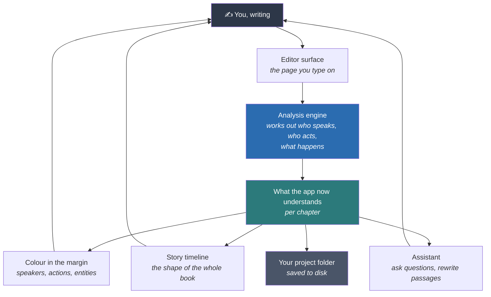

Text flows down the page. Understanding flows back up to you at the bottom.

The important thing here is the **loop**. This is not a process that ends in a
report. Everything the app works out is handed back to you while you are still
writing, and anything you correct goes straight back in.

---


<details>
<summary><b>Under the hood</b> · full technical detail</summary>

### Architecture

This section is organized in two layers:

1. A full-system overview showing how the major subsystems connect.
2. Per-system internal diagrams with input channels, output channels, performance paths, and current bottlenecks.

#### Full Overview

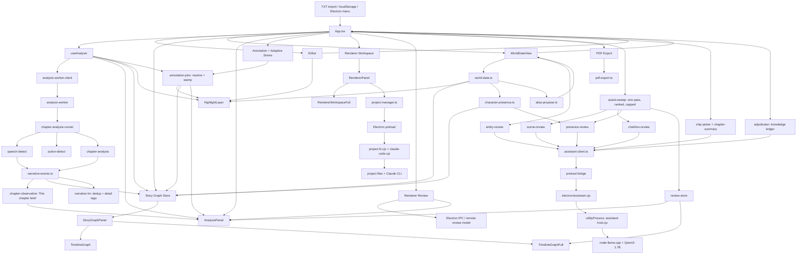

#### Data Ownership Summary

- `App.tsx` is the orchestration root. It owns novel state, chapter selection, preferences, annotation/adaptive stores, story graph, review results, and overlay visibility.
- `Editor` is the live typing surface. It only owns local UI concerns such as sizing, caret tracking, and paragraph-scoped live highlight behavior.
- `useAnalysis` owns current-chapter analysis, stale-cache reuse, worker dispatch, and high-mode adjacent pre-analysis.
- `world-data.ts` owns entity extraction, name resolution, and rename utilities.
- `narrative-events.ts` owns event detection: it decides what happens in a chapter, at clause granularity, and generates each event's label from the clause that triggered it. It replaced `event-detect.ts`, which is retained only so the suites can score against it.
- `chapter-observation.ts` owns the "This chapter" brief above the widgets, a lead line built from the detected events plus up to three anchored facts, each from a different dimension.
- `story-graph.ts` owns persisted chapter graph entries and the asynchronous LM pass. That pass does semantic dedup and detail tags; it deliberately no longer relabels (see System 9).
- `StoryGraphPanel` and `TimelineGraphFull` are presentation layers over precomputed graph/timeline data.
- `RendererPanel` owns renderer chat presentation, slash-command routing, project-backed message persistence, and the bridge into the fullscreen renderer workspace.
- `project-manager.ts` is the typed renderer-side gateway to Electron project filesystem handlers and Claude session status/streaming.
- `character-presence.ts` owns the presence/evocation classification: whether a named character is on the page, speaking, or being talked about while elsewhere. It writes `charactersPresent` and `entry.presence`; it declares `uncertain` rather than guessing.
- `alias-propose.ts` owns alias and duplicate-entry proposals. It never writes to `worldData`, `WorldDataView` applies what the writer confirms.
- `assist-sweep.ts` owns the ONE background model pass per chapter, its fixed task order and its hard budget.
- `review-store.ts` owns every model answer and, critically, the record of every question ASKED, including the ones that came back unusable.
- `assistant-client.ts` is the renderer-side gateway to the local model; `electron/assistant.cjs` owns the model file, the child process and the memory guard.

</details>

## How a chapter becomes understanding

This is the single most important process in the app, so it is worth walking
through slowly. It runs every time you stop typing for a moment.

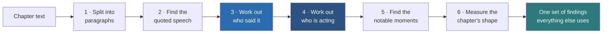

**Step 1, split into paragraphs.** Ordinary text splitting, but it is the unit
everything else counts in.

**Step 2, find the quoted speech.** Locate every stretch of dialogue, including
the awkward ones. Quotes left deliberately unclosed across a paragraph break,
quotes inside quotes, and quoted phrases that are not speech at all, such as a
character reading a sign.

**Step 3, work out who said it.** The hard part, and the heart of the app. When
the text says `"Go now," said Mara`, it is easy. Most dialogue in real fiction
does not say that.

It is tempting to present this as one ranked list of clues. That would be wrong,
so here is the real shape. The engine first checks for a speech verb (*said*,
*asked*, *whispered*) within about 80 characters of the quote. That single test
sends the paragraph down **one of two different chains of rules**, and each chain
is a run of specific tests that stops the moment one matches. There are exactly
thirty-five such exits. A **scoring stage**, where candidates accumulate points,
sits partway down the chain rather than at the end, and two further single-exit
rules sit below it. The chain taken when there is no speech verb nearby, which
is roughly half the traffic, never reaches the main scoring stage at all and
runs a small one of its own.

The signals carrying the most weight are these.

| Signal | What it does |
|---|---|
| An explicit tag | `"Go now," said Mara.` Settles it outright. |
| Narrative focus | Whose paragraph this is. The largest **capped** term, worth nearly three times "the character currently on stage". Two uncapped terms, conversation turns taken and how densely a name appears nearby, can exceed it. |
| Gender agreement | A **filter**, not a score. `she said` removes every man from the running, and when that leaves exactly one candidate it counts as strong evidence rather than weak. |
| The dialogue thread | A running model of who is in this conversation and whose turn it is. Ablating it was measured costing 27 of 217 curated cases at the time it was added. |
| Continuity | Whoever is already active keeps speaking unless something displaces them. |
| Alternation | Two people trading turns. Deliberately loses to continuity when the two disagree. |
| Scene roster | Who has actually spoken in this scene, used to prefer a plausible speaker over a merely nearby name. |
| Candidate filtering | A separate step *before* attribution that strips places, factions and objects out of the pool of possible speakers. Measured fixing **15.2%** of bare dialogue lines that had been handed to something that never speaks in its own book. |
| A later sentence | A high-setting-only pass that reads *forward* and uses a sandwich: if the lines either side of a bare one belong to the same speaker, the bare one belongs to the other party. |

**About the word "confidence".** It is not a probability that the answer is
right. For almost every answer it is a fixed number attached to *whichever rule
fired*, running from about 0.95 for an explicit tag down to about 0.55 for the
weakest inference. The exception is the pronoun-resolution branch, which does
compute a genuine ratio between the winner and the runner-up; measured, that
accounts for between 1% and 7% of attributed lines. So it records **how the engine reached
this answer**, and the strength of colour in your margin is showing you that. A
pale colour means "this came from a weak rule, worth a look", not "the engine
calculated a chance of being wrong".

The paler colour appears everywhere. The explicit "needs review" count is shown
only in annotation mode or with the debug panel on.

**Step 4, work out who is acting.** The same question for actions rather than
speech, as in *who* lit the lantern. Two things to know. It **only runs on the
high setting** (or when you are in annotation or debug mode), so on the first
fast pass there are no actors yet. And it **reads the results of step 3** rather
than working independently. Quoted stretches are excluded from being actions,
confident speakers are added to the pool of possible actors, and the current
speaker becomes the assumed subject for a following sentence that only says
"he" or "she". That coupling is deliberate and worth a lot of accuracy, but it
means **a wrong speaker can carry into a wrong actor**. The debug panel says so
out loud.

**Step 5, find the notable moments.** A separate engine looks for events worth
putting on a timeline, such as a decision, a revelation, an arrival or a turn in
the argument. It writes each one as a short label naming who did it.

**Step 6, measure the chapter's shape.** Dialogue density, pacing, tension rise
and fall, which characters dominate. This is what the timeline draws.

All six steps run out of the way of the page you are typing on, so your typing
never stutters, and they wait for you to pause rather than running again on
every keystroke.

### Fast first, then better

The app does not make you choose an accuracy setting. About a second after you
stop typing it runs the **fast** pass so the page has colour, and then 1.6
seconds after that result lands it quietly re-runs at the **high** setting and
replaces the answer with the better one. End to end that is roughly a second to
colour and about three to the best answer.

This replaced a dial that made *you* choose the setting. That is a bad question
to put to a writer, because the right answer depends on the prose in front of
you and the cost of choosing wrong is invisible. Converging removes the choice.
It does not make the engine right, it just means you always end on the best
answer the engine has.

---

## The systems, one at a time

### 1. Reading the manuscript

**What it is for.** Turning prose into structured facts, with no model and no
network, so the core of the app is free, instant and private.

**How it works.** Everything in the walkthrough above lives here, and none of it
uses a learned model. It runs on four kinds of ordinary rule:

- **Text patterns.** Recipes that match shapes in the text, such as "a closing
  quote mark, then a comma, then the word *said*, then a capitalised word".
- **Word shape.** Whether a word is capitalised mid-sentence, whether it is
  possessive, whether it looks like a surname.
- **Position.** Where a word sits changes what it does. The name in `"Go now,
  Theo."` is being *spoken to*, so Theo is the one person who cannot be
  speaking. The same name outside the quotes would mean the opposite.
- **Counting.** How often each character speaks, how recently, how the scene
  has been alternating.

**What to know as a user.** The colour in your margin is this engine's opinion.
Paler colour means it is less sure. If it is wrong you can correct it, and the
correction sticks to that line forever (see
[Correcting the app](#5-correcting-the-app-when-it-is-wrong)).

**Honest limits, with both numbers.** On the curated suite, which is mostly
ordinary tagged dialogue, the engine scores **86%** at the fast-then-refined
first pass and **100%** once it settles at the high setting. On dialogue where the tag has been
deliberately deleted and the speaker must be recovered from context alone,
across fifteen books, it is right about **52%** of the time.

Most of a real novel sits between those two numbers, nearer the top of the
range, because most dialogue carries some attribution. The 52% is the figure to
hold on to anyway, since it is the one measured on books the engine was never
tuned against. Both are explained in
[How we know it works](#how-we-know-it-works).

---


<details>
<summary><b>Under the hood</b> · full technical detail</summary>

### System 3: Chapter Analysis Pipeline

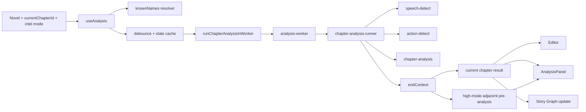

#### Input Channels

- Current chapter text.
- Previous analyzed chapter end-context.
- Sibling chapter stats from cached analyses.
- Resolved names from `world-data.ts`.
- Intelligence level (`low`, `default`, `high`, or auto-resolved).
- ~~Optional learned bias and adaptive inference context.~~ **No longer passed.** Corrections are applied as pins after detection instead; see [Correcting the app when it is wrong](#5-correcting-the-app-when-it-is-wrong).

#### Output Channels

- `ChapterAnalysisResult` for the current chapter.
- `prevResult` and `nextResult` for cross-chapter widgets.
- Snapshot data for `Editor` and `HighlightLayer`.
- Source material for story-graph chapter entries.

#### Performance Paths

- Current chapter analysis runs in a worker-backed path with main-thread fallback.
- High mode also idle-schedules adjacent chapter pre-analysis.
- Stale cached results are shown immediately while fresh analysis recomputes.

#### Current Bottlenecks

- High mode is materially heavier than the other modes on long chapters.
- Adjacent pre-analysis still consumes background time in high mode even though it is chunked and idle-scheduled.
- Without world data, known-name fallback extraction remains more expensive than the world-aware path.

#### Tension curve, a fixed defect recorded

`analyzeChapter` reduces per-paragraph tension to ≤30 buckets. It used to
**point-sample** one paragraph per bucket, which over 40 chapters longer than 30
paragraphs discarded **49.1%** of all paragraphs, missed the chapter's real
maximum in **15%** of chapters, and, because every paragraph-number claim in the
UI was made by inverting that curve, named a paragraph that was not actually at
the chapter's peak in **47.5%** of cases.

Two changes: buckets now **aggregate** (peak level lost 15.0% → 0.0%), and a new
`analysis.peakParagraph` locates the peak from the **full** signal, tie-broken to
the middle of the longest run at the chapter maximum (off-peak 47.5% → **0.0%**).

Read `analysis.peakParagraph`. Do not invert `tensionCurve` to find a paragraph,
tension is a three-level ordinal, so its peak is usually a tie across many
paragraphs and a bucket index maps back to a bucket *centre*.

#### Observed Timing Profile

From `scripts/test-analysis-responsiveness.ts` on the current codebase:

- Fast: ~44.45ms average across sampled chapters.
- Default: ~58.13ms average.
- High: ~214.73ms average.
- High mode is roughly 4.83x the cost of low mode on the sampled set.

</details>


<details>
<summary><b>Under the hood</b> · full technical detail</summary>

### System 9: Narrative Event Engine

What actually happens in a chapter. This is what fills the arc timeline's event
chips and the lead line of the "This chapter" brief.

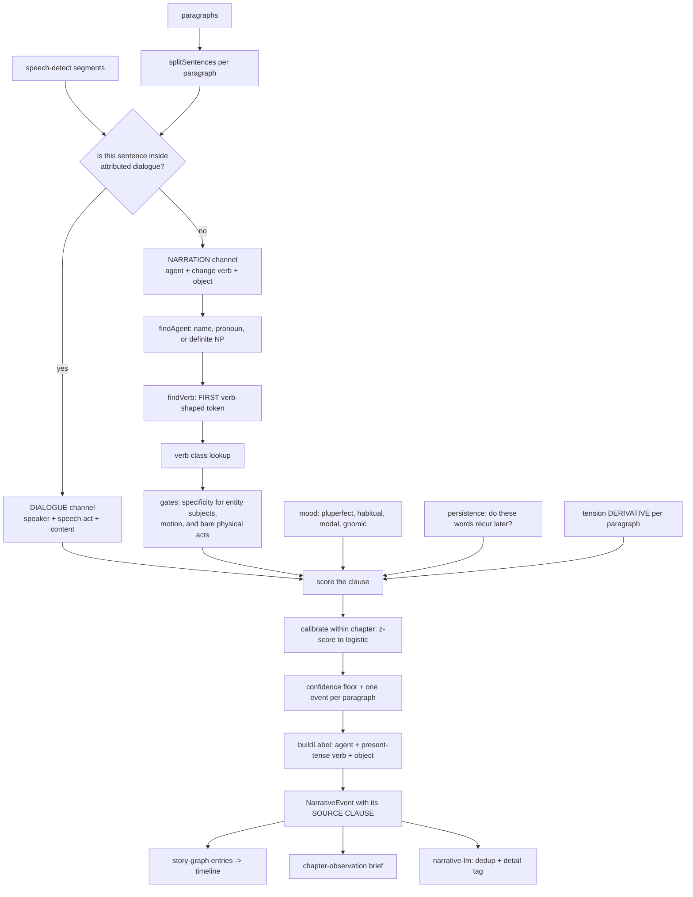

#### Input Channels

- Paragraphs, and `speech-detect` segments for the same paragraphs.
- Known names from world data plus detected speakers.
- Per-paragraph tension, one value per paragraph, **no subsampling**, the engine
  reads its derivative, because a local rise is evidence that something happened
  where a high plateau only says the chapter is tense.

#### Output Channels

- `NarrativeEvent[]`, ranked by calibrated confidence, each carrying its label,
  type, salience, paragraph, offset, and the verbatim clause it came from.
- Both the legacy six types (for the existing colour map) and a richer taxonomy:
  decision, revelation, confrontation, action, arrival, departure, shift,
  state-change, unclassified.

#### Design Rules That Are Load-Bearing

- **The unit is a clause, not a paragraph.** The predecessor scored paragraphs and
  then scavenged a label from anywhere inside, so agent, verb, type and label
  could each come from a different sentence.
- **Verb classes, not phrases.** Verbs are a closed class and generalise; the
  predecessor's 170 multi-word phrases did not, 45% occurred in one sample book
  and not the other, and 24% in neither.
- **A realis test.** Backstory, habit and hypothetical are penalised, not accepted.
  Penalties are subtractive and confidence is calibrated *within* the chapter, so a
  wholly retrospective chapter still ranks its own best clauses.
- **`unclassified` exists on purpose.** The predecessor defaulted unmatched clauses
  to "confrontation", which is why 36.3% of its output was typed that way.
- **Labels are short by construction**, not truncated after the fact, because the
  timeline gives a label 20–36 characters.

#### Two Channels, And Why

Most events in this corpus are **attributed dialogue acts**. Speaker attribution is
this app's strongest signal (`speech-detect` at its measured high-mode accuracy) and the predecessor
used it as a flat +0.2 for "contains a quotation mark".

#### Verification

```
npm run test:event-detect                 # gold set, gated, old vs new
npm run test:event-detect -- --detail     # per-chapter alignment, every miss
FLOOR=0.4 npm run test:event-detect       # sweep the operating point
npm run audit:ood-events                  # label-free, in-distribution vs held out
npm run print:chapter root-crown 16       # numbered paragraphs, for annotating
```

Current gold-set numbers, **74 chapters, 463 gold events (231 major), ±1
paragraph tolerance**. This table was previously written against a 22-event, 5
chapter fixture; the gold set has grown 21× since, and the numbers moved a long
way with it.

| | OLD `event-detect.ts` | NEW `narrative-events.ts` |
|---|---|---|
| emitted | 198 | 620 |
| matched, ±1 paragraph | 82 | **190** (129 on the exact anchor) |
| precision | **41.4%** | 30.6% |
| recall | 17.7% | **41.0%** |
| recall on major events | 19.0% | **43.3%** |
| F1 | 24.8% | **35.1%** |
| type correct, of matched | 3.7% | **27.9%** |
| labels fitting the UI budget | 35.4% | **100%** |
| labels well formed | 75.3% | **99.4%** |

**★ THE OLD ENGINE HAS HIGHER PRECISION AND THAT IS NOT A DEFEAT.** It emitted
198 events against the new engine's 620, it is precise because it is nearly
silent, missing four major events in five. The trade bought recall on major
events from 19.0% to 43.3% and F1 from 24.8% to 35.1%, and the labels went from
a third fitting the timeline's budget to all of them.

What the timeline actually **shows** (the top four per chapter, 275 chips):

| | OLD | NEW |
|---|---|---|
| precision@4 | 41.4% | 46.2% |
| major events shown | 19.0% | **26.8%** |
| shown labels well formed | 75.3% | **100%** |
| shown labels naming an agent | 67.2% | **86.5%** |

Type accuracy is reported, not gated: a trained-literary-scholar typology reached
Krippendorff's α of only 0.57–0.75 on a coarser scheme, so moderate type agreement
is a property of the domain. Position and salience are the gates.

#### Current Bottlenecks And Known Weaknesses

- **`action` dominates the held-out manuscript at 54.0%.** It is the widest class
  in the lexicon and a domestic novel is made of people opening doors. Requiring a
  real object or a specified clause moved it from 58.9%; it needs a better answer.
- **`precision@4` currently FAILS its gate at 46.2% against a target of 48%**,
  so `npm run test:event-detect` exits non-zero. Fewer than half the chips the
  timeline shows are gold events. Every other gate in the suite passes.
- **Precision is 30.6% overall.** The engine emits 620 events for 463 gold ones;
  it over-fires, and the ranking is what makes the surface usable rather than
  the detector.
- Label ↔ gold token overlap is **9.5%**: the label usually names the right beat
  in different words than a reader would use. Closing that gap is abstraction, which
  is what the generative path in `plans/narrative-event-engine.md` is for.
- Detection is synchronous and runs per chapter, not per keystroke, on the same
  deferred path as the story-graph update.

#### The Embedding Seam

`narrative-lm.ts` runs MiniLM three ways: Electron IPC to the main process,
browser WASM, and, via `setEmbedder`, an injected Node backend for the suites.

★ That third path did not exist, and its absence was expensive.
`@xenova/transformers` v2 statically imports `sharp`, whose native binary is not
built in this store. Electron's main process stubs it; no script did. So importing
the module under `tsx` threw at import time, `enrichChapterEntryWithLM` swallowed
it in a bare `catch`, and the offline suite reported **"relabeled events: 0/6
(0%)"**, a number that read as "the LM agrees" and meant "the LM never loaded".
`scripts/lm-node-backend.ts` installs the stub and the backend. Keep the seam: an
engine whose only inference path is inside Electron cannot be measured.

</details>


<details>
<summary><b>Under the hood</b> · full technical detail</summary>

### System 2: Editor And Highlight Layer

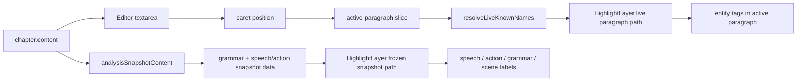

#### Input Channels

- Current chapter text from `App.tsx`.
- Analysis snapshot from `useAnalysis`.
- Known names from `useAnalysis` / world data.
- Annotation overrides and prediction traces from the annotation/adaptive layer.

#### Output Channels

- Textarea edit events back to `App.tsx`.
- Live visual output through `HighlightLayer`.
- Entity click anchors into `EntityPopover`.
- Speech/action annotation clicks into `AnnotationPopover`.

#### Performance Paths

- The live path only resolves names inside the paragraph under the caret.
- Grammar, speech, and action rendering stay on the settled snapshot path.
- Highlight overlay stays mounted to avoid compositor flips while typing.

#### Current Bottlenecks

- Extremely long single paragraphs still cost more than average because the live path is paragraph-scoped, not token-scoped.
- Snapshot path still has to build rich markup for all analyzed paragraphs once analysis settles.
- Grammar remains intentionally excluded from the per-keystroke path because it is not cheap enough for live typing.

</details>

### 2. Knowing the cast

**What it is for.** Working out who the characters are, which names refer to the
same person, and who is actually present in a scene.

**How it works, in three parts.**

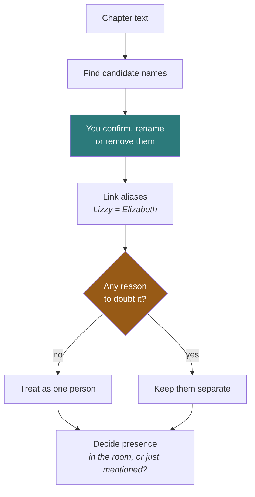

**Finding names.** The app extracts candidate character names from the prose,
and you can confirm, rename or remove them in the world panel. Your version
always wins over the guess.

**Linking aliases.** "Elizabeth", "Lizzy" and "Miss Bennet" are one person. The
app proposes links but is deliberately timid about it, because a wrong merge
corrupts every count downstream and is very hard to notice. It only ever links
a name to one confirmed main name, never chains links together, and several
signals can veto a merge outright.

**Presence versus mention.** A character being *talked about* is not the same as
a character being *in the room*, and treating them as the same thing makes the cast list wrong.
The app decides about **90%** of these cases with rules alone and asks the local
model only about the genuinely ambiguous remainder.

---


<details>
<summary><b>Under the hood</b> · full technical detail</summary>

### System 4: World Data And Entity Scan

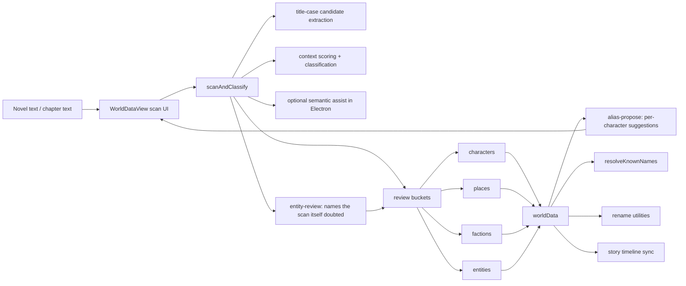

#### Input Channels

- Full novel or chapter text.
- Existing world data.
- Optional adaptive context for prediction traces and feedback.
- Manual edits from `WorldDataView`.

#### Output Channels

- Structured `worldData` buckets.
- Name list used by the highlight layer and speech detection.
- Rename operations across chapter or whole-book text.
- Character aliases and canonical names used by the story timeline.

#### Performance Paths

- Heuristic entity extraction runs in batches with main-thread yielding.
- Semantic assist is hard-disabled outside Electron.
- Live highlight path uses `resolveLiveKnownNames`, not the full scan pipeline.

#### Current Bottlenecks

- Whole-book scans on very large novels are still expensive even without semantic assist.
- Semantic assist remains runtime-gated and cannot be used in plain Vite/web dev.
- Moving entries between buckets is cheap, but rescans remain the dominant cost.

</details>


<details>
<summary><b>Under the hood</b> · full technical detail</summary>

### System 12: Character Presence And Aliases

Two engines that answer questions the rest of the app had been assuming away.

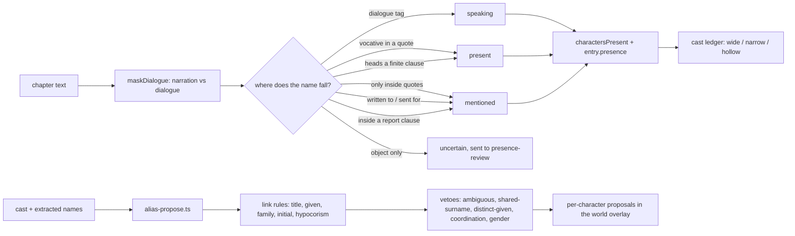

#### Presence vs Evocation

A character named in a chapter is not the same as a character *in* it. The
ledger used to draw one mark for both, because `charactersPresent` came from a
bare `chapter.content.includes(name)`.

The field has a name for this distinction, presence vs **evocation**, and
pointedly does not solve it: the Corpus Novelties NER guidelines annotate both
identically and say telling them apart "can be done in a later step". So there
is no gold set to borrow and no pretrained classifier to call.

**★ THE SIGNAL IS POSITION RELATIVE TO THE QUOTATION MARKS, NOT A VERB LIST.**
Two attempts died on word lists. "Elizabeth Bennet had been obliged to sit down"
and "when Jane and Elizabeth were alone" are presence, and no NAME+action-verb
pattern reaches them because prose puts auxiliaries and appositives in between.
Masking dialogue costs one pass and separates the classes outright.

Measured over 246 cast marks in 67 DEV chapters: **90% decided
deterministically**, and the model reviews the rest.

#### Aliasing, And The One Departure From The Literature

Vala et al. (2015) and Renard's `GraphRulesCharacterUnifier` link name mentions
into a graph, then remove edges along the shortest path between any vetoed pair,
and take connected components as characters.

**★ THIS DOES NOT USE COMPONENTS.** Components are how "Elizabeth Bennet"
reaches "Mr. Bennet" through the shared node "Bennet" and two people become one
— which is exactly why Vala then needs path surgery to undo it. This links a
surface form only to a *canonical character the writer already has*, and drops
any form two of them could claim. Same protection, no graph, and it produces the
per-character list the UI wants anyway.

**★ A WRONG MERGE IS FAR WORSE THAN A MISSED ONE**, and the code says so
everywhere. Two characters collapsing into one speaker is silent and corrupts
every downstream count; a missed nickname costs a nickname. Every ambiguity
resolves to "propose nothing", and nothing is written without a click.

The veto worth knowing about: if a book uses one surname with **both** a male
and a female title, that surname belongs to a family and no bare-surname link to
it is trusted. Without it the engine proposed "Miss Darcy" as an alias of
"Darcy", Georgiana, his sister, across 39 occurrences. Deliberately not a
majority vote: "Mr. Darcy" outnumbers "Miss Darcy" many times over, so a
majority would confidently return male and merge her anyway.

#### Current Bottlenecks

- `proposeAliases` walks the whole book once per candidate name. It is memoised
  on the cast, and only runs while the Characters tab is open.
- Presence is classified per chapter at analysis time and persisted on the graph
  entry; the display builder prefers the stored answer and only recomputes for
  graphs written before the field existed.

</details>

### 3. Showing the shape of the story

**What it is for.** Letting you see a whole book at once, which is the thing
that is impossible to hold in your head.

**How it works.** Each analysed chapter is condensed into a **story graph entry**
(a small summary record) holding its characters, notable events, tension curve
and role in the arc. Those entries stack into a timeline.

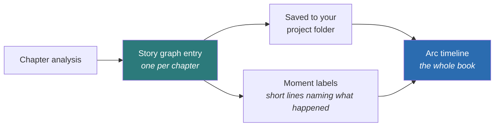

The timeline draws a spine that rises with tension, marks each chapter, shows
which characters carry which stretches of the book, and lets you jump straight
to the sentence behind any event.

**What to know as a user.** The timeline is built as you visit chapters, and it
is **saved**, so it is still there when you reopen the app. Revisiting a chapter
refreshes its entry.

**Honest limits.** Of the four events shown per chapter, fewer than half match
a hand-annotated gold standard. This is recorded as a **currently failing test**
rather than quietly rounded up.

---


<details>
<summary><b>Under the hood</b> · full technical detail</summary>

### System 5: Story Graph And Timeline Stack

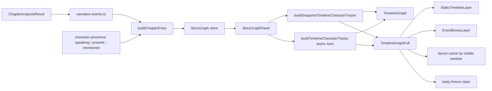

#### What A Graph Entry Holds

Beyond role, tension curve, word count and `majorEvents`, an entry carries:

- `charactersPresent`, characters actually ON THE PAGE. This used to mean
  "named anywhere in the chapter", which put a woman three counties away in the
  same list as the man arguing in the room.
- `presence`, the full per-character classification, evocation included.
  Optional: entries written before the classifier existed carry none, and every
  display consumer must treat that as "unclassified", never as "absent".
- `chipPicks`, the ranks the model promoted for the timeline, if it was asked.

#### Input Channels

- Chapter analysis results.
- `worldData` character names and aliases.
- Chapter metadata and current chapter id.
- Optional LM pass for semantic dedup and detail tags. It does **not** relabel.

#### Output Channels

- Compact side-panel timeline, with per-event position ticks on the tension bar.
- Fullscreen timeline overlay.
- Hover text on every event chip in both views: type, salience, paragraph,
  confidence, and the **source clause**.
- Top-character chips and chapter navigation clicks.
- Stored story graph entries, in the project folder when one is open and local storage otherwise.

#### Performance Paths

- Story graph entries are updated after analysis settles, not on every keystroke.
- Timeline tracks use snapshot-first rendering, then asynchronous world-aware sync.
- Fullscreen timeline now splits into a static layer and a dynamic event-detail layer.
- Event box layouts are cached by visible chapter window.
- Opening the fullscreen overlay freezes background glass/backdrop work behind it.

#### Current Bottlenecks

- Event-chip collision layout is still main-thread work.
- A 170-chapter timeline can still be limited by SVG text and chip density if the visible detail window becomes very busy.
- The LM pass is asynchronous, but still extra work on top of the base story-graph pipeline.

#### Two Fixed Defects, Recorded

**`tensionPosition` was computed for every event and never read.** Chips stack by
array index in both timeline views, so two events at 10% and 90% of a chapter
rendered with identical spacing and the timeline could not show *where* anything
happened. The compact view's tension bar now carries a tick per event at its real
position; the chips still stack, because they need the vertical room to stay
legible.

**The source clause was computed and thrown away.** `story-graph.ts` selected a
sentence, derived a label from it, and dropped it, so a 28-character chip had no
way to justify itself and no way to be checked. `MajorEvent.sentence` and
`.paragraphIndex` now persist, which is what the hover text shows and what makes
an event jumpable.

</details>

### 4. Helping you write

**What it is for.** Answering questions about your own book, and rewriting
passages on request, without the manuscript leaving the machine.

**How it works.** An optional local language model (a small AI that runs on your
own computer) is downloaded once, on your say-so, and verified against a known
fingerprint, so a tampered or corrupted download is refused. Two sizes
exist, a small fast one and a larger, slower one that
"thinks" before answering.

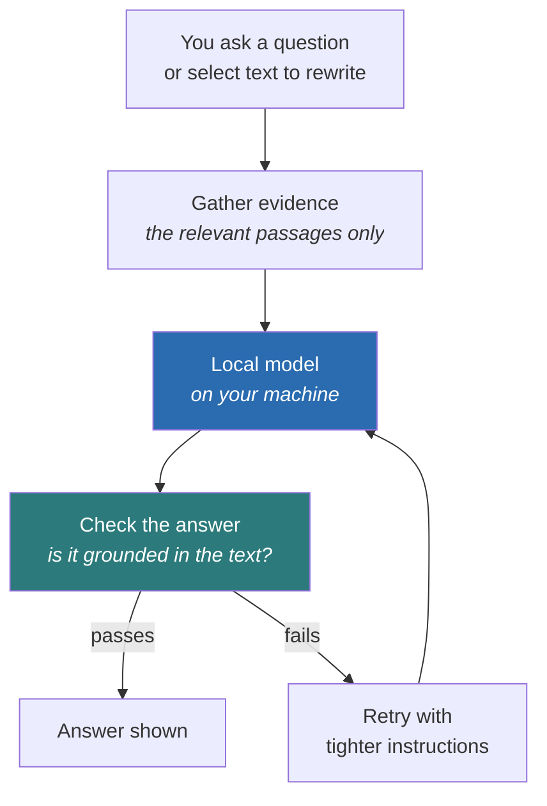

Two design rules matter here:

**The model is given windows, never the whole book.** How much varies by task. The narrowest ask for about 130 to 140 characters on
*each side* of the thing in question, roughly a short paragraph. The widest,
scene review, gets up to 1200 characters, taken as the head and tail of the
scene rather than the middle. This keeps answers about
what the sentences actually say rather than what the model half-remembers.

**Answers are checked, not trusted.** A verifier looks at whether the answer is
actually supported by the passage it was given. A failed check triggers a retry
with tighter instructions, rather than showing you a confident wrong answer.

Background jobs such as summarising a chapter go to a second copy of the engine
that can work on several of them at once, so they do not queue behind whatever
you just asked.

On Apple Silicon Macs the model runs on the graphics chip rather than the main
processor. Measured, that makes it about five times faster at taking your text
in and twice as fast at producing an answer. Both of those describe the
machine's speed, not yours.

---


<details>
<summary><b>Under the hood</b> · full technical detail</summary>

### System 10: Local Assistant Runtime

The generic inference service every layer-3 task goes through. It knows about
models, grammars, tokens and timings, and **nothing** about novels, chapters or
entities, the caller owns all of that and ships it in the system prompt.

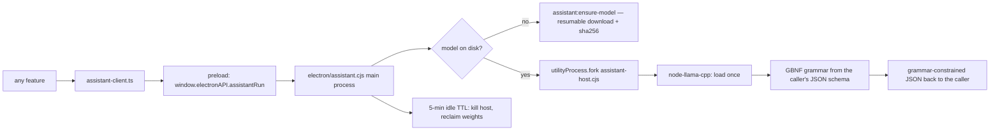

#### The Model

| | |
|---|---|
| Small tier (default) | `qwen3-1.7b-q4_k_m`, Qwen3 1.7B, Q4_K_M, Apache-2.0. 1,107,409,472 bytes, sha256-verified. Context 4096, thinking off. |
| Max tier | `qwen3-4b-thinking-2507-q4_k_m`, 2,497,281,152 bytes, sha256-verified. Context 8192, flash attention on, Q8_0 KV, thinking ON. |
| Batch engine | A pinned `llama-server` binary (llama.cpp b10298, sha256-verified, ~11 MB) serving the batch lane with 4 slots. Apple-Silicon only; elsewhere batch work falls back in-process. |
| Alternatives | Qwen3-4B-Instruct and Granite-4.0-micro ship as presets; any GGUF URL is accepted. **Only the two registry defaults are hash-pinned.** |
| Where it runs | Fully GPU-offloaded on Apple Silicon (measured 5.3x prefill, 2.1x decode versus CPU). Mode and task never change the device. |

#### Design Rules That Are Load-Bearing

- **A child process, not the main one.** llama.cpp weights are the largest
  allocation in the app; when the host exits the OS reclaims all of it with no
  reliance on the addon's own free paths. A wedged inference also cannot take
  the writer's window with it.
- **★ A 1.1 GB FETCH IS NEVER AN IMPLICIT SIDE EFFECT OF A RUN.**
  `assistant:run` lazily forks and loads, and explicitly does *not* download.
  Downloading is its own call, with its own progress events.
- **A memory guard refuses to load** when the machine cannot afford it, rather
  than letting the OS decide which process dies.
- **Grammar-constrained JSON, always.** The caller's JSON schema becomes a GBNF
  grammar, so a malformed answer is impossible rather than merely unlikely.
- **★ REASON BEFORE LABEL, IN EVERY SCHEMA.** A grammar emits properties in
  declaration order; putting the verdict first makes the model commit before it
  has written a word of evidence. Every task in this repo declares
  `{reason, verdict, confidence}` in that order, and it is not cosmetic, the
  one task that got it wrong produced labels contradicting their own reasons.
- **The exported functions are what the harnesses drive**, so
  `scripts/verify-assistant-runtime.cjs` exercises the real code path rather
  than a copy of it.

#### Current Bottlenecks

- The in-process host is one model, one slot, so concurrent interactive tasks
  queue; the sweep is written to be sequential and cancellable rather than to
  fight for the lock. The batch lane is different: it runs on the sidecar with
  four slots and true continuous batching.
- First run after a cold start pays host boot (60 s ceiling) plus model load
  (120 s ceiling) before the first token.
- The idle TTL trades a reload against holding the weights resident. It is
  per-tier: 5 minutes for the small model, 90 seconds for the larger one.

</details>


<details>
<summary><b>Under the hood</b> · full technical detail</summary>

### System 11: The Review Sweep

One background pass per chapter, in a fixed order, with a hard budget. The
alternative, several schedulers against a single-slot inference host, is two
queues fighting for one lock.

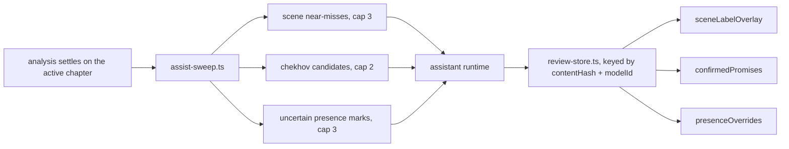

#### Design Rules That Are Load-Bearing

- **★ RANK AND CAP, DO NOT SWEEP.** Eight questions per chapter, bounded
  whatever the prose does. Measured over 73 DEV chapters, an uncapped scene pass
  *alone* would be 16.64 questions per chapter, for a queue an edit invalidates
  before it drains.
- **The cap is on QUESTIONS ASKED, not answers kept.** A chapter whose top three
  near-misses were all answered last time asks nothing and moves on, rather than
  walking down the ranking to find three unasked ones. "Everything worth asking
  has been asked" is the settled state.
- **★ A QUESTION ASKED AND ABSTAINED ON IS STILL RECORDED.** `asked` is
  membership, not payload. Without it, a null answer is re-asked on every mount
  for the life of the chapter.
- **Staleness by reconstruction, plus one guard.** A chapter entry whose
  `contentHash` or `modelId` no longer matches is dropped whole. But
  `knowledgeContentHash` is `length|first-60-chars`, so a length-preserving
  mid-chapter edit leaves it byte-identical, every selector therefore re-checks
  its answer against live text.
- **One selector per surface, and no consumer may re-implement its conditions.**
  What the widget shows and what the harness measures have to be the same
  function, or a gate proves something the writer never sees.

#### The Tasks

| Task | Asked about | What a confident answer does |
|---|---|---|
| `scene-review` | scenes the engine scored as near-misses | supplies a scene label |
| `chekhov-review` | ranked unpaid-promise candidates | marks one as a real promise |
| `presence-review` | the ~10% of cast marks the engine defers | settles present vs mentioned |
| `entity-review` | scan names the scan itself doubted | moves or drops a name |
| `timeline-chips` | stored events, by rank | promotes which chips the timeline shows |
| `chapter-summary` | a settled chapter | writes the brief |
| `continuity-adjudication` | knowledge-ledger candidates | confirms or dismisses a contradiction |

</details>


<details>
<summary><b>Under the hood</b> · full technical detail</summary>

### System 13: Knowledge Ledger And Adjudicator

Facts the manuscript asserts about its own world, and the contradictions between
them. The ledger extracts candidates deterministically and the adjudicator
confirms or dismisses them.

- Generator and adjudicator are **separate**, and the guards run **before** the
  model, a candidate that fails a deterministic check never costs an inference.
- Dismissals are **durable**: a fact the writer has waved off does not come back
  on the next sweep.
- The measured funnel put raw candidate precision at roughly **1 in 8**, which
  is why the guards exist and why the model is the last step rather than the
  first.

Spec: `plans/knowledge-ledger-and-local-adjudicator.md`.

</details>

### 5. Correcting the app when it is wrong

**What it is for.** When the app says Mara and you know it is Theo, you fix it,
and the fix holds.

**How it works.** Clicking a highlighted line opens a small panel. You pick the
right character and confirm. The app writes a note recording the sentence
itself, the text either side of it and your answer.

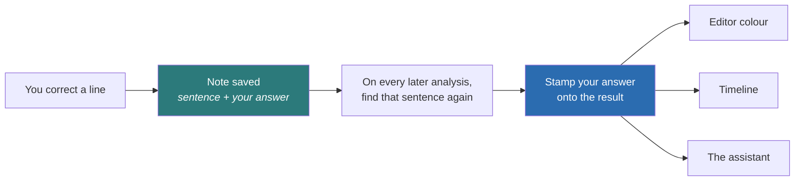

**Two properties, and you can judge them.**

**Your correction changes that line and nothing else.** It does not nudge the
engine's opinion elsewhere in the book. This is deliberate. An earlier design did try to learn
from corrections, and it was withdrawn on a measurement. Ten corrections changed
115 unrelated attributions across one book, while accuracy on held-out passages
moved by 0.0 percentage points. Be precise about what that shows. It is not
proof the app got worse; it is proof of a great deal of unexplained churn buying
no measurable benefit, which is reason enough not to ship it. The likely cause
is that a list of corrections records where the engine *fails*, which is not the
same thing as a description of who speaks most.

**The correction follows the sentence, not a line number.** If you later insert
two paragraphs above it, the note moves with its sentence. If you delete the
sentence, the note is dropped rather than landing on an innocent neighbour.

**What to know as a user.** The trade is real and worth stating. Because a
correction is a fact about one line, fixing a hard line in chapter 3 does not
fix a similar line in chapter 9. You would correct that one too.

---

### 6. The glass look

**What it is for.** A writing surface that feels like a physical object rather
than a form, without costing you frames while you type.

**How it works.** Panels blur and bend whatever sits behind them, the way real
frosted glass does. Most of that uses the browser's built-in effects. A few
parts are drawn by hand instead, because the built-in blur produces visible
stripes across large soft shadows, and once you have seen them you cannot
unsee them.

The rule underneath all of it is that **the page you are typing on always wins**.
An effect that costs too much is quietly simplified rather than allowed to make
the app stutter. Heavy background work is deliberately cut into small pieces so
the screen can keep refreshing between them, which costs a few percent of
background speed and buys visibly smoother scrolling.

---


<details>
<summary><b>Under the hood</b> · full technical detail</summary>

### System 8: Liquid Glass And Compositing

```mermaid
flowchart LR
    A[.liquid-glass / analysis tabs / action groups] --> B[initLiquidGlassFilter]
    B --> C[ResizeObserver + idle scheduling]
    C --> D[liquid-glass-worker]
    D --> E[SVG filter cache]
    E --> F[per-element backdrop-filter url(#id)]
    F --> G[visible glass surfaces]

    H[Timeline / renderer / onboarding overlays] --> I[body.*-overlay-freeze]
    I --> J[background glass flattened]
```

#### Input Channels

- DOM elements matching the glass selector.
- Element width, height, and border radius.
- Worker-generated displacement maps.
- Overlay open/close state for timeline, renderer workspace, and onboarding.

#### Output Channels

- Per-element SVG filter ids applied as backdrop filters.
- Glass surfaces across panels, tabs, overlays, and action groups.
- Freeze modes for the fullscreen timeline, fullscreen renderer workspace, and onboarding overlay.

#### Performance Paths

- Filter generation is idle-scheduled and offloaded to a worker.
- Filter instances are cached and reference-counted.
- Overlay freeze modes disable background blur computation while preserving each overlay's own blur plane and visual treatment.

#### Current Bottlenecks

- Many simultaneous live glass surfaces can still increase compositor cost.
- Large overlay stacks with multiple backdrop-filter planes are expensive in Electron/Chromium.
- Resizing many glass surfaces at once can still burst worker/filter churn.

</details>

### 7. Keeping your work

**What it is for.** Making sure that closing the app loses nothing.

**How it works.** Once you have chosen a project folder, each kind of
information is written to its own small file inside it, next to your `novel.txt`.
Until you choose one, the app is working on an unsaved draft and keeps
everything in its own internal scratch storage instead. It works out which of
the two applies before every single save.

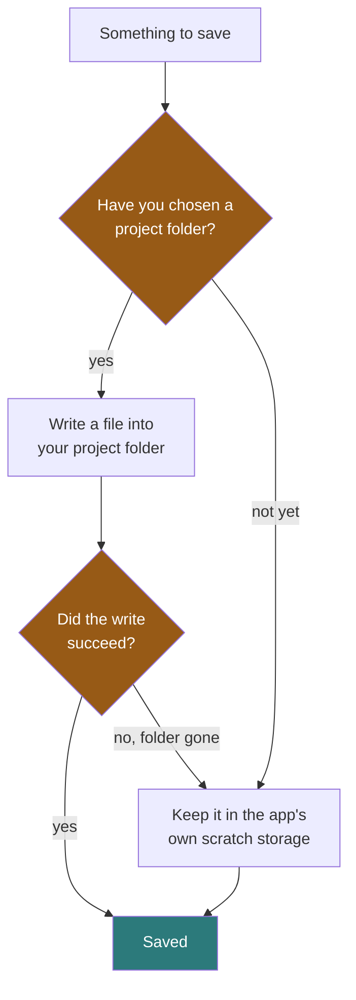

| What is saved | Holds |
|---|---|
| Novel | chapters, metadata, world data |
| Story graph | per-chapter timeline entries |
| Annotations | your corrections |
| Knowledge notes | facts the app worked out about your world, and whether you accepted or dismissed each one |
| Reviews | prose-review results |
| Assistant answers | model answers, keyed to the exact text they were about |

**Two rules keep this honest.**

Anything the app worked out is stamped with a fingerprint of the chapter it came
from, so editing that chapter throws the old conclusion away whole rather than
half-updating it. A conclusion about prose you have since rewritten is not partly
true, it is wrong.

Being exact about that fingerprint, because it is not perfect. It is the
chapter's length plus its opening sixty characters, which is cheap to compute on
every keystroke but blind to an edit that swaps one word for another of the same
length in the middle of a chapter. The app knows this, so the surfaces that
depend on a stored answer re-check it against the live text before showing it.

And if a save is ever refused, the data goes to the scratch storage instead of
being dropped. That rule exists because this app genuinely had the bug. If you
had not yet chosen a project folder, every save was being sent to a folder that
was not there, and nothing checked whether it had worked. The result was that
your timeline was rebuilt beautifully all session and was blank again every
time you reopened the app.

---


<details>
<summary><b>Under the hood</b> · full technical detail</summary>

### Persistence

Desktop writes one JSON file per store into the project directory through
`project-manager.ts` → `electron/project-fs.cjs`. The browser build writes the
same shapes to `localStorage`. `stateTarget()` is the switch and it resolves
*project vs local* rather than *desktop vs web*, so a desktop session with no
project open writes locally, and a refused project write falls back to local
rather than being dropped.

★★ THIS WAS ONCE TRUE OF ONE STORE AND CLAIMED OF ALL OF THEM. The story graph
got the fix; `storage.ts`, which holds the NOVEL, never called `stateTarget()`
at all, and five other stores discarded the result of their project write. The
gate covered story-graph alone, which is exactly how a single-instance fix
became a false universal. All six stores now resolve the target and rescue a
refused write, and `verify-state-persistence.ts` drives every one of them
through both failure modes.

| Store | Project file | localStorage key | Holds |
|---|---|---|---|
| Novel | project files | `glass-editor:novel-v1` | chapters, meta, world data |
| Current chapter | n/a | `glass-editor:current-chapter-v1` | selection only |
| Story graph | `story-graph` | `glass-editor:story-graph-v1` | per-chapter entries, events, presence |
| Annotations | `annotations` | `glass-editor:annotations-v1` | the writer's corrections |
| Adaptive model | `adaptive` | `glass-editor:adaptive-learning-v1` | learned weights and traces. **Only the `entity` task still consumes these**; the speech and action models are retained but no longer reach detection (see [Correcting the app](#5-correcting-the-app-when-it-is-wrong)). |
| Assist reviews | `assist-reviews` | `glass-editor:assist-reviews-v1` | model answers + every key asked |
| Knowledge ledger | `knowledge-ledger` | `glass-editor:knowledge-ledger-v1` | world facts, verdicts, dismissals |
| Review results | `review-results` | `glass-editor:review-results-v1` | prose-review output |
| License | n/a | `glass-editor:license-v1` | tier + activation code |
| Preferences | n/a | `latentwrite:prefs-v1` | all 16 preference fields, including the assistant tier and the dormant review API key |
| Daily words | n/a | `latentwrite:daily-words-v1` | per-day word counts for the goal readout |
| Widget board | `widget-config` | `latentwrite:widget-config-v1` | which analysis widgets are shown and in what order. The only store that is **both** project-backed and local. |

**★ EVERY MODEL-DERIVED STORE IS KEYED BY `contentHash` + `modelId`.** Changing
either drops the chapter's entry whole rather than merging into it: answers
reached against prose that no longer exists are not partially valid, they are
wrong.

</details>

### 8. The renderer workspace

**What it is for.** Working on the *project* rather than on the prose. Asking
for files to be reorganised, a draft to be worked through, or a tool to be set
up. It is a chat panel on a separate screen, and it is the one part of the app
that talks to the internet.

**How it works.** It runs the `claude` command-line tool if you have it
installed, using whatever Claude login that tool already holds. The app never
asks you for a key and never stores one. What you type there, and the files it
is working on, go to Anthropic's servers.

**What to know before using it.** It runs `claude` with its permission prompts
disabled, so an instruction to change your files is carried out without asking
again. Nothing in the code confines it to the project folder either. Treat it as
a capable assistant with real access to your machine, not as a sandbox. None of
the analysis, the timeline or the local assistant uses it, and it never runs
unless you open it.

**Export lives here too.** Plain text, Markdown, Word (.docx), EPUB, and a PDF
with configurable typography. The Markdown, Word and PDF exports have menu
shortcuts.


<details>
<summary><b>Under the hood</b> · full technical detail</summary>

### System 7: Renderer Workspace, Review, And Export

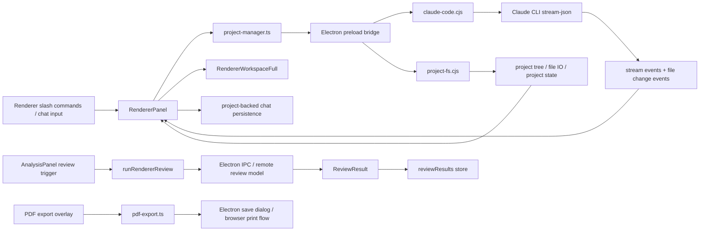

#### Input Channels

- Project-backed chapter files, `novel.txt`, and renderer session state.
- Free-form renderer chat messages and slash commands (`/draft`, `/review`, `/assemble`, etc.).
- Current chapter text for legacy renderer review.
- API key + selected review model.
- Novel metadata and export settings.

#### Output Channels

- Persistent Claude sessions, streamed assistant/thinking/tool lanes, and file-change notifications.
- Fullscreen renderer workspace with file tree, markdown/text preview, and resizable chat pane.
- Renderer review flags in the analysis surface. **Staged, not reachable:**
  `runRendererReview` has no caller in `src/`, so nothing currently collects an
  API key or posts to the API. The IPC handler and the client both exist.
- Persisted review results.
- Exported PDF / print HTML.

#### Performance Paths

- Claude workspace operations run in Electron subprocesses and stay off the live editor path.
- Renderer file-tree updates are narrow: tree listing is project-scoped, file preview only reads the selected file, and chat persistence is project-backed rather than global localStorage.
- Review work is remote and asynchronous; it does not run in the live editor path.
- PDF export is on-demand and isolated behind its own overlay.

#### Current Bottlenecks

- Renderer sessions still depend on Claude CLI availability and model latency.
- Project-wide file-change bursts can refresh the renderer workspace more often than a single-file editor would.
- Review result persistence can grow over time with many chapters.
- PDF export is bounded more by document size and asset generation than by UI render cost.

</details>

---

### 9. The app shell

**What it is for.** Holding the whole thing together. One place owns the
manuscript, the current chapter, your preferences, and every stored result, so
there is a single answer to "what is true right now".

**How it works.** A single root component owns that state and passes it down.
Analysis, saving, the timeline and the assistant are all driven from effects
that watch it. The trade is honest and visible in the code: this makes the flow
easy to follow and the ordering between effects load-bearing, which is why the
[system audit](./plans/system-audit-2026-08.md) calls the root component out as
the largest single piece of complexity in the app.


<details>
<summary><b>Under the hood</b> · full technical detail</summary>

### System 1: App Shell And State Orchestration

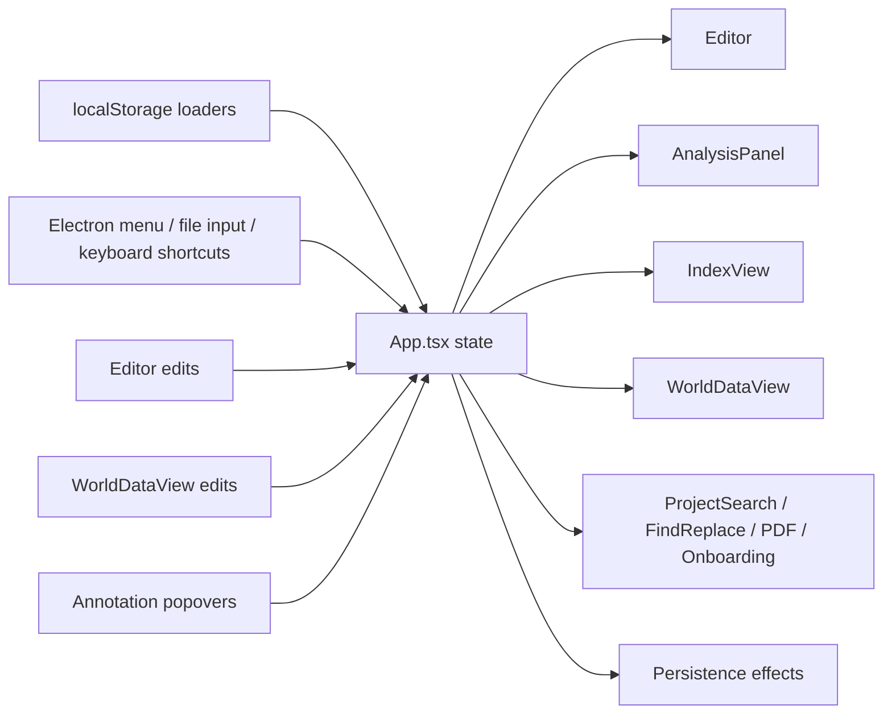

#### Input Channels

- Novel content loaded from `storage.ts`.
- Current chapter id loaded from `storage.ts`.
- Preferences loaded from `preferences.ts`.
- Story graph loaded via `story-graph.ts`, from the project folder or local storage depending on the resolved target.
- Review results loaded via `renderer-review.ts`, from the project folder or local storage depending on the resolved target.
- Annotation store loaded from `annotation-store.ts`.
- Adaptive store loaded from `adaptive-store.ts`.
- Electron menu commands, keyboard shortcuts, import/export actions.

#### Output Channels

- Feeds `Editor`, `AnalysisPanel`, `WorldDataView`, overlays, and toolbars.
- Persists novel, chapter id, preferences, story graph, review results, annotations, and adaptive models.
- Pushes renamed entities back through chapter/book rename operations.

#### Performance Paths

- Chapter edits update the active chapter and fan out into editor, analysis, and story-graph maintenance.
- Analysis settle events can update story graph entries and review surfaces.
- World-data edits can invalidate name resolution, timelines, and entity highlighting.

#### Current Bottlenecks

- Any unstable prop passed from `App.tsx` into large children can reintroduce broad rerender churn.
- Large localStorage payloads remain sensitive to quota and serialization cost if prediction logs become too verbose.
- Story-graph maintenance is already deferred, but still fans out to multiple widgets after analysis settles.

</details>

---

### 10. Rewriting a passage

**What it is for.** Selecting text and asking for it to be proofread, rewritten,
or changed according to an instruction you type. It is the only feature in the
app that writes into your manuscript by itself.

**How it works.** Your request is first classified into an intent, and that
classification decides everything downstream: how much text is sent at once, what
the model is told, how strictly the answer is checked, and whether a failure is
worth retrying. Proofreading merges adjacent paragraphs into one batch because it
is mechanical and never restructures. Rewriting deliberately does not, because
handing the model two paragraphs invites it to merge them.

**The safety rule worth knowing.** Every revised passage is run through the
grammar checker before it is allowed anywhere near your text, and it is
**refused if it contains more hard errors than the text it would replace**. A
model that "improves" a sentence into a broken one gets thrown away rather than
shown to you. Replacements also go through the normal editing path, so undo
works exactly as you would expect.

---

### 11. Asking about a passage

**What it is for.** Right-clicking a paragraph and asking what it means in the
story around it. The rule-based engines can tell you *where* things are. This is
for what a passage is *doing*.

**How it works.** The interesting part is that the model does no searching. A
separate step assembles the evidence, in a fixed priority order, until a token
budget runs out: the cast present in the scene, per-chapter summaries, the
relevant world data, and so on. Whatever does not fit is dropped from the bottom.
The model receives that pack and nothing else, so it cannot wander into the rest
of the book or answer from a half-memory of a novel it read in training.

Two rungs that could be in that ladder are deliberately left out, and the
reasoning is recorded in the source rather than lost.

---

### 12. Custom tools

**What it is for.** Extending the app per project. A tool is a small program that
lives in your project folder, gets a slash command, and can appear as a chat
command, a widget on the analysis board, a sidebar, an overlay, or a highlight
layer over your prose.

**How it works.** Tools declare what they need (the current chapter, the
analysis, world data, specific files), are compiled inside the app when they
change, and draw themselves using a supplied kit of interface pieces so they
match the rest of the app without shipping their own styling. A handful of slash
commands are reserved by the app and cannot be taken over.

**What to know as a user.** This is off unless you enable it, and tools you add
run with the access they declare, so treat one you did not write the way you
would treat any other plugin.

---

### 13. The analysis board

**What it is for.** The panel of widgets showing what the app has worked out
about the chapter you are in.

**How it works.** The board is a registry of widgets you can reorder and hide,
saved per project. The default order is a deliberate reading order rather than an
arbitrary one: what looks **wrong** first, then the chapter's own shape, then how
it sits against its neighbours, then craft detail from coarse to fine. Every
widget carries its own help text, written to answer the question "I do not know
what this widget is telling me".

Widgets cover diagnostics, tension, cast, continuity, cross-chapter arc, chapter
role, shaping, prose profile, voice, rhythm, repetition, style watch and
character voice, plus a slot for any custom tool that asked to be a widget.

---

### 14. Tidying prose

**What it is for.** Two one-button passes over your own text. One re-paragraphs a
wall of unbroken prose. The other inserts scene-break markers where a scene
clearly ends.

**How it works.** Both are built on a shared sentence-segmentation layer tuned
for high precision, and both refuse to act when the signal is ambiguous.

**The rule that protects you.** Your existing paragraph breaks are treated as
authoritative and are never second-guessed. The only case the app fully
reconstructs is a chapter that arrives as a single unbroken block, which is
usually the result of an import rather than a decision you made.

---

### 15. Keyboard shortcuts

| Shortcut | Does |
|---|---|
| ⌘⇧O | Open project |
| ⌘↵ | New chapter |
| ⌘I | Chapter index |
| ⌘J | World data |
| ⌘O | Import .txt |
| ⌘⇧E | Export .txt |
| ⌘⇧P | Export PDF |
| ⌘⇧M | Export Markdown |
| ⌘⇧D | Export Word (.docx) |
| ⌘S | Save |
| ⌘Z / ⌘⇧Z | Undo / redo |
| ⌘F | Find |
| ⌘⇧F | Find across the project |
| ⌘. | Focus mode |
| ⌘⇧I | Toggle analysis on and off |
| ⌘\ | Split view |
| ⌥← / ⌥→ | Previous / next chapter |

---

## The four levels of "AI" in this app

The word "AI" covers four unrelated things here, with different costs, different
failure modes and different privacy properties. **Most of the app is level 1.**

| | What it is | Where it runs | What it costs you |
|---|---|---|---|
| **1. Plain rules** | Text patterns, word shapes, grammar position, counting. No model at all. | Background thread on your machine | Nothing, and it is instant |
| **2. Local embeddings** | A small maths model for judging similarity between passages. | Your machine | Bundled in the app |
| **3. Local language model** | Qwen3, in a 1.1 GB or a 2.5 GB version, required to answer in a fixed format. | Your machine, in its own process | Two optional downloads, the model and an 11 MB engine |
| **4. Cloud Claude** | Anthropic's Claude, reached by running the `claude` command-line tool you already have installed. | Anthropic's servers | Whatever your existing Claude login costs you. The app never asks for or stores a key. |

**Levels 1 to 3 all run on your machine and send nothing anywhere. Level 4 is
the only one that leaves your computer**, it lives behind a separate screen you
have to open deliberately, and none of the analysis on this page uses it. If you
never open it, it never runs.

On the downloads at level 3. The two the app offers by default are pinned to a
known fingerprint, so a corrupted or substituted file is refused. You can also
point it at any other model file yourself, and those are not pinned, because the
app cannot know in advance what you are going to hand it.

Three rules hold across all four, and they are the reason the app is usable
without any of the optional parts:

**The rule-based answer is always first-class.** Every local-model task is an
*improvement on* an answer that level 1 already produced. Turning the model off,
or never downloading it, reduces depth. It never leaves you with something
wrong that a model was supposed to fix.

**The model judges, it does not invent.** Each task hands the model a short list
of candidates the rules already found, plus the exact sentences involved, and
takes back one choice. A bad model answer can cost you a mark. It cannot
conjure a character who is not there.

**The model sees windows, never the manuscript.** Small snippets around the
thing in question, never the book.

---

## How we know it works

Every engine has a **suite** (a pass-or-fail gate) and most also have a **probe**
(a script that measures something and prints it for a human to read). Both are
kept, because a gate tells you nothing broke and a probe tells you how well it
actually does.

### Measured accuracy

Everything below was produced by running the test suites in this repository,
except the two rows marked with a dagger, which are carried forward from earlier
runs because they need the optional model on disk or a scoring pass the repo
does not currently automate. Nothing here is copied from a code comment.

Four words are used throughout, so they are worth defining once.

- A **gold set** is a set of passages a human marked up by hand, treated as the
  right answer.
- **Precision** is how often the app is right when it says something. High
  precision means few false alarms.
- **Recall** is how much of the real thing it found at all. High recall means
  few misses. The two trade against each other, which is why both are shown.
- **precision@4** is precision counting only the four events the timeline
  actually puts on screen, rather than everything the engine found. It is the
  number that matches what you would see.

| Engine | Benchmark | Result |
|---|---|---|
| Speech attribution | curated cases, 217 expectations | fast **80%** · default **86%** · high **100%** |
| Speech attribution | **tag deleted**, 786 lines, 15 books | fast **51.5%** · default **52.0%** · high **52.9%** |
| Narrative events | gold set, ±1 paragraph | precision **30.6%** · major recall **43.3%** |
| Narrative events | what the timeline actually shows | precision@4 **46.2%** |
| Event labels | gold set | well-formed **100%** · names an agent **86.5%** |
| Character presence | 246 marks, 67 chapters | **90%** decided by rules alone |
| Presence review (model) † | the 7 cases rules would not decide | 4 answered correctly, 3 declined, **0 answered wrongly**. Needs the model downloaded, so it is not part of the automated run. |
| Alias linking † | 47 characters, 6 books | 8 proposals, **8 correct, 0 wrong merges**. The automated probe reports the 8 proposals and their refusals; the correctness scoring was done by hand. |
| Local prose review | 8 patterns, 120 expectations | **100%** recall and precision |

**The two speech numbers are the most important thing on this page.** The
curated suite is hand-written cases, and scoring 100% on examples you wrote
yourself is a weak signal, because it can be tuned against. The second
benchmark deletes the dialogue tag and forces recovery from context alone across
fifteen books. Eight of those were never used during development, though only
six of the eight contain any lines the benchmark can score, so the held-out
evidence is a little thinner than the book count suggests. **52% is the honest
number.** The same caution applies to the 100% on prose review, whose eight
patterns were written alongside the detectors that find them.

### A test that is currently below its target

```
FAIL  precision@4 (what is SHOWN)  46.2%  target ≥ 48%
```

The timeline shows four events per chapter and fewer than half of them match the
hand-marked set. Nothing is broken and nothing crashes; a number the project set
for itself has not been reached, and the test is left failing so it cannot be
forgotten. Every other check in that suite passes.

### Proving that a cleanup changed nothing

`scripts/fingerprint-analysis.ts` fingerprints 130,001 facts (every speaker,
action, event and statistic) across seven books at three settings. A change that
is supposed to be invisible must produce an identical hash. An accuracy score
staying still is not the same proof, because a change can trade two errors for
two different errors and keep the score.

---


<details>
<summary><b>Under the hood</b> · full technical detail</summary>

### How This Repo Measures Itself

Two kinds of script, and they are not interchangeable.

- **A suite gates.** `test-*.ts` asserts behaviour and exits non-zero. Its job is
  to stop a regression.
- **A probe measures.** `probe-*.ts` / `probe-*.cjs` prints distributions, funnels
  and real output for reading. Its job is to tell you whether a feature is worth
  building *before* you build it, and what it is actually doing afterwards.

Four rules this repo learned the hard way, each from a shipped defect:

- **★ PAIR EVERY NEGATIVE GATE WITH A POSITIVE ONE.** `every(x => !bad)` is
  satisfied perfectly by an empty set, and `0 === 0` is true. Two features here
  have gone green while rendering nothing at all.
- **★ MEASURE THE SHIPPED MODULE, NOT A COPY OF ITS REGEX.** A probe that
  re-implements the thing it measures scores prose the real filters already
  reject.
- **★ MEASURE AT THE CUT THE PRODUCT USES.** Scoring a model task on inputs the
  deterministic engine would never send it measures nothing. Doing this
  correctly is what turned one failing measurement here into a passing one.
- **★ A GATE KEYED TO PIXELS CANNOT SURVIVE VISUAL WORK**, which is the only
  work it exists to check. Visual gates select on `data-*` attributes.

#### Measured Accuracy, In One Place

Numbers below are from a live run of the suites in this repo, not from comments.
Where two numbers exist for one engine, both are shown, they measure different
things and the gap is the point.

| Engine | Benchmark | Result |
|---|---|---|
| Speech attribution | curated cases, 217 expectations | fast **80%** · default **86%** · high **100%** |
| Speech attribution | **masked tag**, 786 lines, 15 books | fast **51.5%** · default **52.0%** · high **52.9%** |
| Narrative events | gold set, ±1 paragraph | precision **30.6%** · major recall **43.3%** |
| Narrative events | what the timeline SHOWS, top 4 | precision@4 **46.2%** · major shown **26.8%** |
| Event labels | gold set | well-formed **100%** · name an agent **86.5%** · fit the budget **100%** |
| Character presence | 246 marks, 67 DEV chapters | **90%** decided deterministically |
| Presence review (model) | 7 deferred cases | 4 right-and-applied, **0 wrong-and-applied** |
| Alias proposer | 47 characters, 6 DEV books | 8 proposals, **8 correct, 0 wrong merges** |
| Local prose review | 8 patterns, 120 expectations | **100%** recall and precision |

**★ THE TWO SPEECH NUMBERS ARE THE MOST IMPORTANT THING ON THIS PAGE.** The
curated suite is hand-written cases, and 100% on fixtures you wrote yourself is
a weak signal, it can be tuned against. The masked benchmark deletes the
dialogue tag and forces recovery from context alone across 15 books, eight of
them held out. **52% is the honest number.** Quote that one.

The same caution applies to the 100% on local prose review: eight patterns, 120
expectations, all authored alongside the detectors.

#### Currently Failing Gates

Recorded rather than hidden. `npm run test:event-detect` exits non-zero on:

```
FAIL  precision@4 (what is SHOWN)  46.2%  target ≥ 48%
```

The timeline shows the top four events per chapter, and fewer than half of those
are gold events. Every other gate in that suite passes.

</details>

### Measured Out: Model Tasks That Were Built And Withdrawn

Three tasks are implemented, tested, and deliberately **not wired**. Each keeps
its number and a wire-it-back condition in its own header. They are kept rather
than deleted because the measurement is the asset, the next model gets
evaluated against the same probe.

| Module | Measurement | Why it is off |
|---|---|---|
| `attribution-review.ts` | 5 cases: 1 right, 1 declined, **3 wrong and applied**, every wrong answer at 0.8–1.0, stable across 2 prompt versions × 4 presentations | The deterministic engine's own posterior is better. A suggestion wrong three times in five, carrying a fluent reason, costs more attention than it saves. |
| `alias-review.ts` | 8 pairs: 1 right, **1 wrong and surfaced**, both at confidence 1.0 | It merged two sisters while reasoning "both names share the same surname and are given different first names", which is the *proof* they are two people. A merge has no deterministic answer underneath it to fall back on. |
| salience blend in `story-graph.ts` | precision@3 49.1% blended vs 49.1% off; major coverage 16.9% vs 18.6% | The embedding score is good enough to PRUNE with and not good enough to RANK with. Constant churn, zero accuracy. Pruning stays; the blend weight is 0. |

**★ THE PATTERN WORTH COPYING.** Each was withdrawn on a number, not an opinion,
and the withdrawal condition is stated in the file so nobody has to re-argue it
from the prompt. The rule that decided all three: score **wrong-and-applied**,
not accuracy. A declined answer costs nothing when a deterministic engine
already holds one.

---

## Is any of it paid?

Not today. The code contains a tier map (`src/lib/features.ts`) that marks a few
features as "pro", and a plan for what a paid tier might eventually be, but
**nothing is currently gated**. Every feature described on this page is
available, and the check that would enforce a tier is not called from anywhere.

Two things are worth stating plainly because they will not change. The
rule-based engines are never gated, so the app's understanding of your
manuscript is not a paid feature. And nothing is enforced by a server, because
there is no server.

---


<details>
<summary><b>Under the hood</b> · full technical detail</summary>

### Licensing

`src/lib/features.ts` maps a `FeatureKey` to the tier that unlocks it, and
`hasAccess(key, tier)` is the only check. Current map:

| Feature | Tier |
|---|---|
| `intel-auto`, `intel-off`, `split-view` | free |
| `intel-manual`, `renderer-workspace`, `custom-tools`, `story-nlp-control` | pro |

Codes are HMAC-SHA-256 over a build-time salt, validated locally. Nothing about
the tier is enforced server-side, and the deterministic engines are not gated,
see the first rule under "The Four Model Layers".

Plan: `plans/pricing-and-license-system-plan.md`.

</details>

## A note on how this project works

Two habits show up everywhere in this repository and explain a lot of the code
you will read.

**Measure before claiming.** Optimisations that did not move a number were
reverted rather than shipped. Accuracy figures are given alongside the benchmark
that makes them look worst.

**Record what was tried and rejected.** The `plans/` directory holds the
experiments that failed as well as the ones that shipped, because the most
expensive mistake is re-running an experiment someone already disproved.

> **Everything from here on is written for developers.** If you came to
> understand what the app does and whether to trust it, you have read it.

---

## Project layout

```
src/
  App.tsx              the shell: state, effects, wiring
  components/          editor, highlight layer, panels, timeline, popovers
  lib/
    speech-detect.ts       who is speaking          (the core engine)
    action-detect.ts       who is acting
    narrative-events.ts    what happens
    chapter-analysis.ts    chapter shape and tension
    annotation-pins.ts     your corrections, pinned to their sentence
    story-graph.ts         per-chapter timeline entries
    world-data.ts          characters, places, aliases
    project-manager.ts     where state gets saved
electron/
  assistant.cjs          local model runtime
  assistant-sidecar.cjs  batch engine for background jobs
  project-fs.cjs         reading and writing the project folder
scripts/                 every suite, probe and verification harness
plans/                   design records and measured findings
```

### Where to start reading

| If you want to understand | Start with |
|---|---|
| How speaker attribution works | `src/lib/speech-detect.ts` |
| How the app is wired together | `ARCHITECTURE.md` |
| Why a design is the way it is | `plans/` |
| What is known to be weak | this page, plus `plans/system-audit-2026-08.md` |

---

## Command reference

```bash
# Run
npm run dev                                   # browser build
npm run electron:dev                          # desktop app
npm run build && npm run electron:build       # installable build

# Accuracy suites
npx tsx scripts/accuracy-suite.ts             # speech attribution, curated
npx tsx scripts/test-masked-attribution.ts    # speech attribution, tag deleted
npm run test:event-detect                     # events vs the gold set
npx tsx scripts/test-character-presence.ts    # presence vs mention
npx tsx scripts/test-alias-propose.ts         # alias linking and its vetoes
npx tsx scripts/scan-accuracy-suite.ts        # local prose-review patterns

# Behaviour gates
npx tsx scripts/verify-annotation-pins.ts     # corrections stick, and touch nothing else
npx tsx scripts/verify-state-persistence.ts   # nothing is lost on close
npx tsx scripts/fingerprint-analysis.ts --check   # output is byte-identical

# Drift audits, on books never used in development
npm run audit:ood
npm run audit:ood-events

# Visual checks against the real components (needs `npm run dev`)
electron scripts/verify-timeline-cast.cjs
electron scripts/verify-alias-ui.cjs

# Local-model tasks (skip cleanly when the model is not downloaded)
electron scripts/verify-assistant-tasks.cjs
```

---

### Every script in the project

All 80 entries in `package.json`, grouped. The short list above is
what you would reach for daily; this is the complete inventory, because a
suite that nobody knows exists is a suite that stops being run.

**Run and build**

| Command | Runs |
|---|---|
| `npm run build` | `tsc -b && vite build` |
| `npm run dev` | `vite` |
| `npm run electron:build` | `npm run build && electron-builder --mac --conf…` |
| `npm run electron:dev` | `npm run build && electron .` |
| `npm run preview` | `vite preview` |

**Accuracy suites, scoring an engine against expectations**

| Command | Runs |
|---|---|
| `npm run test:action-assign` | `scripts/test-action-assign.ts` |
| `npm run test:action-corpus` | `scripts/test-action-corpus.ts` |
| `npm run test:alias-scan` | `scripts/test-alias-scan.ts` |
| `npm run test:arc-insights` | `scripts/test-arc-insights.ts` |
| `npm run test:assist-reviews` | `scripts/test-assist-reviews.ts` |
| `npm run test:attribution-corpus` | `scripts/test-attribution-corpus.ts` |
| `npm run test:auto-format` | `scripts/test-auto-format.ts` |
| `npm run test:cast-corpus` | `scripts/test-cast-corpus.ts` |
| `npm run test:cast-roles` | `scripts/test-cast-roles.ts` |
| `npm run test:chapter-brief` | `scripts/test-chapter-brief.ts` |
| `npm run test:chapter-observation` | `scripts/test-chapter-observation.ts` |
| `npm run test:chapter-roles` | `scripts/test-chapter-roles.ts` |
| `npm run test:chapter-summary` | `scripts/test-chapter-summary.ts` |
| `npm run test:chip-picker` | `scripts/test-chip-picker.ts` |
| `npm run test:dialogue-events` | `scripts/test-dialogue-events.ts` |
| `npm run test:entity-review` | `scripts/test-entity-review.ts` |
| `npm run test:entity-scan` | `scripts/test-entity-scan.ts` |
| `npm run test:event-detect` | `scripts/test-event-detect.ts` |
| `npm run test:evidence-pack` | `scripts/test-evidence-pack.ts` |
| `npm run test:glass-exact` | `scripts/test-liquid-glass-exact.ts` |
| `npm run test:glass-fuzz` | `scripts/test-liquid-glass-fuzz.ts` |
| `npm run test:glass-pixels` | `scripts/glass-pixel-diff.cjs` |
| `npm run test:glass-pixels:save` | `scripts/glass-pixel-diff.cjs` |
| `npm run test:knob-glass` | `scripts/test-knob-glass.ts` |
| `npm run test:knowledge-ledger` | `scripts/test-knowledge-ledger.ts` |
| `npm run test:known-names` | `scripts/test-known-names.ts` |
| `npm run test:label-quality` | `scripts/test-label-quality.ts` |
| `npm run test:local-review` | `scripts/test-local-review.ts` |
| `npm run test:max-ask` | `scripts/test-max-ask.ts` |
| `npm run test:narrative-lm` | `scripts/test-narrative-lm.ts` |
| `npm run test:orb-physics` | `scripts/orb-physics-probe.ts` |
| `npm run test:pronoun-owners` | `scripts/test-pronoun-owners.ts` |
| `npm run test:prose-segments` | `scripts/test-prose-segments.ts` |
| `npm run test:tension-scene` | `scripts/test-tension-scene.ts` |

**Probes, which measure and print rather than pass or fail**

| Command | Runs |
|---|---|
| `npm run analyse:event-signals` | `scripts/analyse-event-signals.ts` |
| `npm run print:alias-chapter` | `scripts/test-alias-scan.ts` |
| `npm run print:chapter` | `scripts/print-chapter.ts` |
| `npm run probe:alias-referent` | `scripts/probe-alias-referent.cjs` |
| `npm run probe:assist-funnels` | `scripts/probe-assist-funnels.ts` |
| `npm run probe:chip-quality` | `scripts/probe-chip-quality.cjs` |
| `npm run probe:entity-funnel` | `scripts/probe-entity-funnel.ts` |
| `npm run probe:lm-blend` | `scripts/probe-lm-blend.ts` |
| `npm run probe:lm-cost` | `scripts/probe-lm-cost.ts` |
| `npm run probe:max-ask` | `scripts/probe-max-ask.cjs` |
| `npm run probe:max-ask-golden` | `scripts/probe-max-ask-golden.cjs` |
| `npm run probe:missed-majors` | `scripts/probe-missed-majors.ts` |
| `npm run probe:position-prior` | `scripts/probe-position-prior.ts` |
| `npm run probe:rank-inversion` | `scripts/probe-rank-inversion.ts` |
| `npm run probe:writer-view` | `scripts/probe-writer-view.ts` |

**Verification, behaviour gates, many running in real Electron**

| Command | Runs |
|---|---|
| `npm run diff:toggle-sequence` | `scripts/diff-toggle-sequence.cjs` |
| `npm run gold:validate` | `scripts/validate-gold-batch.ts` |
| `npm run verify:alias-scan-ui` | `scripts/verify-alias-scan-ui.cjs` |
| `npm run verify:app-toggle` | `scripts/probe-app-toggle.cjs` |
| `npm run verify:assistant-runtime` | `scripts/verify-assistant-runtime.cjs` |
| `npm run verify:assistant-tasks` | `scripts/verify-assistant-tasks.cjs` |
| `npm run verify:cross-widgets` | `scripts/verify-cross-widgets.mjs` |
| `npm run verify:knowledge-e2e` | `scripts/verify-knowledge-e2e.mjs` |
| `npm run verify:max-ask-e2e` | `scripts/verify-max-ask-e2e.mjs` |
| `npm run verify:model-manage` | `scripts/verify-model-manage.cjs` |
| `npm run verify:orb-fun-fade` | `scripts/verify-orb-fun-fade.cjs` |
| `npm run verify:timeline-cast` | `scripts/verify-timeline-cast.cjs` |
| `npm run verify:timeline-cast-scroll` | `scripts/verify-timeline-cast-scroll.cjs` |
| `npm run verify:timeline-panel` | `scripts/verify-timeline-panel.cjs` |
| `npm run verify:toggle-motion` | `scripts/verify-toggle-motion.cjs` |
| `npm run verify:toggle-press` | `scripts/verify-toggle-press.cjs` |
| `npm run verify:toggle-tap` | `scripts/verify-toggle-tap.cjs` |
| `npm run verify:widget-help` | `scripts/verify-widget-help.mjs` |

**Drift audits, run on held-out books the engines were never tuned on**

| Command | Runs |
|---|---|
| `npm run audit:ood` | `scripts/ood-language-audit.ts` |
| `npm run audit:ood-events` | `scripts/ood-event-audit.ts` |

**Performance**

| Command | Runs |
|---|---|
| `npm run bench:assistant` | `scripts/bench-assistant.cjs` |
| `npm run bench:glass-glow` | `scripts/glass-glow-bench.cjs` |
| `npm run bench:glass-gpu` | `scripts/glass-gpu-bench.cjs` |
| `npm run profile:glass-app` | `scripts/glass-app-profile.cjs` |

**Tooling**

| Command | Runs |
|---|---|
| `npm run export:orb` | `scripts/export-orb-svg.ts` |
| `npm run train:event-ranker` | `scripts/train-event-ranker.ts` |

---

## The IPC surface

The writing surface and the part of the app with real access to your machine are
two different processes, and everything that crosses between them goes through
one narrow, explicitly listed bridge. That list is the security boundary, so it
is worth seeing whole. **49 entries** in total.

| Group | Calls | Events | Examples |
|---|---|---|---|
| **App menu and draft guard** | 5 | 1 | `export-pdf`, `draft-guard:update`, `renderer-review`, `narrative-lm-embed` … |
| **Project filesystem** | 15 | 0 | `project:open`, `project:create`, `project:current`, `project:readFile` … |
| **Edge colour capture** | 1 | 0 | `edge-color:capture` |
| **Renderer workspace window** | 3 | 1 | `workspace:open`, `workspace:focus`, `workspace:isOpen` |
| **Local assistant runtime** | 8 | 1 | `assistant:status`, `assistant:ensure-model`, `assistant:run`, `assistant:cancel` … |
| **Custom tools** | 3 | 0 | `tool:compile`, `tool:scanProject`, `tool:importTools` |
| **Claude CLI (the renderer workspace)** | 5 | 6 | `claude:status`, `claude:run`, `claude:stream`, `claude:cancel` … |

Two properties hold across all of it. The bridge is an allow-list, so the page
you type on cannot reach anything not named here. And in the browser build none
of it exists, so every call resolves to an unavailable result rather than
throwing, which is why the web version degrades instead of breaking.

---

## Building and packaging

`electron-builder.yml` defines two distribution paths.

| Target | State |
|---|---|
| **DMG (sideload, arm64)** | Builds today. Deliberately **unsigned**, with hardened runtime and Gatekeeper assessment off, so macOS will warn on first open until a Developer ID certificate is configured. |
| **Mac App Store (.pkg)** | Fully configured but not signed. Needs a Developer Program membership, two certificates, a provisioning profile, and the sandbox entitlements already checked in under `build/`. |

Three things a first-time builder needs to know.

**The build depends on a directory outside this repository.** `extraResources`
pulls in `../novel-writing-system`, a sibling folder. Without it,
`npm run electron:build` will not complete from a fresh clone. This is the
single most likely reason a new checkout fails to package.

**Some things cannot live inside the app archive.** The archive is read-only,
but llama.cpp ships prebuilt binaries and dynamic libraries that must be opened
from a real filesystem path, and the tool compiler is a WebAssembly bundle with
the same constraint. Both are explicitly unpacked.

**Platform binaries are pruned by installation, not by configuration.** The
llama.cpp binaries arrive as optional dependencies gated on operating system and
processor, so an install on an Apple Silicon Mac only ever materialises the one
Metal build. The upstream template's per-platform include patterns are
deliberately *not* copied here, because they are JavaScript template strings in
a TypeScript config and electron-builder's own expander does not understand them
in YAML; pasting them in fails at pack time.

---

## The analysis widgets

Every widget carries its own help text, written to answer "I do not know what
this is telling me". Those descriptions are reproduced here verbatim, because
they are the documentation.

| Widget | What it tells you |
|---|---|
| **Diagnostics** | Specific problems found in this chapter, such as unclear attribution or a stalled opening. Each line names the thing to go and look at. |
| **Tension** | How much pressure each paragraph carries, from the first to the last. The peak marks where the chapter turns, and a flat line means nothing is escalating. |
| **Cast** | Who speaks and how much of the dialogue each character holds. One dominant slice means a single voice is carrying the scene. |
| **Continuity** | Things that may contradict earlier chapters, including timeline slips, place and time hand-offs, objects introduced and never used again, and knowledge a character could not have yet. |
| **Cross Arc** | This chapter's tension shape beside the chapters before and after it, with who left the story and who arrived. Shows whether it varies the rhythm or repeats it. |
| **Role** | The job this chapter does in the book, such as buildup, breather or climax, and how its length, tension and dialogue compare with your average chapter. |
| **Shaping** | Whether the chapter delivers the effect its structure promises. Over-structured means the scaffolding is doing more work than the prose is. |
| **Prose Profile** | Point of view and tense as the text actually reads, not as intended, with reading grade, sentence variety, and how much you show against how much you tell. |
| **Voice** | The dominant mode of the writing, whether sensory, action or dialogue, which senses you write through most, and the register the prose sits in. |
| **Rhythm** | Every sentence in the chapter as one bar, in the order you wrote them. Bars of similar height read monotonous, mixed heights read varied. |
| **Repetition** | Exact phrases used more than once, with where each one first appears. Useful for catching echoes you did not intend. |
| **Style Watch** | Habits worth a second look, counting filter words, passive voice, adverbs and clichés, plus sentence openers you repeat. |
| **Character Voice** | How each character's dialogue differs, by average line length and how often they speak. Also flags pronouns that do not match a character's profile. |

The board is reorderable and each widget can be hidden. The default order is a
deliberate reading order rather than an arbitrary one: what looks **wrong**
first, then the chapter's own shape, then how it sits against its neighbours,
then craft detail from coarse to fine.

---


## Current System Hot Spots

- Fullscreen timeline detail chips remain the primary timeline-specific hot path.
- Event detection adds a synchronous per-chapter pass on the deferred story-graph path; it is clause-level over every sentence, so it scales with sentence count rather than paragraph count.
- High intelligence mode remains intentionally expensive; fast mode is the writing-safe path.
- Whole-book world/entity scans remain expensive on large manuscripts.
- LocalStorage persistence still needs disciplined payload sizes for annotations/adaptive data.
- Complex backdrop-filter stacks are still a compositor risk when not explicitly frozen or isolated, which is why timeline, renderer workspace, and onboarding all use body-freeze overlay modes.

---

## Files To Start With

- `src/App.tsx`, root orchestration.
- `src/components/Editor.tsx`, live writing surface.
- `src/components/HighlightLayer.tsx`, overlay rendering.
- `src/lib/use-analysis.ts`, analysis hook and worker dispatch.
- `src/lib/chapter-analysis-runner.ts`, pure analysis pipeline.
- `src/lib/world-data.ts`, world/entity scanning and name resolution.
- `src/lib/narrative-events.ts`, event detection. Read its header before changing it; every rule is a response to a measured failure.
- `src/lib/chapter-observation.ts`, the "This chapter" brief above the widgets.
- `src/lib/story-graph.ts`, chapter graph generation and persistence.
- `plans/narrative-event-engine.md`, the diagnosis, the numbers, and the on-device LLM decision table.
- `src/components/StoryGraphPanel.tsx`, compact graph and fullscreen entry point.
- `src/components/TimelineGraphFull.tsx`, fullscreen story timeline.
- `src/components/RendererPanel.tsx`, renderer chat surface and slash-command routing.
- `src/components/RendererWorkspaceFull.tsx`, fullscreen renderer workspace with file tree + viewer.
- `src/components/Onboarding.tsx`, welcome flow, widget previews, renderer intro, and shortcut guide.
- `src/lib/project-manager.ts`, typed bridge for Electron project/session APIs.
- `electron/project-fs.cjs`, project directory structure, file IO, and project state handlers.
- `electron/claude-code.cjs`, Claude CLI subprocess/session manager.

Added since the sections above were first written:

- `src/lib/character-presence.ts`, presence vs evocation. Read the header before touching a pattern; every rule is a response to a measured failure.
- `src/lib/alias-propose.ts`, alias and duplicate proposals, and the vetoes that make them safe.
- `src/lib/assist-sweep.ts`, the one model pass per chapter, its order and its caps.
- `src/lib/review-store.ts`, model answers, and the record of what was asked.
- `src/lib/assistant-client.ts`, renderer-side gateway to the local model.
- `electron/assistant.cjs`, model registry, download, memory guard, child process.
- `electron/assistant-host.cjs`, the inference child process and its message protocol.
- `src/lib/knowledge-ledger.ts` + `src/lib/adjudicator.ts`, world facts and their contradictions.
- `src/lib/features.ts`, the whole paywall, in twenty lines.
- `plans/assistant-adjudication-wave-2.md`, the spec the review sweep implements.
- `plans/knowledge-ledger-and-local-adjudicator.md`, the ledger spec.
- `plans/pricing-and-license-system-plan.md`, tiering.
- `src/lib/liquid-glass-filter.ts`, glass filter worker orchestration.

---

## Going deeper

| Document | What it holds |
|---|---|
| [`ARCHITECTURE.md`](./ARCHITECTURE.md) | The implementation map: modules, seams, what runs when |
| [`plans/`](./plans/) | Design records, measurements and the reasoning behind each decision |
| [`plans/system-audit-2026-08.md`](./plans/system-audit-2026-08.md) | A read-only survey of what is weak, stale or risky |
| [`UPGRADE-LOG.md`](./UPGRADE-LOG.md) | What changed, and why |

---
